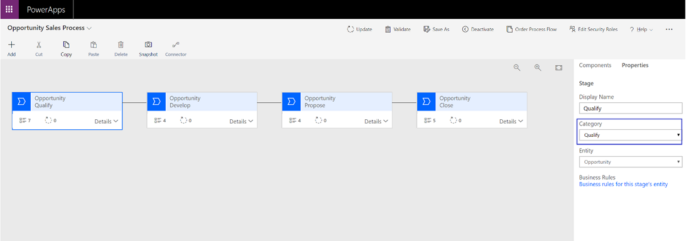
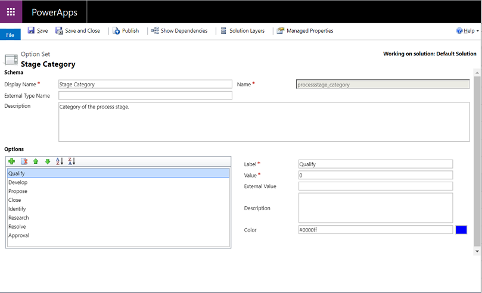

# Frequently-asked questions: Sales business process flows

Find answers to the frequently-asked questions related to the Sales business process flows in Dynamics 365 Sales.

## Sales pipeline chart and pipeline phases

Sales pipeline chart is an out-of-the-box chart that allows sales reps or managers to visualize the opportunity revenue by their pipeline phase. The following is a sample Sales Pipeline chart with pipeline phases such as 1-Qualify, 2-Develop and so on. 

The pipeline phase for an opportunity is determined based on its current business process flow stage. Whenever an opportunity moves across its business process flow stages, the pipeline phase is set to a value in the format of {StageCategoryIndex} - {CategoryName}.

To understand how each of the pipeline phases are named, see the business process flow definition for the opportunity. Go to the **Settings** area and open the business process definition associated with the opportunity record. 
 
For the out-of-the-box 'Opportunity Sales Process' business process flow, there are four stages and each stage is mapped to a unique category, highlighted in the Properties section of the image below. You can customize the business process flow definition by adding or removing the stages and also update the stage display name. The pipeline phase attribute is set to a value based on stage's category and is not impacted by change of the stage's display name. 

 
The category values used for the business process stage are defined in a global optionset named Stage Category. Whenever an opportunity moves from Qualify to Develop stage of the Opportunity Sales process business process flow, the associated new stage's category (Develop, in case of Qualify to Develop) metadata is read. Since the order of the Develop option is 2, the pipeline phase of the opportunity is set to '2-Develop'.

The pipeline phase for an opportunity is labeled such that the category order of the associated business process flow stage is prefixed to the category name. This allows the various pipelines phases to be ordered by the order of the associated category options in the Stage Category optionset metadata. If you've a business requirement to introduce a new BPF stage, for example, Negotiation, which should appear between the 'Propose' and 'Close' stages, then you must add a new category option named 'Negotiation' in the **Stage Category** optionset and ensure it is positioned between the 'Propose' and 'Close' options. 

Here are some frequently-asked questions about the pipeline phases:

- Question: Why do I see multiple pipeline phases with different sequences Eg: 6-Close, 7-Close?

    Answer: This can happen if you've changed the sequence of a stage category option (in this case, Close) from 6 to 7. For existing opportunities that moved to the Close stage before this change was made will continue to show the same pipeline phase value set during its last business process flow stage change. However, the opportunities that enter the Close stage after this change was made will have the new sequence for the Close category option. You can reset the values for older opportunities by either changing the business process flow stage to a different stage and bringing it back to the Close stage or by updating the stepname attribute of the opportunity programmatically. 

- Question:  Why do I see pipeline phase values from multiple business process flow definitions?

    Answer: This is expected if you use multiple business process definitions for the Opportunity entity. The out-of-the-box pipeline phase attribute is set on every Business process flow stage change of the opportunity record irrespective of the number business process flows associated with the opportunity record. In these cases, you should consider adding a custom field and set its value via SDK only for the required sales process BPF stage changes for the opportunity. 

- Question: Why is Chart ordering displayed differently in Unified interface vs. the legacy web client?

    Answer: The legacy web client displays the chart by using the associated category option's value while the Unified interface charts display the stages alphabetically. As the pipeline phases are prefixed with the stage's category order in the Stage Category optionset, display according to the category option sequence.
