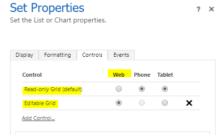

# Frequently asked questions

## Entity: Opportunity

**Question**: When can I edit the **Est.Revenue** value in **Opportunity** form?

**Answer**: To edit the value of estimated **Revenue** in **Opportunity** form , the **Revenue** must configured as **User Provided** and the opportunity must be in **Open** state. 

   > [!div class="mx-imgBorder"]
   > 

 
## Entities: Opportunity, Quote, Invoice, and Order

> [!IMPORTANT]
> In the section we use the entity **Opportunity** to frame the questions. However, these questions are true for other entities - **Quote**, **Invoice**, and **Order**.

**Question**: Why any view other than **Opportunity Product Inline Edit View** loses the inline editable functionality in WebClient if it’s been selected for **Opportunity Product** sub grid in the **Opportunity** form?

**Answer**: This behavior is known and is by design in Web Client. However, this behavior is changed in Unified Interface. We recommende you to use Unified Interface to experience inline edit view. You can verify if a grid is editable, go to **Grid control properties**.

   > [!div class="mx-imgBorder"]
   > 

   >[!NOTE]
   > - In Unified Interface, the behavior of the grid columns **Price Per Unit** and **Quantiy** editable or non-editable is independent of the view that is selected.  
   > - Editable grid doesn’t guarantee that all columns are editable and it depends on the **Pricing**.

## Entities: Opportunity Product, Quote Product, Order product, and Invoice product 

> [!IMPORTANT]
> In the section we use the entity **Opportunity Product** to frame the questions. However, these questions are true for other entities - **Quote Product**, **Order Product**, and **Invoice Product**.

**Question**: How to configure the value of default **Pricing** to **Override Price** on **Opportunity Product** form?

**Answer**: To configure the value of default **Pricing** as **Override Price** in **Opportunity Product** form: 
1. Go to **Settings** > **Customizations** > **Customize the System**.
2. Select **Entities** > **Opportunity Product** > **Fields**.
3. Select **ispriceoverridden** field and configure the **Default Value** to **Override Price**.
4. Save and publish the customizations.
 
## Entities: Order and Invoice

> [!IMPORTANT]
> In the section we use the entity **Order** to frame the questions. However, these questions are true for **Invoice** also.

**Question**: How can I change the default value for **Prices Locked** field in **Order** form?

**Answer**: You can change the default value for **Prices Locked** field in **Order** form through customizations or inline editable grid:
- **Through customizations**:
    1. Go to **Settings** > **Customizations** > **Customize the System**.
    2. Select **Entities** > **Order** > **Fields**.
    3. Select **ispricelocked** field and configure the **Default Value** to **No**.
    4. Save and publish the customizations.
- **Through inline editable grid**: 
    Select the Lock icon on editable grid and you can change the value of **Prices Locked** field.

**Question**: What is the **Prices Locked** (ispricelocked) field mean on the **Order** form and how this value of field impacts the **Price Per Unit** column in the **Products** grid?

**Answer**: The **Prices Locked** (ispricelocked) field controls the prices specified on the **Order** are locked from any further updates. 
Behavior of **PricePerUnit** in the **Products** subgrid and **Order** product from:  
- **For existing product**:
 
|Configuration| In editable grid – **PricePerUnit** column value| In non-editable grid – **PricePerUnit** column value| **Order** product form|
|-------------|-------------|-------------|-------------|
|**Prices Locked** is Yes|Non-Editable|Non-Editable|Non-Editable|
|**Prices Locked** is No and **Pricing** is Override Price|Editable|Non-Editable|Editable|
|**Prices Locked** is No and **Pricing** is Use Default|Non-Editable|Non-Editable|Non-Editable|

- **For new product**:

|Configuration| In editable grid – **PricePerUnit** column value| In non-editable grid – **PricePerUnit** column value| **Order** product form|
|-------------|-------------|-------------|-------------|
|**Prices Locked** is Yes|Non-Editable|Non-Editable|Non-Editable|
|**Prices Locked** is No|Editable|Non-Editable|Editable|
   
**Question**: What is the result of changing product price in **Pricelist** on the **PricePerUnit** of **Order** product form?

**Answer**: The following table defines the effect of changing product price in **Pricelist** on the **PricePerUnit** of **Order** product form:

|Entity State|IsPriceLocked|Pricing|Is the value of **PricePerUnit** on the **Order** product form change?|
|------------|-------------|-------|----------------------------------------------------------------------|
|Editable|Yes|Default or Override|No|
|Editable|No|Default|Yes|
|Editable|No|Override|No|
|ReadOnly|Yes or No|Default or Override|No|