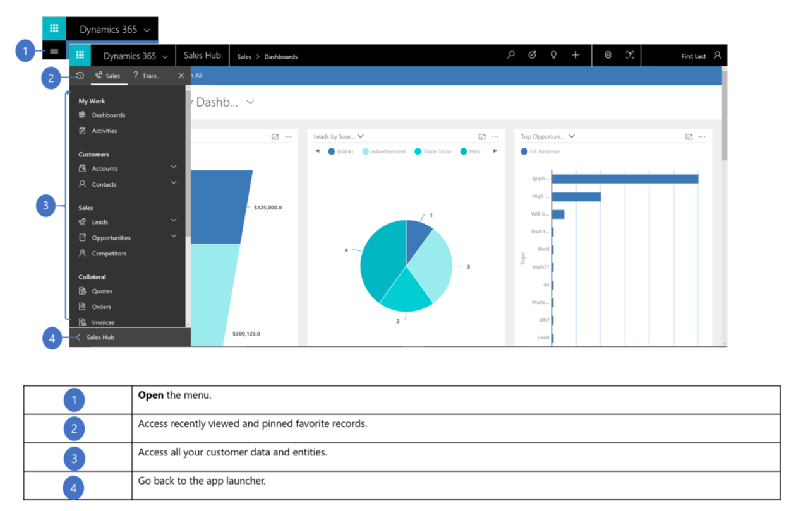

# Find your way around the Sales Hub app

[!INCLUDE[cc-applies-to-update-9-0-0](../includes/cc_applies_to_update_9_0_0.md)]

The Sales Hub app is built on the Unified Interface framework, which uses responsive web design principles to provide an optimal viewing and interaction experience for any screen size, device, or orientation. The Sales Hub app is also built from the ground up with accessibility in mind.

## Nav bar at the top 

The nav bar at the top of every screen includes buttons for common tasks like searching for customer data or entering records. 
The nav bar also includes access to tools that help you manage your work, such as a guided task flow that walks you through common 
tasks, or the Relationship Assistant that offers suggestions for the next steps to take with your customers. 

## Menu options

Choose the menu button to see a list of all your options in one place, including access to communication tools like e-mail and Skype calling,
customer records, your calendar, and settings. You'll also find quick access to any recently viewed records and pinned favorites.

