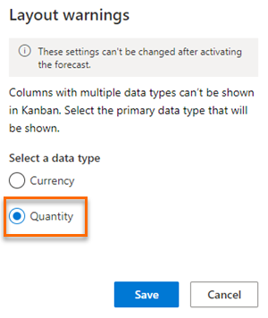
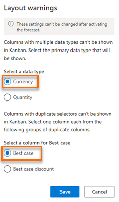

# Forecast with different data type

You'll use the following scenarios to configure a forecast with different data types: 

- Columns that are configured with different data types.
- Columns that are configured with same selector.

let's look at few examples on how you can configure and publish these forecasts.

- [Example 1: With a forecast category, create two different currency columns and a quantity column](#same-fc-different-data-type-currency-qty)
- [Example 2: With a forecast category, create a currency column and a quantity column](#same-fc-different-data-type)
- [Example 3: With two different forecast categories, create a currency column and a quantity column](#different-fc-different-data-type)

**Example 1: With a forecast category, create two different currency columns and a quantity column**

You're configuring a forecast in which you want to see **Best case** forecast category's total amount, discount amount, and the teams that you've worked to get this amount. You configure three **Best case** columns as following:

| Column name | Selector | Data type | Amount field |
|-------------|----------|-----------|--------------|
| *Best case* | Best case| Currency | Actual amount |
| *Best case discount* | Best case| Currency | Extended Amount |
| *Best case teams* | Best case| Integer | TeamsFollowed |

You completed the other forecast configurations as required. While activating and publishing the forecast, an error message is displayed on the top of the **Activate forecast** configuration page. The kanban view doesn't support multiple data types. Selecting the primary data type helps in displaying the underlying records with required data type in kanban view. Also, if you have enabled predictive forecasting, Snapshots requires a primary data type and doesn't support multiple data types. 

Select **Fix Issue** and the following **Layout warning** pane is displayed to select a primary data type to roll up the values for the columns with different data types. 

> [!div class="mx-imgBorder"]
>  

- If you select the primary data type as **Quantity**, the forecast chooses the **Best case teams** column to display as the **Best case teams** column is the only column that has a quantity (integer) as data type. You can proceed with activating the forecast as there is no conflict between the columns display. 
    
    > [!div class="mx-imgBorder"]
    >  

- If you select the primary data type as **Currency**, the forecast has to choose between **Best case** and **Best case discount** columns to display, as both these columns have **Currency** as data type and of the same selector (Best case). Choose the column to display appropriately and save. 

    > [!div class="mx-imgBorder"]
    >  

**Example 2: With a forecast category, create a currency column and a quantity column**

You're configuring a forecast in which you want to see **Best case** forecast category's total amount and the teams that you have worked to get this amount. You configure two **Best case** columns as following:

| Column name | Selector | Data type | Amount field |
|-------------|----------|-----------|--------------|
| *Best case* | Best case| Currency | Actual amount |
| *Best case teams* | Best case| Integer | TeamsFollowed |

You completed the other forecast configurations as required. While activating and publishing the forecast, an error message is displayed on the top of the **Activate forecast** configuration page. The kanban view doesn't support multiple data types. Selecting the primary data type helps in displaying the underlying records with required data type in kanban view. Also, if you have enabled predictive forecasting, Snapshots requires a primary data type and doesn't support multiple data types. 

Select **Fix Issue** and the following **Layout warning** pane is displayed to select a primary data type to roll up the values for the columns with different data types. 

> [!div class="mx-imgBorder"]
>  

Select the primary data type as required. Though, the column selector is same for **Best case** (currency) and **Best case teams** (quantity), there will not any conflict between the columns to display as the data types are different and the forecast will choose the column according to your selection.

**Example 3: With two different forecast categories, create a currency column and a quantity column**

You're configuring a forecast in which you want to see the total revenue of **Won** forecast category and see the teams that you have worked with under the **Best case** forecast category. You configure the **Won** and **Best case** columns as following:

| Column name | Selector | Data type | Amount field |
|-------------|----------|-----------|--------------|
| *Won* | Won | Currency | Actual amount |
| *Best case teams* | Best case| Integer | TeamsFollowed |

You completed the other forecast configurations as required. While activating and publishing the forecast, an error message is displayed on the top of the **Activate forecast** configuration page. The kanban view doesn't support multiple data types. Selecting the primary data type helps in displaying the underlying records with required data type in kanban view. Also, if you have enabled predictive forecasting, Snapshots requires a primary data type and doesn't support multiple data types. 

Select **Fix Issue** and the following **Layout warning** pane is displayed to select a primary data type to roll up the values for the columns with different data types. 

> [!div class="mx-imgBorder"]
>  

Select the primary data type as required. Since the **Won** (currency) and **Best case** (quantity) are different columns with different selectors and data types, the forecast will choose the columns to display according to your primary data type selection.

### See also

[Activate and upload simple columns data](activate-upload-simple-columns-data-forecast.md)

[Choose layout and columns](choose-layout-and-columns-forecast.md)
