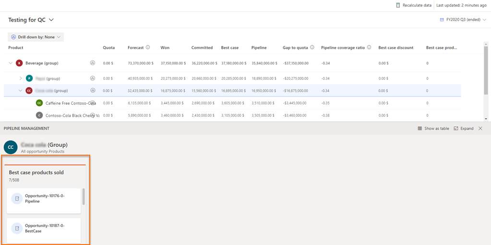
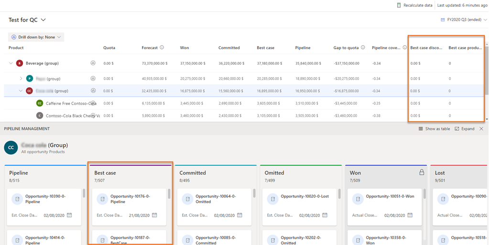
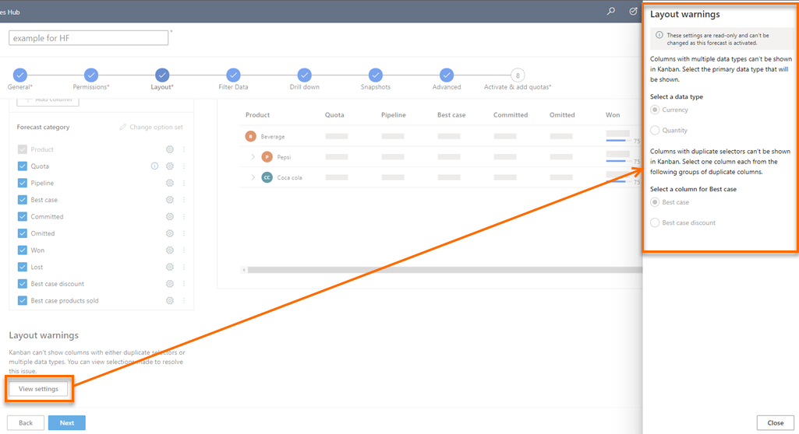

# Forecast with multiple data type columns

In a forecast grid, you can have multiple columns with different data types such as currency and quantity displayed in a single view. For example, in a product-based forecast, you can display the **Best case** column values as a volume (quantity) and as a quantity (currency) simultaneously. 

> [!div class="mx-imgBorder"]
> 

>[!NOTE]
>To configure columns, see [Choose layout and columns](choose-layout-and-columns-forecast.md).

Kanban view, deal flow, and trend chart can only display a single data type at a time. Hence, for multiple data type forecast, you must select the primary data type to be displayed before activating the forecast.

Similarly, kanban view, deal flows, and trend charts can't show two columns with the same selector. For example, **Best case** selector is used for multiple revenue columns. Since kanban and deal flow can only show a single revenue column for a category, you must choose the revenue column to display in these views before activating the forecast.  

>[!NOTE]
>To use deal flows and trend charts, you must enable premium forecasting.

Let's look at few examples on how you can configure and activate these forecasts.

- [Example 1: With a forecast category, create two different currency columns and a quantity column](#same-fc-different-data-type-currency-qty)
- [Example 2: With a forecast category, create a currency column and a quantity column](#same-fc-different-data-type)
- [Example 3: With two different forecast categories, create a currency column and a quantity column](#different-fc-different-data-type)

**Example 1: With a forecast category, create two different currency columns and a quantity column**

You're configuring a forecast in which you want to see **Best case** forecast category's total amount, discount amount, and number of products sold to get this amount. You configure three **Best case** columns as follows:

| Column name | Selector | Data type | Amount field |
|-------------|----------|-----------|--------------|
| *Best case* | Best case| Currency | Actual amount |
| *Best case discount* | Best case| Currency | Discount Amount |
| *Best case products sold* | Best case| Integer | Number of products sold |

After you've completed the other configuration steps as required and while activating, an error message is displayed at the top of the **Activate forecast** configuration page. More information: [Activate and upload simple columns data](activate-upload-simple-columns-data-forecast.md)

> [!div class="mx-imgBorder"]
> 

Select **Fix issue** and the following **Layout warnings** pane is displayed to select a primary data type to display values for the selected data type. 

> [!div class="mx-imgBorder"]
>  

- If you select the primary data type as **Quantity**, the forecast chooses the **Best case products sold** column to display in the kanban view, deal flows, and trend charts as the **Best case products sold** column is the only column that has a quantity (integer) data type. You can proceed with activating the forecast after you select the primary data type. 
    
    > [!div class="mx-imgBorder"]
    >  

    As in this forecast, the **Best case products sold** column is the only column that is a quantity (integer) data type and hence, kanban view in the below screen displays only one lane with single quantity-based column:

    > [!div class="mx-imgBorder"]
    > 
    
- If you select the primary data type as **Currency**, you must choose between **Best case** and **Best case discount** columns to display in the kanban view, deal flows, and trend charts, as both these columns have **Currency** as data type and are of the same selector (Best case). Choose the column appropriately and save. 

    > [!div class="mx-imgBorder"]
    >  

    As in this forecast, the **Best case** column is selected to display in the kanban view, though the **Best case discount** column is of the same selector and data type. Also, the quantity column **Best case products sold** is of the same selector is displayed in the forecast grid and not in the kanban view. 

    > [!div class="mx-imgBorder"]
    > 

**Example 2: With a forecast category, create a currency column and a quantity column**

You're configuring a forecast in which you want to see **Best case** forecast category's total amount and number of products sold to get this amount. You configure two **Best case** columns as following:

| Column name | Selector | Data type | Amount field |
|-------------|----------|-----------|--------------|
| *Best case* | Best case| Currency | Actual amount |
| *Best case products sold* | Best case| Integer | Number of products sold |

After you've completed the other configuration steps as required and while activating, an error message is displayed at the top of the **Activate forecast** configuration page. More information: [Activate and upload simple columns data](activate-upload-simple-columns-data-forecast.md)

> [!div class="mx-imgBorder"]
> 

Select **Fix issue** and the following **Layout warnings** pane is displayed to select a primary data type to display values for the selected data type. 

> [!div class="mx-imgBorder"]
>  

Select the primary data type as required. The selector is same for **Best case** (currency) and **Best case products sold** (quantity) columns and the difference is with the data type. Choose  a data type to display the column in the kanban view, deal flows, and trend charts.

**Example 3: With two different forecast categories, create a currency column and a quantity column**

You're configuring a forecast in which you want to see the total revenue of **Won** forecast category and see the products sold under the **Best case** forecast category. You configure the **Won** and **Best case** columns as following:

| Column name | Selector | Data type | Amount field |
|-------------|----------|-----------|--------------|
| *Won* | Won | Currency | Actual amount |
| *Best case products sold* | Best case| Integer | Number of products sold |

After you've completed the other configuration steps as required and while activating, an error message is displayed at the top of the **Activate forecast** configuration page. More information: [Activate and upload simple columns data](activate-upload-simple-columns-data-forecast.md)

> [!div class="mx-imgBorder"]
> 

Select **Fix issue** and the following **Layout warnings** pane is displayed to select a primary data type to display values for the selected data type. 

> [!div class="mx-imgBorder"]
>  

Select the primary data type as required. Since the **Won** (currency) and **Best case** (quantity) columns has different selectors and data types, you must choose a primary data type to display in the kanban view, deal flows, and trend charts.

## View selected primary data type and columns

You can view the details of the primary data type and selected column (among duplicate columns with same selector) to display in kanban view, deal flows, and trend charts. The displayed details are view only and can't be edited. To view the details:

1. Sign in to the **Sales Hub** app.

2. In the site map, select the Change area icon , and then select **App Settings**. 

3. Under **Performance management**, select **Forecast configuration**.

    The forecast configuration page opens. 

4. Select the **More options** icon corresponding to the forecast and selects **Edit**.

5. Go to the **Layout** configuration step. At the bottom of the **Layout** section, a **Layout warnings** section is displayed. 

6. Select **View settings**. A layout warnings pane is displayed on the right-side of the page.

    > [!div class="mx-imgBorder"]
    >  

    You can view the selected primary data type and column to display in the kanban view, deal flows, and trend charts.

### See also

[Activate and upload simple columns data](activate-upload-simple-columns-data-forecast.md)

[Choose layout and columns](choose-layout-and-columns-forecast.md)
