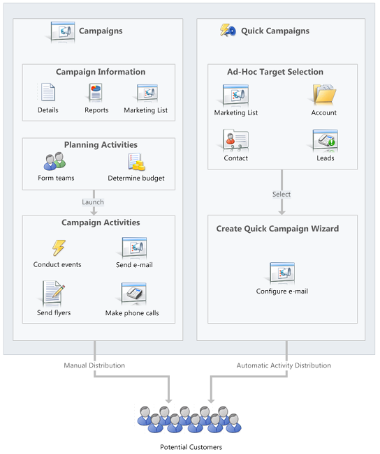

# Get started with in-app marketing (Sales)

Promote your business and improve sales with targeted marketing campaigns in [!INCLUDE[pn-dyn-365-sales](../includes/pn-dyn-365-sales.md)]. Create activities for each campaign and assign them to different team members. Track customer response and costs for each campaign. Follow this step-by-step guide to get started with your marketing campaigns.  
  
## Import contacts, accounts, and leads  
 Get your customer records into [!INCLUDE[pn-dyn-365-sales](../includes/pn-dyn-365-sales.md)], and add these to marketing lists so you can target your campaigns. [!INCLUDE[proc_more_information](../includes/proc-more-information.md)] [Import accounts, leads, or other data](../customerengagement/on-premises/basics/import-accounts-leads-other-data.md)  
  
## Create marketing lists  
 Group accounts, contacts, or leads into a targeted marketing list. You can create a marketing list easily with the search functionality in [!INCLUDE[pn-dyn-365-sales](../includes/pn-dyn-365-sales.md)], so you find all of your customers in a particular area, for example, and add them to the member list. [!INCLUDE[proc_more_information](../includes/proc-more-information.md)] [Create a marketing list using in-app marketing](../sales-enterprise/create-marketing-list-using-app-marketing-sales.md)  
  
## Understand the difference between a campaign and a quick campaign  
 In the marketing area, use standard campaigns to manage the end-to-end process of a complete marketing campaign, like managing campaign and planning activities, distributing the activities to other team members, and tracking how the campaign did. Campaigns include extensive tracking features, including detailed information, reports, and multiple marketing lists.  
  
 In contrast to standard campaigns, use quick campaigns to automatically distribute a single activity to selected accounts, contacts, or leads, or to a single marketing list. The effects of a quick campaign are immediate.  
  
   
  
## Create a campaign or a quick campaign  
 Depending on your requirement, track your marketing activities through a campaign or a quick campaign. [!INCLUDE[proc_more_information](../includes/proc-more-information.md)] [Create or edit a campaign using in-app marketing](../sales-enterprise/create-edit-campaign-using-app-marketing-sales.md), [Create a quick campaign using in-app marketing](../sales-enterprise/create-quick-campaign-using-app-marketing-sales.md)  
  
## Track a campaign response  
 Record the replies you get from the potential customers in response to a specific marketing campaign to make sure your team can act on the responses. Measure the success of specific campaign activities based on their response rates. [!INCLUDE[proc_more_information](../includes/proc-more-information.md)] [Track a marketing campaign response using in-app marketing](../sales-enterprise/track-marketing-campaign-response-using-app-marketing-sales.md)  
  
## See how your campaigns are doing with default marketing reports  
 Use one of the following reports to assist you in monitoring and analyzing marketing activities:  
  
- **Campaign Activity Status**: Use this report to track a campaign. The report displays a summary for one campaign.  
  
- **Campaign Comparison**: Use this report to identify your most and least successful campaigns.  
  
- **Campaign Performance**: Use this report to track the progress and status of your campaigns.  
  
## Let your customers unsubscribe from marketing communications  
 You can enable customers to unsubscribe from email marketing communications your organization sends them.  
  
 More information: [System Settings dialog box - Marketing tab](/power-platform/admin/system-settings-dialog-box-marketing-tab)  
  
 Note that you cannot add unsubscribe functionality to direct email or email templates.  
  
### See also  
 [Create a marketing list using in-app marketing](../sales-enterprise/create-marketing-list-using-app-marketing-sales.md)   
 [Create or edit a campaign using in-app marketing](../sales-enterprise/create-edit-campaign-using-app-marketing-sales.md)   
 [Create a quick campaign using in-app marketing](../sales-enterprise/create-quick-campaign-using-app-marketing-sales.md)   
 [Add an activity to a campaign using in-app marketing](../sales-enterprise/add-activity-campaign-using-app-marketing-sales.md)   
 [Add a marketing list, sales literature, or product to a campaign using in-app marketing](../sales-enterprise/add-marketing-list-sales-literature-product-campaign-using-app-marketing-sales.md)   
 [Track a marketing campaign response using in-app marketing](../sales-enterprise/track-marketing-campaign-response-using-app-marketing-sales.md)   
 [Overview of Sales](../sales-enterprise/user-guide.md)

[!INCLUDE[footer-include](../includes/footer-banner.md)]
