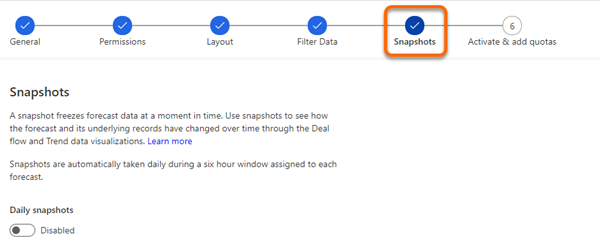
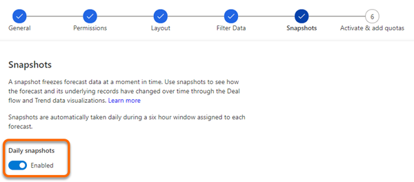

# Take snapshots automatically  

## Requirements
|  | |
|-----------------------|---------|
| **License** | Dynamics 365 Sales Enterprise or Dynamics 365 Sales Premium  More information: [Dynamics 365 Sales pricing](https://dynamics.microsoft.com/sales/pricing/) |
| **Security Role** | System Administrator or Sales Manager    See [Predefined security roles for Sales](security-roles-for-sales.md)|
|||

A snapshot freezes the forecast data at a moment in time. The frozen data includes aggregate column values, manual adjustments, and underlying record fields that directly affect the forecast. You can use these snapshots to see how the forecast and its underlying data have changed over time. 

Snapshots are taken automatically each day and while configuring the forecasts you can enable the option. When enabled, the snapshots are taken daily for that forecast and you can view deal flows and trend data based on the snapshots.

>[!NOTE]
>- Premium forecasting must be enabled for the snapshot feature.
>- You can enable or disable snapshots any time while a forecast active. When disabled, the previously taken snapshots are still available.  

To enable the snapshots, follow these steps:

1.	While configuring a forecast, the **Snapshots** step is displayed. 

    More information: [Configure forecasts by using a custom rollup entity](/dynamics365/sales-enterprise/configure-forecast-using-custom-rollup-entity)
 
    > [!div class="mx-imgBorder"]
    >  

2.	Set the **Daily snapshots** toggle to **Enabled**. After the forecast is active, snapshots are automatically taken daily. The initial snapshot might take a few hours to generate.

    > [!div class="mx-imgBorder"]
    >  

    >[!NOTE]
    >-	For a forecast that's in progress, the snapshots are taken from the date the option is enabled. 
    >-	For a forecast that's scheduled for future, the snapshots are taken from the start date of the forecast. 
    >-	The final snapshot of a forecast is taken on the final day of the forecast.
    >-	Snapshots aren’t taken when a forecast is in inactive state or for the past dates. 

>[!IMPORTANT]
>While configuring columns for a forecast, ensure that each column is unique and the **Selector** option doesn't have duplicates. If duplicates exist, when you activate the forecast an error will be displayed that states that snapshots can't be enabled for the forecast.

### See also

[About premium forecasting](configure-premium-forecasting.md) 
[Analyze deals flow between snapshots](analyze-deals-flow-between-snapshots.md)

[!INCLUDE[footer-include](../includes/footer-banner.md)]
