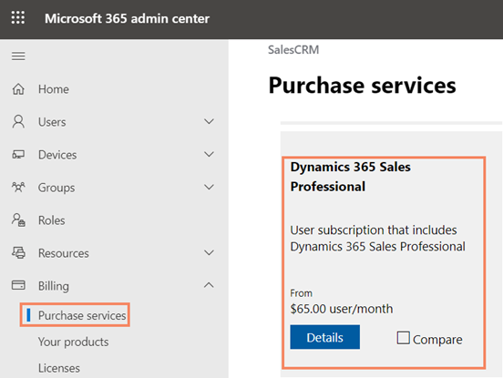
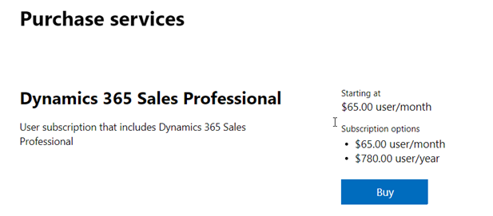

# Move from Dynamics 365 Sales Enterprise edition to Dynamics 365 Sales Professional 

## Requirements
|  | |
|-----------------------|---------|
| **License** | Dynamics 365 Sales Enterprise or Dynamics 365 Sales Premium  More information: [Dynamics 365 Sales pricing](https://dynamics.microsoft.com/sales/pricing/) |
| **Security roles** | System Administrator   See [Predefined security roles for Sales](security-roles-for-sales.md)|
|||

[!INCLUDE[pn-dyn-365-sales](../includes/pn-dyn-365-sales.md)] Professional is targeted at businesses that have simpler sales needs and do not require the full sales capabilities. If you ever want to switch from [!INCLUDE[pn-dyn-365-sales](../includes/pn-dyn-365-sales.md)] Enterprise to [!INCLUDE[pn-dyn-365-sales](../includes/pn-dyn-365-sales.md)] Professional, do the following:

1.	Purchase a [!INCLUDE[pn-dyn-365-sales](../includes/pn-dyn-365-sales.md)] Professional subscription.

2.	Assign [!INCLUDE[pn-dyn-365-sales](../includes/pn-dyn-365-sales.md)] Professional licenses to the users.

3.	Install the [!INCLUDE[pn-dyn-365-sales](../includes/pn-dyn-365-sales.md)] Professional edition solution.

4.	Delete the [!INCLUDE[pn-dyn-365-sales](../includes/pn-dyn-365-sales.md)] Enterprise edition solution.

## Purchase Dynamics 365 Sales Professional subscription

1.  Sign in to [Microsoft 365 admin center](https://admin.microsoft.com) with the Dynamics 365 account that has admin permissions.

2.  In the navigation pane, select **Purchase Services**, and then select the Dynamics 365 Sales Professional tile. 

    > [!div class="mx-imgBorder"]
    >  

3.  Select **Buy**, and then follow the steps to purchase new licenses. 

    > [!div class="mx-imgBorder"]
    >  

## Assign licenses to your users

After you’ve purchased the licenses, assign the licenses to users. 

1.	Go to Microsoft 365 admin center, and in the navigation pane, select **Users** > **Active users**.

2.	Select multiple users, and then select **Manage product licenses**. 
    
    > [!div class="mx-imgBorder"]
    > 

3.	Select **Replace existing product license assignments**, and then select **Next**. 

4.	Turn on the license for your Dynamics 365 Sales plan. 

5.	Select **Replace**, and then select **Close** twice. 

6.	Review the license status on the **Active users** page and make other assignments as needed. 

## Install Dynamics 365 Sales Professional solution

Go to the Microsoft 365 admin center to install Dynamics 365 Sales app (solution) to your production environment. For more information, see [Install Dynamics 365 Sales Professional](../sales-professional/provision-sales-professional-instance.md#install-app)

After you complete these steps, your organization will be effectively moved to [!INCLUDE[pn-dyn-365-sales](../includes/pn-dyn-365-sales.md)] Professional.

## Delete the Dynamics 365 Sales Enterprise solution

1.	Make sure that you have the System Administrator or System Customizer security role or equivalent permissions.

2.	Sign in to Dynamics 365. 

3.	Select **Settings** > **Solutions**. 

4.	Select the [!INCLUDE[pn-dyn-365-sales](../includes/pn-dyn-365-sales.md)] Enterprise solution and select **Delete**. 

    > [!NOTE]
    > When you delete this solution, the Sales Enterprise app module is deleted and any configuration and customization specific to this app module such as its site map or form preferences are also lost.

> [!IMPORTANT]
> As per contractual agreement, you can't mix and match Enterprise and Professional users on the same instance. If you plan to keep Professional licenses, make sure you abide by the contractual requirements. More information: [Microsoft Dynamics 365 Licensing Guide](https://go.microsoft.com/fwlink/?LinkId=866544)

### See also

[Dynamics 365 Licensing Update](/dynamics365/licensing/update)

[!INCLUDE[footer-include](../includes/footer-banner.md)]
