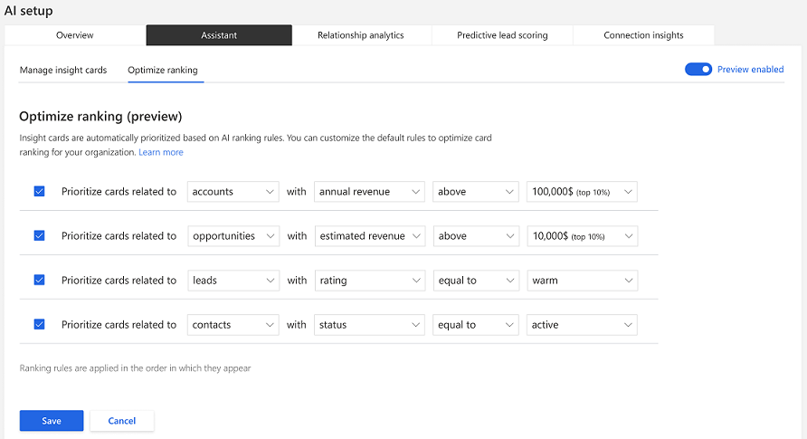

# Preview: Optimize ranking of insight cards

[!INCLUDE [cc-beta-prerelease-disclaimer](../includes/cc-beta-prerelease-disclaimer.md)]

> [!IMPORTANT]
> [!INCLUDE[cc_preview_features_definition](../includes/cc-preview-features-definition.md)]  

Several cards are defined for your organization and all will be displayed to the users through an externally prioritized list. In this list of cards, users might miss those that are important and need follow-up. The **Optimize ranking** option in Assistant allows you to optimize the ranking of cards that are important and promotes those cards to display at the top.

You can define up to four rules in the ranking section, based on entities such as Account, Leads, and Opportunity. Also, the cards are given a priority in the order you define. For example, you created two rules—the first is to prioritize cards for which annual revenue is above $100,000 and the second is to prioritize cards for which estimated revenue is above $10,000. The assistant analyzes the cards and displays those with annual revenue of more than $100,000, followed by those with estimated revenue of more than $10,000, and then followed by the cards that are not prioritized. 

Follow these steps to rank the cards:

1. Sign in to **Dynamics 365 for Sales** and go to **Settings** > **Sales AI**.
2. In the **Assistant** section, select **Configure** or select the **Assistant** tab.

    

3. On the **Assistant** tab, select the **Optimize ranking** tab.

   
 
    The list of rankings that are defined in your organization is displayed.

    When ranking rules are checked, it specifies that the rules are active. If any rule is not required in your organization, deselect the rule and select **Save**.

4. There are four properties you can edit for a rule. The rules are set using these four properties. The basic structure of rules displays as: **Cards related to** *'Name of the entity'* **with** *'Attribute type' 'Condition' 'Value'*. 

    The four properties are:
    - **Name of the entity**: The entities such as account, leads, and opportunities are used to model and manage business data in Dynamics 365 for Customer Engagement apps.
        After you select the entity, the values in the Attribute type, Condition, and Value drop-down lists change accordingly.
    - **Attribute type**: An entity has a set of attributes. For example, the account entity contains attributes such as Name, Address, and OwnerId. 
        The attribute types displayed in the drop-down list vary depending on the entity selection and are related to the fields defined within CRM.
    - **Condition**: The condition specifies that a card is displayed when the set condition is met. For example, some common conditions are above, equal, and below.
    - **Value**: The value specifies the unit of measure for a condition to validate for the attribute type.

        For example, you want to prioritize cards of accounts where the annual revenue is more than $100,000 and display it to your user in your organization. You define the rule as, **Cards related to** *account* **with** *annual revenue* *above* *100,000*.

5. Save the rule.

    The ranking rule is created, processed, and applied to the cards in your organization.

### See also

- [Manage custom insight cards using Microsoft Flow](manage-custom-cards-flow.md)
- [Create insight cards](create-insight-cards-flow.md)
- [Edit insight cards](edit-insight-cards.md)
