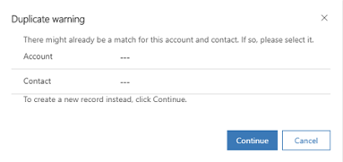
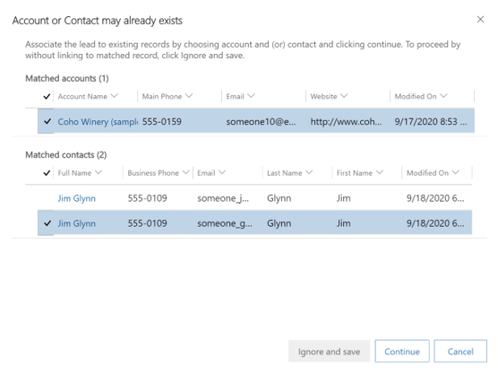

# Qualify or convert leads (Sales Hub)

Does your lead have what you're looking for and vice versa? After you've identified the timeframe, budget, purchase process, and decision makers for the sale, it's time to qualify your lead. 

Your system administrator defines what happens to a lead when it is qualified:
-  If your system administrator has set **Create Account, Contact, and Opportunity records by default upon qualifying a lead** to **No**, you'll be prompted to choose what records to create when the lead is qualified (account, contact, or opportunity). 
-  If they've set **Create Account, Contact, and Opportunity records by default upon qualifying a lead** to Yes, an account, contact, and opportunity record is created when the lead is qualified.

## Qualify a lead (Sales Hub)

1. Select the site map , and then select **Leads**.

2. In the list of leads, open the lead you want to qualify.

3. In the **Qualify** section of the sales process bar, enter all applicable information.

4. On the command bar, select **Qualify**.

5. If you see a prompt to select which records to create when the lead is qualified, select **Yes** for the records that you want to create, and then select **OK**.

      

If you don't see a prompt, qualifying a lead will automatically create an account, contact, and opportunity record. 

You are moved to the next stage in the business process based on the organization-level setting configured by your system administrator.  

> [!NOTE]
> If an opportunity isn't created when qualifying a lead, the business process flow doesn't progress to the next , although the lead status becomes qualified.

> [!TIP]
> To qualify multiple leads at once, go to the list of leads, select the leads that you want to qualify, and on the command bar, select **Qualify**.

For information on how to resolve the common errors that you may get while you qualify a lead, see the [troubleshooting guide](troubleshooting.md).

## What happens when duplicates are found while qualifying leads?

When qualifying a lead, if a duplicate account or contact is detected while creating new records, a duplicate warning is shown to you. Depending on whether your system administrator has enabled the improved duplicate detection and merge experience, you will see the options to resolve duplicates.

For information on enabling the improved duplicate detection and merge experience, see [Enable the improved duplicate detection and merge experience](https://go.microsoft.com/fwlink/p/?linkid=2148601).

### Duplicate detection when improved duplicate detection and merge experience is disabled

When the improved duplicate detection experience is disabled, you will see the **Duplicate warning** dialog box.

> [!div class="mx-imgBorder"] 
> 

In the **Account** and **Contact** fields, select the matching account and contact record and select **Continue**. To ignore the duplicate warning and create new records, leave the Account and Contact fields blank, and select **Continue**.

The **Account** and **Contact** lookup fields are filtered with matched results and shown along with additional information to precisely identify the record to which the lead should be linked. For example, when you select the **Contact** lookup search icon, you'll see only matched contact records.

### Duplicate detection when improved duplicate detection and merge experience is enabled

When the improved duplicate detection and merge experience is enabled, you will see the **Account or Contact may already exist** dialog box.

> [!div class="mx-imgBorder"] 
> 

The **Matched accounts** and **Matched contacts** sections will show all the matching records (based on the duplicate detection rules) along with additional information to precisely identify the record to which the lead should be linked.

To associate the lead record to an existing matching record, select the record, and select **Continue**. To create a new account or contact record, select **Ignore and save** without selecting a matching record.

The lead is qualified. 

## What happens to notes and attachments when leads are qualified?

When salespeople work on a lead, they use notes to store key information on the things they have researched about the lead. This could be information like new contacts at the site, current value of the contract, vendor information and so on. When a lead is qualified, these notes are displayed in the Opportunity record so that the information is not lost.
 
## Typical next steps  
  [Create or edit an opportunity](../sales-enterprise/create-edit-opportunity-sales.md)  
  
  [Learn about the sales process, nurturing sales from lead to order](../sales-enterprise/nurture-sales-from-lead-order-sales.md) 
  
### See also  
[Define lead qualification experience](define-lead-qualification-experience.md)  
[Print leads, quotes, and other records](../basics/print-leads-quotes-other-records.md)          
[Dynamics 365 Sales troubleshooting guide](troubleshooting.md)  
[Boost sales with Versium Predict](../versium-predict/versium-predict.md)  
[Get sales Insights, powered by InsideView](../insights-insideview/insights-powered-by-insideview.md)  

[!INCLUDE[footer-include](../includes/footer-banner.md)]
