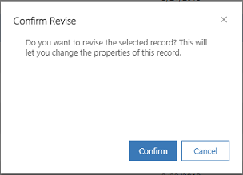

# Make revisions to a product (Sales and Sales Hub)

[!INCLUDE[cc-applies-to-update-9-0-0](../includes/cc_applies_to_update_9_0_0.md)]

Keep the product inventory updated by quickly revising properties for the products as required, and republishing the information so that your sales agents can see the latest changes to the inventory.  

## Revise a product (Sales Hub)

1. [!INCLUDE[proc_permissions_admin_cust_mgr_vp_sales_ceo](../includes/proc-permissions-admin-cust-mgr-vp-sales-ceo.md)]  
  
2. Select the site map , and then select **Products**. 
    
3.  Open an active product, bundle, or family you want to change, and on the command bar, select **Revise**.  

    
  
4. In the **Confirm Revise** dialog box, select **Confirm**.

   

    This will change the product status to **Under Revision**.  
  
5.  Change the product properties, as required. [!INCLUDE[proc_more_information](../includes/proc-more-information.md)] [Use properties to describe a product](../sales-enterprise/use-properties-describe-product.md)  
  
6.  Once you're done making the changes, on the command bar, select **Publish** or **Publish Hierarchy**.  
  
    > [!TIP]
    
    >  If some of the product properties-related information that you changed doesn't align with the customer or business needs, revert the changes and continue with the last active version of the product. To do this, select **Revert**. This changes the status of the product back to **Active**.  
  
 Revising a family sets all the products and bundles under it to the **Under Revision** state.   

## Revise a product (Sales app)
 
1.  [!INCLUDE[proc_permissions_admin_cust_mgr_vp_sales_ceo](../includes/proc-permissions-admin-cust-mgr-vp-sales-ceo.md)]  
  
    #### Check your security role  
  
    -   [!INCLUDE[proc_follow_steps_in_link](../includes/proc-follow-steps-in-link.md)]  
  
    -   [!INCLUDE[proc_dont_have_correct_permissions](../includes/proc-dont-have-correct-permissions.md)]  
  
2.  [!INCLUDE[proc_settings_prod_catalog](../includes/proc-settings-prod-catalog.md)]  
  
3.  In the Product Catalog area, select **Families & Products**.  
  
4.  Open an active product, bundle, or family you want to change, and on the command bar, select **Revise**.  
  
     This will change the product status to **Under Revision**.  
  
5.  Change the product properties, as required. [!INCLUDE[proc_more_information](../includes/proc-more-information.md)] [Use properties to describe a product](../sales-enterprise/use-properties-describe-product.md)  
  
6.  Once you're done making the changes, on the command bar, select **Publish** or **Publish Hierarchy**.  
  
    > [!TIP]
    >  If some of the information that you changed doesn't align with the customer or business needs, revert the changes and continue with the last active version of the product. To do this, select **Revert**. This changes the status of the product back to **Active**.  
  
 Revising a family sets all the products and bundles under it to the **Under Revision** state.   
  
## Typical next steps  
  [Retire a product](../sales-enterprise/retire-product.md)  
   [Set up a product catalog: Walkthrough](../sales-enterprise/set-up-product-catalog-walkthrough.md)  
 
### See also  
 [Set up a product catalog: Walkthrough](../sales-enterprise/set-up-product-catalog-walkthrough.md)
