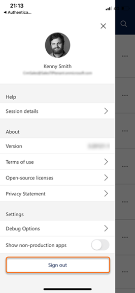

---
title: Using the Dynamics 365 Sales mobile app
description: Instructions for using the Dynamics 365 Sales mobile app
ms.date: 11/30/2020
ms.topic: article
ms.service: dynamics-365-sales
author: sbmjais
ms.author: shjais
manager: shujoshi
---

# Use the Dynamics 365 Sales mobile app

[!INCLUDE [cc-beta-prerelease-disclaimer](../../includes/cc-beta-prerelease-disclaimer.md)]

Use the Dynamics 365 Sales mobile app to plan your day by seeing what it has in store such as upcoming meetings and insights. You can also take post-meeting actions such as adding notes, creating contacts, and updating data in relevant records.

## Sign in and sign out of the app

You can sign in to the Dynamics 365 Sales mobile app by using your work email address you use for Dynamics 365. If you need help with your sign-in information, contact your Dynamics 365 administrator.

### Sign in to the app

1. On your mobile device, search for **Dynamics 365 Sales**, and then open the app.

2. On the welcome screen, tap **Sign in**.

    

3. Enter you email and password.

4. From the list of apps, tap the app you want to use.

    

### Sign out from the app

1. Tap your profile picture at the top left of the screen.

2. Tap **Apps**.

    

3. Tap  at the top left of the screen, and then tap **Sign out**.

    

## Your first experience

When you sign in and select the app for the first time, you'll see the welcome page that briefly shows the various things that you can do with the Dynamics 365 Sales mobile app.

Tap **Next** to go through all the welcome pages and learn more about what the app offers.

When you're on the last page, tap **Let's go**.

## Get familiar with the home page

The home page gives you a quick access to important and relevant information of your day. The home page is divided into the following sections.

### Meetings

This section shows important information about the last meeting you were in and the next one coming up for the day. More information: [View agenda](view-agenda.md)

> [!NOTE]
> Only those meetings are displayed that have at least one external attendee (not a part of your organization).

### Recent contacts

Use **Recent contacts** to open an extended list of the contacts you've recently accessed through the web or the mobile app. You can tap a contact to view its details.

### Recent records

Tap **Recent records** to view an extended list of the records you've worked on recently through the web or the mobile app, such as an account or opportunity. You can tap a record to view its details. More information: [Open a record](open-record.md)

### Reminders and insights

Shows action cards from the relationship assistant. The cards show up to five reminders and five insights. If your administrator has created custom cards, they can be shown here, too.

Insight cards help keep you up to date with your work in Dynamics 365 Sales, letting you know when you need to follow-up on an email, attend a meeting, and much more. The cards are generated by the assistant based on data stored in Dynamics 365 Sales and your Exchange inbox and calendar. More information: [Insight cards reference](https://docs.microsoft.com/dynamics365/ai/sales/action-cards-reference)

When you select **Reminders** or **Insights**, an extended list appears. Tap a reminder or an insight to see details about it. Tap **Open** in the card to open the reminder or the insight card.

Tap  to take further action on a reminder, such as dismiss, snooze, or mark it as helpful or not helpful.

## Navigate through the app

You can use the navigation bar at the bottom of the screen to navigate through the app.

From anywhere in the app:

-   Tap **Home** to go to the home page.

-   Tap **Search** to search for records.

-   Tap **Meetings** to go to the calendar view.

-   Tap **More** to open items in Unified Interface.
