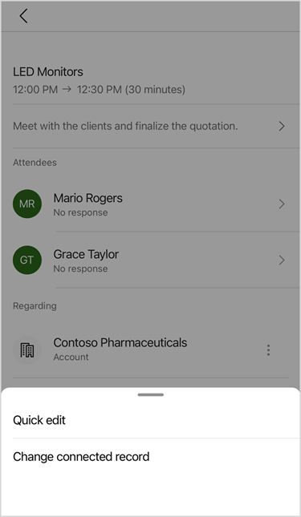

---
title: View meetings in the Dynamics 365 Sales mobile app
description: Instruction to view meetings in the Dynamics 365 Sales mobile app
ms.date: 11/03/2020
ms.topic: article
ms.service: dynamics-365-sales
author: sbmjais
ms.author: shjais
manager: shujoshi
---

# View meetings

[!INCLUDE [cc-beta-prerelease-disclaimer](../../includes/cc-beta-prerelease-disclaimer.md)]

On the home page, you can see resources that can help you plan your day better. For example, quickly see one past and one upcoming meeting in the **Meetings** section.

To see more meetings for the day, tap **Meetings** either on the home page or on the navigation bar. Meetings scheduled from Microsoft Outlook are displayed.

> [!NOTE]
> You can't create a meeting from the Dynamics 365 Sales mobile app.

**To view meetings**

1.  On the navigation bar, tap **Meetings**.

    

    The calendar view opens.

    

    The current meeting time is shown in blue color with a triangle icon beside it. To see the details of a meeting, tap the meeting record.

2.  To see meetings for a specific date, tap a date in the calendar.

    

    If there are no meetings scheduled for a day, nothing would be displayed.

## See meeting details

To see details of a specific meeting, tap the meeting record either on the home page or the calendar view. The meeting details are displayed.

The following meeting details are displayed:

-   Meeting name

-   Meeting time

-   Meeting description: When you tap on it, the detailed description of the meeting is shown.

-   List of attendees: The list of attendees shows up to 5 attendees. When you tap an attendee, it opens the contact record in the Quick view form. If the attendee is an unknown contact (not a record stored in Dynamics 365 Sales), you'll see an option to create a contact. More information: [Create a contact](create-contact.md)

-   Regarding: Indicates the record the meeting is regarding. From the **More** menu, you can do the following:

    -   Open the connected record in an edit mode

    -   Choose a different record to connect with the meeting

        

    If there's no regarding record set, you'll see a "No connected record" message. More information: [Connect a record to a meeting](#connect-a-record-to-a-meeting)
    
    > [!NOTE]
    > You'll be able to set the regarding record only if server-side synchronization is enabled in your environment. Contact your administrator to enable server-side synchronization in your environment.

## Connect a record to a meeting

1. Tap a meeting record either on the home page or the calendar view.

    

2. On the meeting details page, tap **Set regarding**.

    

3. On the **Regarding** page, either select a recent record or tap **Search** and to look for the appropriate record.

    

4. After selecting a record, tap **Save**.

    

    The connected record details are displayed under the **Regarding** section.

    

