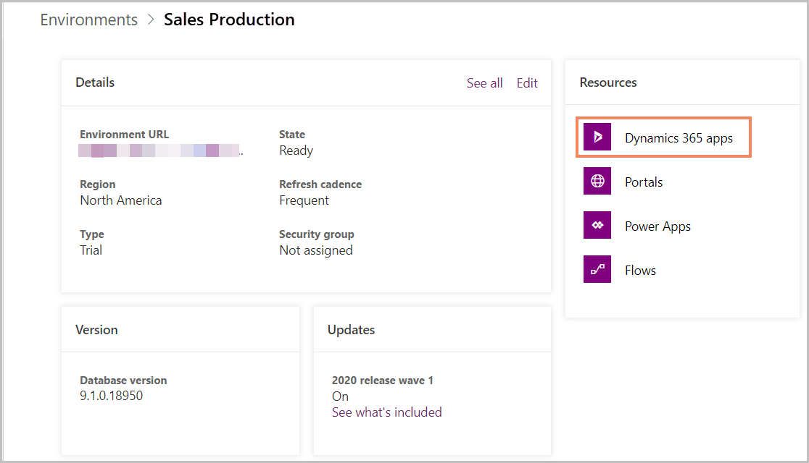
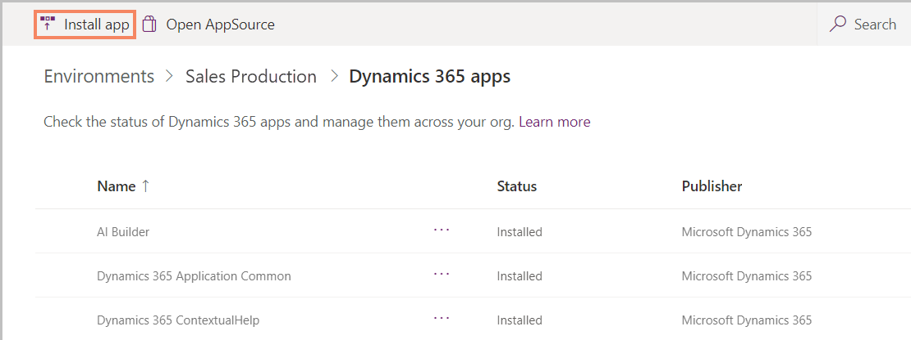
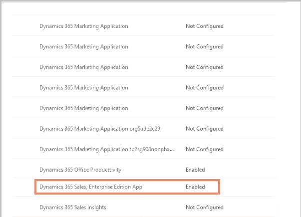
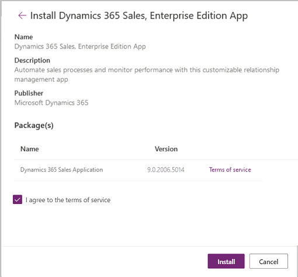
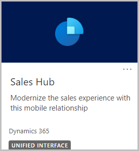

# Set up Dynamics 365 Sales

[!INCLUDE[cc-data-platform-banner](../includes/cc-data-platform-banner.md)]

To set up Dynamics 365 Sales, you must complete these general steps.

1. Buy a subscription, or sign up for a free 30-day trial subscription.

    1. To try Dynamics 365 Sales, go to the [Dynamics 365 trials](https://trials.dynamics.com/) site, select **Sales**, and follow the instructions.

    2. To buy a subscription, go to your **Microsoft 365 admin center** &gt; **Billing** &gt; **Purchase Services** and then select **Dynamics 365 Sales** and **Buy Now**. You can also get Sales from this [Dynamics 365 purchasing page](https://dynamics.microsoft.com/pricing/#Sales).

        Your organization's subscription to Dynamics 365 Sales in Dynamics 365 provides access to the Microsoft 365 admin center through a global administrator account. The global administrator manages every aspect of the subscription and may add subscriptions to other Microsoft Online Services.

2. [Install the solution](#install).

3. [Verify the installation.](#verify)

4. [Give users access to the Sales Hub app](#grant-access).

## Install the Sales solution

After getting a Dynamics 365 Sales subscription, follow these steps to install the Dynamics 365 Sales solution.

> [!IMPORTANT]
> You must have at least one Dynamics 365 Sales Enterprise license to install the Sales app.

1. Go to the [Power Platform admin center](https://admin.powerplatform.microsoft.com/).

2. In the site map, select **Environments**.

3. On the **Environments** page, select the environment where you want to install the Sales Hub app. You can use the **Search** box at the right side of the command bar to search for your specific environment.

    > [!div class="mx-imgBorder"]  
    > 

    > [!NOTE]
    > If you don't have an environment created, create one. More information: [Create and manage environments in the Power Platform admin center](/power-platform/admin/create-environment#create-an-environment-in-the-power-platform-admin-center)

4. After you open your environment, select **Dynamics 365 apps** under **Resources.**

    > [!div class="mx-imgBorder"]  
    > 

5. On the Dynamics 365 Apps page, on the command bar, select **Install Apps**.

    > [!div class="mx-imgBorder"]  
    > 

6. In the **Install Dynamics 365 apps** panel, select **Dynamics 365 Sales, Enterprise Edition App**, and then select **Next**.

    > [!div class="mx-imgBorder"]  
    > 

7. You'll see the app details with the version number. Select the **I agree to the terms of service** check box, and then select **Install**.

    > [!div class="mx-imgBorder"]  
    > 

The Sales Hub app will be installed in your environment.

> [!TIP]
> You can also download the Dynamics 365 Sales app from [Microsoft AppSource](https://appsource.microsoft.com/product/dynamics-365/mscrm.d427d98b-6082-4358-bc85-731fe3337f27?src=Office&tab=Overview).

## Verify whether the installation is complete

Go to the **My Apps** page by going to https://&lt;orgurl&gt;/apps/. In the **Published Apps** section, you'll find a tile for Sales Hub from the publisher Dynamics 365.

> [!div class="mx-imgBorder"]  
> 

## Grant access

Every user in the organization must have the **Sales, Enterprise app access** role to be able to access the Sales Hub app. To assign a security role to a user, see [Assign security roles to users in an environment that has a Common Data Service database](/power-platform/admin/database-security#assign-security-roles-to-users-in-an-environment-that-has-a-common-data-service-database).

### See also
[Overview of Sales and Sales Hub](overview.md)  
[Learn the basics of Dynamics 365 Sales](user-guide-learn-basics.md)
