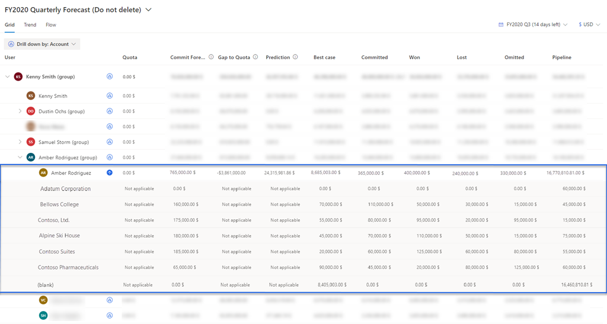
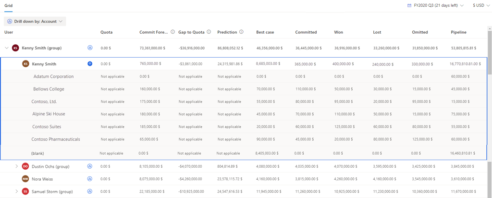

# View and understand data through drill down

[!INCLUDE [cc-early-access](../includes/cc-early-access.md)]

Through a forecast, you will have a visibility into the pipeline amounts that your sellers are projecting for the period. Now, you might want to know which accounts contribute to a specific seller’s Committed value or maybe you want to know which products are contributing to a different seller’s Won value. The drill down feature allows you to break down your seller’s forecast projections as a function of the contributing factors that you care about such as Account and Product. The drill down feature looks at the underlying records that are contributing to the value of the rollup column and groups them according to the selected drill down type.

By viewing drill down data, you can understand how the records in each group are performing and set the next course of action. This helps you to plan better and achieve the targets as set in the forecast.

Let’s look at an example. **Amber Rodriguez** is a seller and she’s engaged with four accounts. Her projected revenue for the current period is $400,000.00. **Kevin Smith**, her sales manager, wants to understand how her revenue of $400,000.00 is broken down by each account. On the forecast page, Kevin chooses the Account drill down from the drop-down menu. Then, he selects the drill down icon beside Amber’s record to view a list of Accounts that make each of Amber’s forecast pipeline values.

> [!div class="mx-imgBorder"]
> 

Before you start using the feature, an administrator or forecast manager must add the drill down attributes to the forecast. To learn more, see [Configure and manage drill downs](configure-manage-drill-downs.md).

When a drill down attribute is added to your forecast, a drop-down list is displayed below the **Grid** tab. The following screenshot is an example:

> [!div class="mx-imgBorder"]
> 

## Select a drill down 

By default, when you open a forecast, no drill down is selected and the icon corresponding to each row is disabled. To enable and view the details, you must select a drill down and then the icons corresponding to each row are enabled. Select the icon to view the forecast data in a drill down mode. To select a drill down, follow these steps:

1.	Open a forecast with drill down added.

2.	Select the **Drill down by** list and choose the drill down on which you want to break the data. For example, **Account**.
 
    > [!div class="mx-imgBorder"]
    > 

    The icon corresponding to each row is active and turns Blue. The data in the forecast is broken down into multiple groups according to the selected drill down type (**Account**).

    > [!div class="mx-imgBorder"]
    > 

## View and understand the drill down data

After you have selected a drill down, the icon for each row is active and the data is grouped according to the selected drill down. 

For example, select the drill down as Account and the data in the forecast is grouped according to the accounts that are associated with the opportunities. Here we want to view the contribution of each account to the value of each category of **Kenny Smith**. 

Select the drill down icon corresponding to **Kenny Smith**. All the accounts with values that are contributing to Kenny’s forecast are displayed. 

For simple column types such as, **Quota**, the values are displayed as **Not applicable** because these values are uploaded manually to forecast. Also, for **Prediction** column the values are displayed as **Not applicable** because the prediction values are not based on drill down entity.

At the bottom of the table, a **blank** row is created with values for the opportunities that are not related to any account.
 
> [!div class="mx-imgBorder"]
> 

You can view the opportunities are affecting forecast values of an account, select one of the following options:

-	Select an account row to show all opportunities, regardless of forecast category.
-	Select a cell of an account to show only the opportunities that are affecting roll-up column value.

>[!NOTE]
>If you edit the underlying opportunities in drill down view, the updated values will not show in the drill down. To view the updated values, close the drill down and open it again. 

To learn more about the underlying opportunities, see [View and manage underlying opportunities](view-and-manage-underlying-opportunities.md).

## See also

[Project accurate revenue with sales forecasting](project-accurate-revenue-sales-forecasting.md) 

[Configure and manage drill downs](configure-manage-drill-downs.md)
