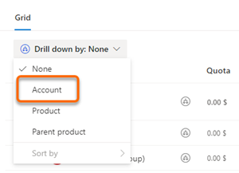
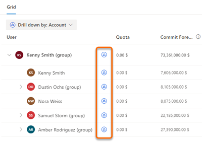

# View and understand data through drill-down entities

Through a forecast, you'll have visibility into the pipeline amounts that your sellers are projecting for the period. Now you might want to know which accounts contribute to a specific seller's Committed value or maybe you want to know which products are contributing to a different seller's Won value. You can use the drill-down feature to break down your seller's forecast projections as a function of the contributing factors that you care about, such as Account and Product. The drill-down feature looks at the underlying records that are contributing to the value of the rollup column and groups them according to the selected drill-down option.

By viewing drill-down data, you can understand how the records in each group are performing and set the next course of action. This helps you to plan better and achieve the targets as set in the forecast.

Let's look at an example. **Amber Rodriguez** is a seller who's associated with four accounts. Her projected revenue for the current period is $400,000. **Kevin Smith**, her sales manager, wants to understand how her revenue of $400,000 is broken down by each account. On the forecast page, Kevin chooses the Account drill-down option from the drop-down menu. Then he selects the drill-down icon beside Amber's record to view a list of accounts that make each of Amber's forecast pipeline values.

> [!div class="mx-imgBorder"]
> 

Before you start using the feature, an administrator or forecast manager must add the drill-down options to the forecast. To learn more, go to [Configure and manage drill-down entities](configure-manage-drill-downs.md).

When a drill-down option is added to your forecast, a drop-down list is displayed below the **Grid** tab. The following screenshot is an example:

> [!div class="mx-imgBorder"]
> 

## Select a drill-down option

By default, when you open a forecast, no drill-down choice is selected and the icon corresponding to each row is disabled. To enable and view the details, you must select a drill-down option. That enables the icons corresponding to each row. Select the icon to view the forecast data in a drill-down mode. To select a drill-down option, follow these steps:

1.	Open a forecast with the drill-down feature added.

2.	Select the **Drill down by** list and choose the drill-down option on which you want to break down the data. For example, **Account**.
 
    > [!div class="mx-imgBorder"]
    > 

    The icon corresponding to each row turns blue and is now active. The data in the forecast is broken down into multiple groups according to the drill-down selection (**Account**).

    > [!div class="mx-imgBorder"]
    > 

## View and understand the drill-down data

After you've selected a drill-down category, the icon for each row is active and the data is grouped according to the drill-down selection.    
>[!NOTE]
>If you are unable to view the drill-down data, see [Unable to view drill down data in a forecast grid](ts-forecasts.md#unable-to-view-drill-down-data-in-a-forecast-grid).  
For example, select the drill-down option as Account and the data in the forecast is grouped according to the accounts that are associated with the opportunities. Here we want to view the contribution of each account to the value of each category of **Kenny Smith**.   
Select the drill-down icon corresponding to **Kenny Smith**. All the accounts with values that are contributing to Kenny's forecast are displayed.    
For simple column types such as **Quota**, the values are displayed as **Not applicable** because these values are uploaded manually to forecast. Also, for the **Prediction** column, the values are displayed as **Not applicable** because the prediction values aren't based on a drill-down entity.

At the bottom of the table, a **blank** row is created with values for the opportunities that aren't related to any account.    
> [!div class="mx-imgBorder"]
> 

>[!NOTE]
>- In the example, you can observe that the sum of all accounts' drill-down data matches the forecast data. If the data doesn't match, it might be that the forecast data is old. Drill-down is always calculated on live data. Select **Recalculate** to get the latest forecasting data to match with the drill-down data. More information: [Maintain up-to-date forecast data](keep-forecast-data-up-to-date.md)
>- The forecast and drill-down data are independently calculated based on the configurations. Hence, the forecast and drill-down data might not always match. For example, in a product-based forecast, the sum of product revenue might not match the sum of opportunity values because there might be some opportunities that aren't associated with products. If you drill down the data based on products, only the associated Opportunity products will be aggregated for drill down, whereas the forecast displays the sum of all opportunities' data.
 
To view the opportunities that are affecting the forecast values of an account, do one of the following:   
-	Select an account row to show all opportunities, regardless of forecast category.
-	Select a cell in an account row to show only the opportunities that affect the roll-up column value.

> [!NOTE]
> If you edit the underlying opportunities in drill-down view, the updated values won't show in the drill-down selection. To view the updated values, close the drill-down selection and open it again. 

More information: [View and manage underlying opportunities](view-and-manage-underlying-opportunities.md)

## See also

[Project accurate revenue with sales forecasting](project-accurate-revenue-sales-forecasting.md)  
[Configure and manage drill-down entities](configure-manage-drill-downs.md)
