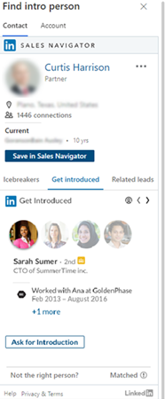
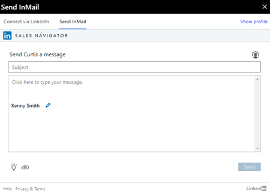

# Work with LinkedIn activities 

## Requirements
|  | |
|-----------------------|---------|
| **License** | Dynamics 365 Sales Premium  More information: [Dynamics 365 Sales pricing](https://dynamics.microsoft.com/sales/pricing/) |
| **Security Role** | Salesperson and above    See [Predefined security roles for Sales](security-roles-for-sales.md)|
|||

As a seller, you can use the LinkedIn network, which contains millions of users and offers a unique depth and quality of information you can use to research and connect with your customers. This functionality allows you to use LinkedIn Sales Navigator in your sequence to recommend the next best action.

When a sequence contains steps that are related to LinkedIn activities, you can do the following actions on the steps to interact with customers:

-	Research a customer to learn more about their preferences. More information: [Research activity](#research-activity)
-	Get introduced to a customer. More information: [Get introduced activity](#get-introduced-activity)
-	Send personal messages to connect with a customer. More information: [Connect activity](#connect-activity)
-	Send an InMail to customer. More information: [Send InMail activity](#send-inmail-activity)

## Research activity

The **Research** activity allows you to view LinkedIn profiles, including customer contact and account information, which can help you to better understand them before you start working with them.

You can do the actions as described in the following table:

|              | Up next widget | Work list item |
|--------------|----------------|----------------|
| Sample image |  | |
| Action | Select **Show profile**. | Hover over the item and then select the LinkedIn icon. |
| Close step | Select **Mark as complete** to close the step and move to next step.  -Or- Select the **More options** icon and then choose an appropriate option: •	**Skip** to ignore the step. •	**Snooze** to look into the step later. •	**Assign** to transfer the step to a different seller. | Select the **More options** icon and then choose an appropriate option: •	Select **Mark as complete** to close the step and move to next step. •	**Skip** to ignore the step. •	**Snooze** to look into the step later. •	**Assign** to transfer the step to a different seller. |

When the action is selected, the **LinkedIn Research** pane opens on the right side with information about the customer profile and account. 

The following image is an example of the research side pane:
 
>[!div class="mx-imgBorder"]
>

For more information on contacts and accounts, see [Leads Module References](/linkedin/sales/display-services/leads-screenshots) and [Accounts Module References](/linkedin/sales/display-services/accounts-screenshots), respectively.

## Get introduced activity

The **Get introduced** activity allows you to ask for an introduction to a customer from anyone within your network who's already connected to the customer. If the Sales Navigator instance has licensed TeamLink, you’ll be able to see anyone in your organization who's connected to the customer and can make the introduction.

You can do the actions as described in the following table:

|              | Up next widget | Work list item |
|--------------|----------------|----------------|
| Sample image |  | |
| Action | Select **Get introduced**. | Hover over the item and then select the LinkedIn icon. |
| Close step | Select **Mark as complete** to close the step and move to next step.  -Or- Select the **More options** icon and then choose an appropriate option: •	**Skip** to ignore the step. •	**Snooze** to look into the step later. •	**Assign** to transfer the step to a different seller. | Select the **More options** icon and then choose an appropriate option: •	Select **Mark as complete** to close the step and move to next step. •	**Skip** to ignore the step. •	**Snooze** to look into the step later. •	**Assign** to transfer the step to a different seller. |

When the action is selected, the **Find intro person** pane opens on the right side. On the **Contact** tab, select the **Get introduced** tab, and then the list of contacts who could introduce to the customer is displayed.  

The following image is an example of the get introduced side pane:

>[!div class="mx-imgBorder"]
> 

For more information on customer introductions, see [Get Introduced](/linkedin/sales/display-services/leads-screenshots#get-introduced).

## Connect activity

The **Connect** activity allows you to send connection invites along with personal messages, to solidify customer relationship and add them to your network.

You can do the actions as described in the following table:

|              | Up next widget | Work list item |
|--------------|----------------|----------------|
| Sample image |  | |
| Action | Select **Connect**. | Hover over the item and then select the LinkedIn icon. |
| Close step | Select **Mark as complete** to close the step and move to next step.  -Or- Select the **More options** icon and then choose an appropriate option: •	**Skip** to ignore the step. •	**Snooze** to look into the step later. •	**Assign** to transfer the step to a different seller. | Select the **More options** icon and then choose an appropriate option: •	Select **Mark as complete** to close the step and move to next step. •	**Skip** to ignore the step. •	**Snooze** to look into the step later. •	**Assign** to transfer the step to a different seller. |

When the action is selected, the **Connect via LinkedIn** pane opens on the bottom-right side. On the **Connect via LinkedIn** tab, you can see the default message used to connect with the customer.

The following image is an example of the connect message side pane:

>[!div class="mx-imgBorder"]
> 

For more information on connecting with a customer, see [Connect](/linkedin/sales/display-services/leads-screenshots#connect).

## Send InMail activity

The **Send InMail** activity allows you to directly message customers you’re not already connected to on LinkedIn.

You can do actions as described in the following table:

|              | Up next widget | Work list item |
|--------------|----------------|----------------|
| Sample image |  | |
| Action | Select **InMail**. | Hover over the item and then select the LinkedIn icon. |
| Close step | Select **Mark as complete** to close the step and move to next step.  -Or- Select the **More options** icon and then choose an appropriate option: •	**Skip** to ignore the step. •	**Snooze** to look into the step later. •	**Assign** to transfer the step to a different seller. | Select the **More options** icon and then choose an appropriate option: •	Select **Mark as complete** to close the step and move to next step. •	**Skip** to ignore the step. •	**Snooze** to look into the step later. •	**Assign** to transfer the step to a different seller. |

When the action is selected, the **Send InMail** pane opens on the bottom-right side. Go to the **Send InMail** tab, enter a subject, message, and any attachments if necessary, and then select **Send**. The InMail is sent to the customer.

> [!NOTE]
> To view the profile of the customer, select **Show profile**.

The following image is an example of the InMail side pane:

>[!div class="mx-imgBorder"]
> 
 
For more information on sending InMail, see [Send an InMail Message](https://www.linkedin.com/help/linkedin/answer/437).

### See also

[Add LinkedIn activities to sequence](linkedin-activities-sequence.md)

[!INCLUDE[footer-include](../includes/footer-banner.md)]
