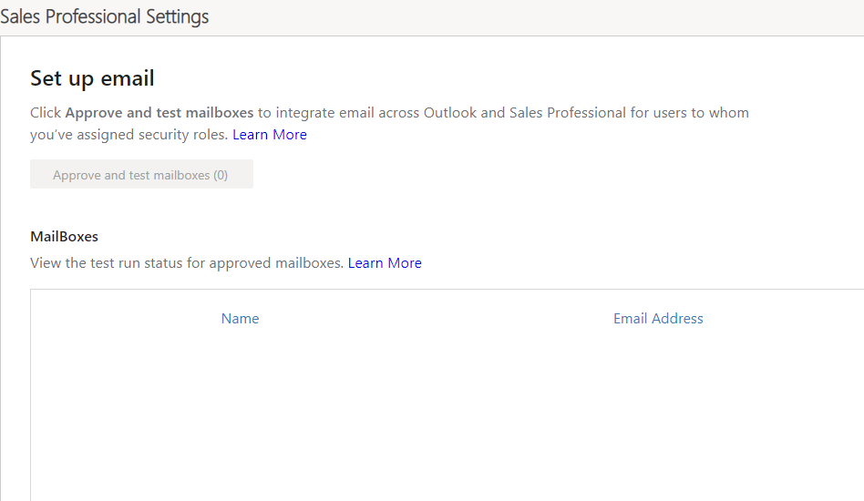
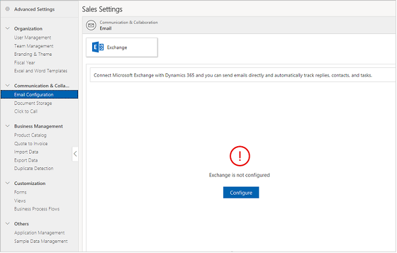

# Configure email in Dynamics 365 for Sales Professional by integrating with Exchange

To store email and other messaging records in Dynamics 365 for Sales Professional, you need to synchronize it with your email system.

Dynamics 365 for Sales Professional uses server-side synchronization to synchronize your email system with Dynamics 365 for Sales.

## What is Server Side Synchronization?

Using server-side synchronization makes messaging data available to a web browser, tablet, or smartphone that is running Dynamics 365 for Sales
Professional.

Server-side synchronization provides direct Dynamics 365 for Sales Professional-to-email server synchronization. When you use Exchange, you can
synchronize email, contacts, tasks, and appointments.

Some features offered by server-side synchronization include the following: 

-  Email folder tracking. You can simply drag email to a folder to track it. Folder tracking works on any mobile device that supports Microsoft Exchange, which
means you can track email from just about any device.

-  Support for Dynamics 365 App for Outlook. You can track incoming email with the new Dynamics 365 App for Outlook. Dynamics 365 App for Outlook works
    with Outlook on the web. So, all you need is a browser to track incoming email.

## Prerequisite for Exchange integration

To configure Exchange, you must have:

-   System Administrator or Sales Professional Manager role

-   Office 365 subscription.

-   Exchange Online subscription

For more information about managing subscriptions, see [Manage Microsoft Dynamics 365 (online)
instances](https://go.microsoft.com/fwlink/?linkid=730725).

1.  In the site map, select **Sales Settings**, and then under **Standard settings**, select **Set up email**.

2.  If your organization has an Exchange subscription, skip to Step 5.

3.  If you don’t have an Office 365 subscription, you’ll be prompted to purchase an Office 365 subscription. Select the link to purchase an Office 365
    subscription.

    

4.  After you purchase a subscription, go to **Set up email**. This time, Exchange will be automatically detected.

5.  If an Exchange subscription is detected but Exchange isn’t configured, you’ll get an option to configure Exchange.

    > [!Important]     

    > If Exchange is already configured for any user in your organization, instead of the Configure button, the user’s mailbox will appear. To configure mailboxes for other users, you must add the users in **Advanced Settings** > **User Management**. When you do this, their mailboxes will automatically appear here, which you can test and enable later.

    

6.  Select **Configure**. A consent dialog box opens.

7.  In the consent dialog box, select **I Agree**.

    >   [!Note]

    >   The integration won’t work unless you agree.

9.  When you select I Agree, the following happens:

    1.  Server-side synchronization is automatically enabled and configured at the system (organization) level.

        -   The email server profile is set to Exchange Online (automaticallycreated when a new Dynamics 365 instance is provisioned). The email
            server profile stores settings that are used by server-side synchronization to connect to an email server and process email for
            the associated mailboxes.

        -   Incoming Email, Outgoing Email, and Appointment, Contacts, and Tasks are all set to use Server-side synchronization

    2.  When Exchange is configured, the following happens:

        -   Existing user mailboxes that have valid Exchange licenses are automatically approved. Approval of mailboxes is required for the
            mailbox can process email. The incoming and outgoing email configuration of the selected mailboxes is tested, and mailboxes are
            then enabled for processing email.

            > [!Important]

            > User mailboxes are automatically approved and enabled only when the primary email of the user is equal to the user's UPN (User Principal Name attribute).      

        -  For newly added users, you must manually test and enable the mailboxes.

    3. All these user mailboxes are automatically approved. A mailbox needs to be approved before it can process email.

    4. The incoming and outgoing email configuration of the selected mailboxes is tested, and mailboxes are then enabled for processing email.  
      
        > [!Note]
        
        > If an error occurs in a mailbox, an alert is sent to the user of the mailbox. You can also see the alert when you open the mailbox record. The
        **Test Run Status** column is set to Failure for the mailbox. You mustselect all such mailboxes, and test and enable them. More information: [Test
        and enable mailboxes](#test-and-enable-mailboxes).  `  
        
    5.  Dynamics 365 App for Outlook is automatically enabled for all the users.

## Test and enable mailboxes

The Test Run column shows the status of the test performed on the mailboxes. If an error occurs while testing any of the mailbox, it’s status is set to Failed
and the user of the mailbox is sent an alert.

As an administrator, you must select all such mailboxes, select the **More Commands** icon, and then select **Test and Enable**.

The error must automatically resolve now. If the error persists, please contact Support.

### See Also

[Overview of Dynamics 365 for Sales Professional](sales-professional-overview.md)  
[Quick Setup & Advanced Settings overview](standard-advanced-settings-overview.md)
