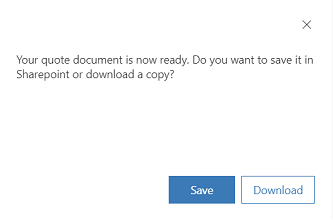

# Create PDF documents from sales records

Create and share professional-looking PDF documents for sales records by generating a PDF document using a standard template from your organization. 

The capability to create PDF documents is available on the following entities: Account, Contact, Lead, Opportunity, Order, Quote, and Invoice.

Your system administrator can choose the entities on which PDF generation is enabled. 

> [!IMPORTANT]
> If you do not see the **Create PDF** and **Email as PDF** options on one of the supported entity records, it might be because your system administrator hasn't enabled the PDF-generation capability for that entity. In this case, check with your system administrator.

1.	Open a quote record.

2.	On the command bar, select **Create PDF** and then select a template on which you want to create the PDF.  

    > [!div class="mx-imgBorder"]
    > 

    > [!IMPORTANT]
    > Templates are available out of the box for the Account, Opportunity, Order, Quote, and Invoice entities. For entities that do not have the out-of-the-box templates, you can create new templates. You can't create a PDF document for an entity record if there's no template available for that entity. 

    > [!TIP]
    > To learn more about using Word templates, see [Use Word templates to create standardized documents](../admin/using-word-templates-dynamics-365.md). 

You’ll see a dialog box with options to save the PDF or download the PDF.

> [!div class="mx-imgBorder"]
> 

If you select **Save**, the PDF document is stored in the default SharePoint site if SharePoint is configured and enabled for the Quote entity. If SharePoint isn't configured, the **Save** option saves the PDF as a Notes attachment to the Quote record in Dynamics 365 Sales. The **Download** option downloads the PDF to your local drive. After it's downloaded, you can add this document to a note, send it as an attachment in an email, or upload it to SharePoint.

> [!NOTE]
> Save a PDF to SharePoint is an early access feature. You can opt in early to enable these features in your environment, which will allow you to test these features and then adopt them across your environments. For information about how to enable these features, see [Opt in to 2020 release wave 1 updates](https://aka.ms/EarlyAccessOpt-in). 

## Email as a PDF document

You can also generate a PDF document and directly email it to a customer.

1.	Open an entity record. For example, open a quote record.

2.	On the command bar, select **Email as PDF** and then select a document template.

    > [!div class="mx-imgBorder"]
    > 
    
    An email form opens. 
    
    The following information is automatically populated.

    |Field             |	Populated with                                 |
    |------------------|-------------------------------------------------| 
    |**To**                |	Potential customer, if applicable                |
    |**From**	             |  Current user                                   |
    |**Attachments**       |	The generated PDF, added as an attachment         |
    |**Regarding**	       |  Record from which the email was triggered| 
    |**Subject**	         |  Title of the record                                    |

3.	Verify and change any details in the email form, and then select **Send**.

> [!IMPORTANT]
> The time taken to generate the PDF document and download or send email is dependent on the size of the file. You'll see optimum performance when the file size is less than 2 MB. Larger files can require considerably more response time.

### See also

[Enable PDF generation from sales records](enable-pdf-generation-quote-sales-professional.md)  
