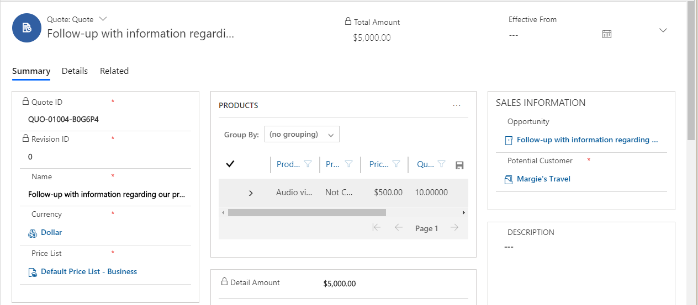
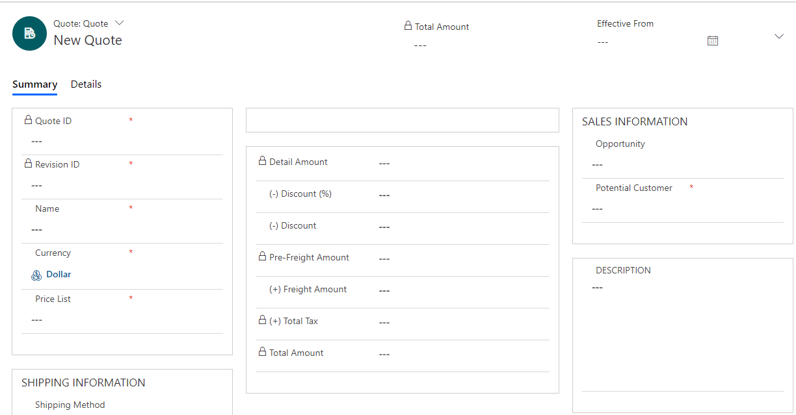

# Create and manage quotes in Dynamics 365 for Sales Professional

Most sales begin with a price quote in Dynamics 365 for Sales Professional. A quote is a formal offer for products proposed at specific prices and related payment terms, which you send to an opportunity, account, or contact. 

If you’ve created your quote from an opportunity, you may have already added products that your customer is interested in to the opportunity. When you create a quote from the opportunity, all the products are already added to the quote.

You’ll probably edit a quote multiple times as a sale progresses. Initially, you create a draft, and then you need to activate it when it’s ready to go to a customer.

When the customer accepts the quote, and you are ready to ship the products, you create an invoice. Otherwise, you close the quote as revised, canceled, or lost.

## Create a quote from an opportunity

1.  In the site map, select **Opportunities**.

2.  Select the opportunity you want to create a quote for.

3.  On the command bar, select **Create Quote**.

    The quote form opens.

    

4.  Type shipping and payment information in the **Shipping Information** area of the **Quote** screen.

5.  Type the billing and shipping addresses in the **Addresses** area of the **Quote** screen.

6.  To add products from your opportunity to your quote, on the command bar of the Quote form, select **Get Products**. You add more products or remove existing ones from the **Quote Products** grid.

7.  In the **Products Summary** area, enter all the information you have available. If you are adding a discount, add a percentage or amount, or both.

8.  Select the **Save** button at the bottom right corner of the screen.

9.  When your quote is ready to send to your customer, select **Activate Quote** at the top of the screen.

## Create a new quote

1.  In the site map, select **Quotes**.

2.  Select **New**.

    The quote form opens.

    

3.  Add your quote information.

4.  To add products from your opportunity to your quote, select **Get Products** at the top of the **Quote** screen and select **OK**.

5.  In the **Sales Information** area, select the potential customer you’re creating this quote for. If the record doesn’t already exist, you can create a new one.

6.  In the **Shipping Information** area, type shipping details.

7.  In the **Addresses** area, type shipping and billing addresses.

8.  Select the **Save** button at the bottom right corner of the screen.

9.  When your quote is ready to send to your customer, select **Activate Quote** at the top of the screen.

## Email a quote

When you’ve added all the details to the quote, you can send it to the customer. To directly send an email to customer with a quote attached, open the quote, and on the command bar, select **Send by Email**.

 "Send By Email command bar button"

### See Also

[Develop sales from lead to cash in Dynamics 365 for Sales Professional](develop-sales-lead-to-cash-sales-professional.md)  
[Overview of Dynamics 365 for Sales Professional](sales-professional-overview.md)
