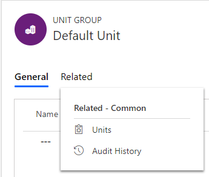

Create unit group and add units
===============================

Units are the quantities or measurements that you sell your products or services
in. For example, if you sell gardening supplies, you might sell seeds in units
of packets, boxes, and pallets. A unit group is a collection of these different
units.

1.  Make sure that you have the System Administrator or Sales Professional
    Manager role of equivalent permissions.

2.  In the site map, select **Units**.

3.  Select **+New**.

>   The Create Unit Group dialog box opens.

>   A screenshot of a cell phone Description automatically generated

1.  Fill in your information, and select **OK**:

>   a. **Name**. Type a meaningful name for the unit group. In our example, you
>   would type "Televisions."

>   b. **Primary Unit**. Type the lowest common unit of measure that the product
>   will be sold in. In our example, you would type "Piece." Other examples
>   could include box, cartons, ounces, hours, or tons, depending on your
>   product.

1.  To add units to the unit group, open the unit group you just created, then
    select the **Related** tab, and then select **Units**.

>   A screenshot of a cell phone Description automatically generated

1.  On the **Units** tab, you’ll see that the primary unit is already added.
    Select **Add New Unit**.

>   A screenshot of a cell phone Description automatically generated

1.  In the **Quick Create: Unit** form, fill in the following, and select
    **Save**:

>   a. **Name**. Type a meaningful name for the unit. In our example, you would
>   type "box."

>   b. **Quantity**. Type the quantity that this unit will contain. For example,
>   if a box contains 2 pieces, you would type "2."

>   c. **Base Unit**. Select a base unit. The base unit will establish the
>   lowest unit of measurement for the unit you're creating. Using our example,
>   you would select "Piece."

>   A screenshot of a cell phone Description automatically generated
