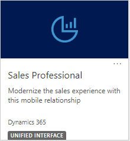
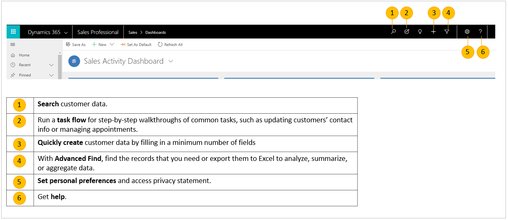
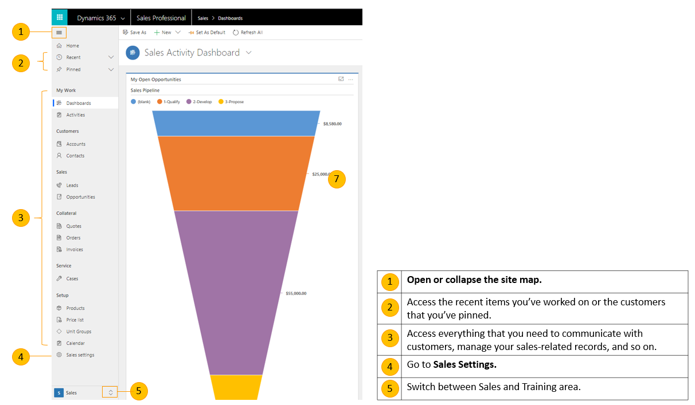

# Learn the basics of Dynamics 365 for Sales Professional

Start here to onboard quickly and learn about the Sales app and its user
interface.

## Go to Sales Professional app

1.  Sign in to Office 365, select the Office 365 app launcher, and then select the icon for **Dynamics 365**.

    

    >   [!Note]

    >   The apps available to you in the app launcher depend on your subscription.

2.  In the Dynamics 365 Home page, select the tile for Sales Professional

    

## Find your way around the app
----------------------------

The Sales Professional app is designed so that you can access the tools and customer data you need quickly when you need them.

### Nav bar at the top

The nav bar at the top of every screen includes buttons for common tasks like searching for customer data or entering records. The nav bar also includes
access to tools that help you manage your deals, such as a guided task flow that walks you through common sales tasks,

### Menu on the side

Select the Site map icon to see a list of all your options in one place, including access to communication tools like email and customer records, your
calendar, and settings. You’ll also find quick access to any favorite customers you’ve pinned and your recent work, so you don’t have to waste time backtracking.

## Understand the data in the app

Every day, you’ll work with different customer records and record types as you move customers through your business processes, collecting the data you need to
fill in the fields for their records—and ultimately to win their business.

-   What’s a record? In Dynamics 365, a **record** is a complete unit of information such as all the information about a single contact. You can think of it as a row in a table. For example, each time you add a new account to the app, you’re creating a new record in the Sales Professional app.

-   What’s a record type? Each record you add to the system belongs to a certain **record type**, such as an account, contact, lead, or opportunity.

## Quick create – Enter new records fast

The Quick Create command makes it fast and easy to enter almost any type of information into the system. The command is on the navigation bar (also referred
to as the nav bar), so it’s always available whenever you need to enter new info into the system.

With Quick Create, you need to complete only a few fields. Later, when you have more time or more information, you can fill in more details.

1.  On the nav bar, select the **New** button , and then select the item you want.

2.  Fill in the fields, and then select **Save**.

## Business processes in Dynamics 365 for Sales Professional

Business processes help everyone follow best practices, even when handling situations that don’t occur very often. You complete a step by entering data or
marking the step completed in the process bar at the top of the screen. When all the steps are done, you can move on to the next stage.

There are three ready-to-use business processes that you can use as you move your leads through a sales process:

    -   Lead to invoice. This business process flow is available on:

        -   All leads

        -   On opportunities created from leads

    -   Opportunity sales process. This business process flow is available on:

       -   All directly created opportunities (not originating from lead) forms

### See Also

