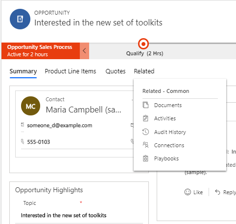
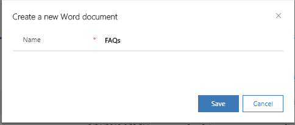
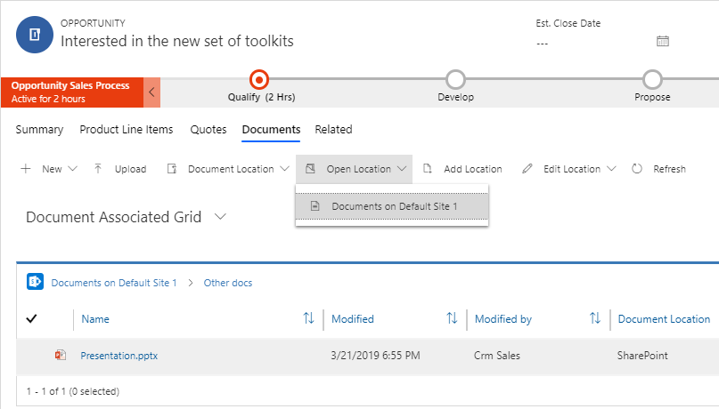
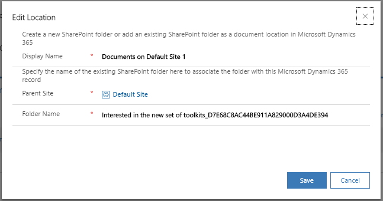

# Manage your SharePoint documents and document locations in Dynamics 365 for Sales Professional

With Dynamics 365 for Sales Professional, you can store your documents on SharePoint and manage them from within your app.

The documents that you create in the Sales app are stored on SharePoint, and are automatically synced to your desktop and mobile devices.

>   [!Note] 

>   Before you can use SharePoint to store the documents, it must be enabled by your system administrator.

>   [!Important]

>   This feature requires that you have an Office 365 subscription or a subscription to an online service such as SharePoint.

## What record types support document management?

By default, SharePoint is enabled on the following entities:

-   Account

-   Contact

-   Lead

-   Opportunity

-   Quote

-   Invoice

-   Product

-   Appointment

-   Task

-   Phone Call

## Where do you access the documents from?

For record types that support document management, open the record, select the **Related** tab, and then select **Documents**.

## What happens when you navigate to the Documents tab first time?

When SharePoint is enabled, for record types that support document management, a default document location (folder) is automatically created on SharePoint the
first time you go to the **Documents** tab. The name of the document location is in the following format: <record_name>_<record_id>.

## View existing SharePoint documents

Open a view with a document grid.

For example,

1.  In the site map, select **Opportunities**

2.  Select the **Related** tab, and then select **Documents**.

    

3.  Select **Document Location** to filter the document list. Select from the available document locations.

## Create a new document

To create a new SharePoint document in your app:

1.  Go to the record you want to create the document for, and select the **Documents** tab.

2.  Navigate to the document location and folder where you want to create this new document.

3.  Select **New**, and then choose a document type such as Microsoft Word, Microsoft Excel, Microsoft PowerPoint, or OneNote.

    You can also create a folder from here.

4.  In the **Create a New Document dialog** box, enter a document or folder
    name.

    

5.  Select **Save**.

    The document is created in the folder of the current document location you’re in.

    If you create a folder, you’ll be able to see a folder hierarchy at the top of Documents list.

    

    Select the folder name to navigate between the folders.

## Upload a document

To upload existing document to SharePoint from your app:

1.  Go to the record you want to create the document for, and select the **Documents** tab.

2.  Select **Upload.**

3.  Select the file you want to upload. You can select only one file at a time.

    -   The document is created in the folder of the current document location
    you’re in.

    >   [!Note] 
    
    >   -  You can upload a file of up to 50 MB of size. 
    
    >   -  If your internet connection is slow, you may get an error while uploading large files.

4.  If files with the same name exists in SharePoint, select if you want to overwrite the files.

5.  Select **Upload**.

## Manage SharePoint locations

You may create new or edit existing SharePoint locations from your app.

In the **Documents** list

1.  To open the location, on the command bar, select **Open Location**, and then
    select the location.

    

2.  To edit the location, on the command bar, select **Edit Location** > <location name>.

    The **Edit Location** dialog box appears.

    

3.  The display name, parent site, and folder name is automatically populated. Provide the new location details, and select **Save**.

4.  To add a location, on the command bar, select **Add Location**.

    The **Add Location** dialog box appears.

    

5.  The display name, parent site, and folder name is automatically populated. Change the details if required, and then select **Save**.

## Create folders

1.  To create folders to store documents, on the command bar, select **New** > **Folder**.

2.  In the **Create a New Folder** dialog box, enter a name of the folder, and select **Save**.

>   [!Note]

>   If your folder name contains a slash (/), Dynamics 365 for Sales Professional creates nested folders. For example, if you enter the folder name as Bike/2001, two folders are created: "Bike" and "2001". The 2001 folder is created inside the Bike folder.

## Actions on documents

When you select one or more documents in the Documents list, you can take the
following other common SharePoint actions on the documents:

-   Edit

-   Delete

-   Check in

-   Check out

-   Discard check out

-   Edit properties

### See Also

[Configure Dynamics 365 for Sales Professional to integrate with SharePoint](connect-with-sharepoint.md)  
[Manage your customers](manage-accounts-contacts.md)   
[Overview of Dynamics 365 for Sales Professional](sales-professional-overview.md)
