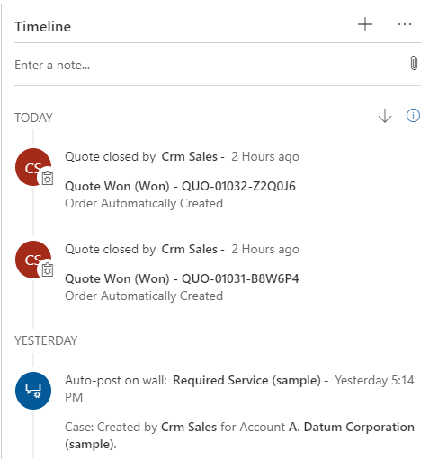
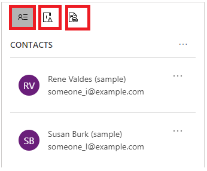
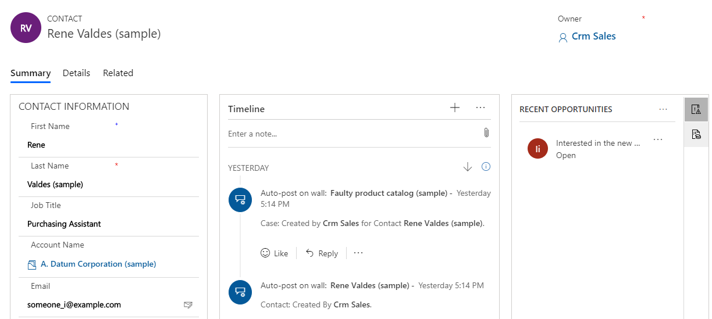

Manage your customers
=====================

In Dynamics 365 for Sales Professional, accounts and contacts records types are
used to store information about your customers.

Accounts are organizations you do business with, and contacts are individual
people with whom you have a relationship. A contact may or may not be associated
to an account.

Accounts and contacts share a one-to-many relationship, which means that a
single account can have multiple contacts.

You can add accounts or contacts manually or use the Import wizard in your Sales
app to get in all your customer data in to the system.

Create or edit an account
-------------------------

1.  Select the site map icon

    

    , and then select **Accounts**.

2.  To create a new account, select **New**.

-   \-OR-

    To edit an existing account, open the account.

1.  Fill in or change the information. Don’t know what to enter in a field?
    Hover over the field name to see a tooltip.

>   Required fields are marked with a red asterisk (\*). Here are some important
>   fields in the account record:

>   A screenshot of a cell phone Description automatically generated

Account form showing the Summary tab

>   **Summary tab.** Use the summary tab to store all the primary information
>   about the account. This is the tab you’ll use the most.

>   The left pane includes fields like:

>   \- **Primary Contact.** The main person you are working with at this
>   account.

>   \- **Account Name.** The name of the organization you do business with. This
>   name is used in searches, reports, and lookup fields related to accounts.

>   \- **Parent Account**. The parent organization of an account. The parent
>   account must also be added as an account first to be able to choose it as a
>   parent account. - The middle pane, which is called a timeline, records all
>   the activities related to the account or the communication with the account.
>   - The right pane shows everything that’s happening with the account. In
>   other words, it shows related records to the account.

>   The **Timeline** pane shows all the activities with the account.

>   A screenshot of a cell phone Description automatically generated

>   The last pane has three tabs that show the contacts of the account, the
>   recent opportunities with the account, and the recent invoices generated for
>   them.

>   A screenshot of a cell phone Description automatically generated

>   **Details tab (Company Profile).** This is used for track important profile
>   information about an account like their industry, number of employees or
>   annual revenue.

1.  Select **Save**.

Create or edit a contact
------------------------

Typically, contacts are associated with an account. However, in some cases,
contacts won’t have an associated account.

Account and contact forms are very similar as they store similar information
about the customers.

To create or edit a contact

1.  Select the Site Map icon Menu icon, and then select **Contacts**.

2.  To create a new contact, select **New**.

-   \-OR-

    To edit an existing contact, open the contact record.

1.  Fill in or change the information. Don’t know what to enter in a field?
    Hover over the field name to see a tooltip.

-   Here are some important fields of a contact record:

    

    Contact form showing the Summary tab

    The **Summary** tab stores all the primary information about the contact.

    The left pane includes important details like the following:

    -   **Full Name.** This is combination of First Name and Last Name. 

    -   **Account Name.** This points to the account record this contact is
        associated with.

    -   **Contact Info.** Fields like Email, Business Phone, and Mobile Phone
        fields store the contact details of the contact.

    The rest of the sections are similar to that of an account form.

1.  Select **Save** on the lower right corner.

### See Also

Develop sales from lead to cash in Dynamics 365 for Sales Professional  
Overview of Dynamics 365 for Sales Professional
