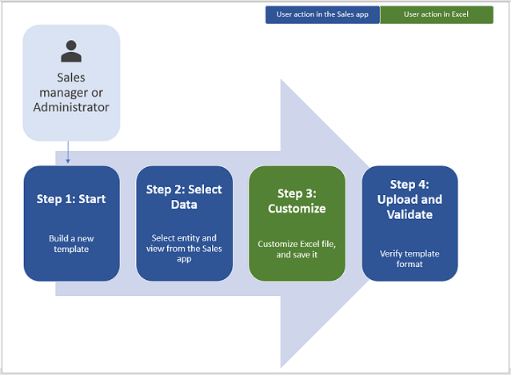
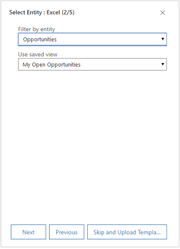
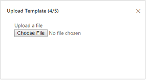
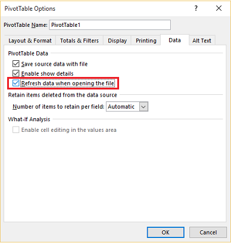

Create and manage Excel templates in Dynamics 365 for Sales Professional
========================================================================

Microsoft Excel provides powerful ways to analyze and present your Dynamics 365
for Sales Professional data. With Excel templates, you can easily create and
share your customized analysis with others in your organization.

You can use Excel templates for:

-   Sales Forecasting

-   Pipeline Management

-   Leads Scoring

-   Territory Planning

-   And much more…

Try out the Excel templates included with Microsoft Dynamics 365 for Sales
Professional to get a quick view of what kind of analysis is possible. The
Pipeline Management template is shown here:

Excel template for pipeline management

Templates display information from the view defined for a record type (entity).
There are four steps for creating an Excel template.

Steps to create an Excel template

Step 1: Create a new template from existing data
------------------------------------------------

1.  Make sure you have the System Administrator role in Dynamics 365 for Sales
    Professional.

2.  In the site map, select **Sales Settings**.

3.  Under **Advanced Settings**, select **Excel and Word Templates**.

4.  Select **New template**.

5.  In the **Create Template Type** pane, select **Excel Template**, and then
    select **Next**.

    

>   Select template type in the Create Template wizard

>   Select template type in the Create Template wizard

1.  Select an entity to which the template applies. The template will use data
    from this entity. The views you can select in the next field depend on the
    entity you select.

2.  The view defines the query used to display records and the columns or fields
    that are shown. Select a view, and then select **Next**.

>   Select entity in the Create Template wizard

>   Select entity in the Create Template wizard

1.  In the **Download Template** page, select **Download**.

2.  To upload the template later, select **Upload the template** later check
    box, and then select **Next**.

3.  To upload the template back after you customize the data, go to the list of
    templates, and then select **Upload Template**. More information: [Upload
    the template and share it with
    others](#step-3-upload-the-template-and-share-with-others)

Step 2: Customize the data in Excel
-----------------------------------

Open the newly-created template in Excel to customize the data.

Excel template with data

Let’s walk through a simple example of customizing an Excel template using
Dynamics 365 for Sales Professional sample data.

Example customization of Opportunities data

1.  Select Enable Editing to allow customization of the Excel spreadsheet.

2.  Add a new column and name it “Expected Revenue”.

>   Add a column in Excel template

>   Add a column in Excel template

1.  Create a formula for expected revenue. Don’t refer to cells using their
    addresses; define and use names instead.

>   Create formula to calculate expected revenue in Excel

>   Create formula to calculate expected revenue in Excel

1.  Create a pivot table and chart.

>   Place user-added content above or to the right of the existing data table.
>   This prevents the content from being overwritten if you add new data in
>   Dynamics 365 for Sales Professional later and you create a new Excel
>   template.

>   For more information, see: [Best practices and considerations for using
>   Excel
>   templates](#best-practices-and-considerations-for-using-excel-templates).

>   Create a PivotTable in Excel file

Create a PivotTable in Excel file

1.  Save the spreadsheet.

You’re now ready to upload the Excel template into Dynamics 365 for Sales
Professional.

Step 3: Upload the template and share with others
-------------------------------------------------

When you have your Excel template customized the way you want, you can upload it
into Dynamics 365 for Sales Professional.

Administrators can use the **Advanced Settings** page to upload the Excel
template into Dynamics 365 for Sales Professional.

>   [!Note] Users in your organization can see the templates available to them
>   by selecting the **Excel Templates** button on the command bar in the list
>   of records.

Upload the Excel template into Dynamics 365 for Sales Professional

1.  Under **Advanced Settings**, select **Excel and Word Templates**, and then
    **select Upload template**.

2.  Find and upload the file.

>   create-template-wizard-step-upload-template

>   create-template-wizard-step-upload-template

1.  Select **Upload**.

You’ll see the summary of the file you’re uploading.

1.  Select **Finish**.

Best practices and considerations for using Excel templates
-----------------------------------------------------------

Here are some things you need to be aware of to create and make best use of
Excel templates in Dynamics 365 for Sales Professional.

-   **Test your Excel templates**

>   Excel has lots of features. It’s a good idea to test your customizations to
>   see that all Excel features work as expected in your templates.

-   **Data in templates and privacy concerns**

>   By default, pivot chart data is not updated when a spreadsheet is opened.
>   This can create a security issue if certain pivot chart data should not be
>   seen by users with insufficient permissions.

>   **Consider the following scenario:**

-   A Dynamics 365 for Sales Professional administrator creates a template where
    the view contains sensitive data in a pivot chart which is uploaded into
    Dynamics 365 for Sales Professional.

-   A salesperson who should not have access to the sensitive data in the pivot
    charts uses the template to create an Excel file to do data analysis.

>   **The outcome.** The salesperson might be able to see the pivot chart data
>   as uploaded by the Dynamics 365 for Sales Professional administrator
>   including access to views for which the salesperson does not have
>   permissions.

>   In addition, iOS does not support updating pivot data and pivot charts when
>   using the Microsoft Excel app on iOS devices.

>   [!Important]

>   Sensitive data should not be included in pivot tables and pivot charts.

-   **Set pivot chart data to automatically refresh**

>   By default, pivot chart data does not automatically refresh when you open
>   the spreadsheet. Other types of charts do update automatically.

>   In Excel, right-click the pivot chart, and then select **PivotChart
>   Options** > **Refresh data** when opening the file.

    

>   Define PivotTable options

Define PivotTable options

-   **Placing new data**

>   If you want to add content to the Excel template, place your data above or
>   to the right of the existing data. A second option is to place your new
>   content on a second sheet.

-   **Excel templates with images may cause an error**

>   If you attempt to view Dynamics 365 for Sales Professional data with an
>   Excel template that has an image saved in it, you may see the following
>   error: “An error occurred while attempting to save your workbook. As a
>   result, the workbook was not saved.” Try removing the image from the
>   template and reloading it into Dynamics 365 for Sales Professional.

-   **Excel templates and Office Mobile app in Windows 8.1**

>   Excel templates will not open in Windows 8.1 devices with the Office Mobile
>   app. You’ll get the following error message: “We’ve recovered as much of
>   your document as we could, but you can’t edit it. Try to open and repair the
>   document on your PC to fix the problem.”

>   This is a known issue.

>   Use table column names and range names in formulas

>   When you create Excel formulas, don’t use column titles or cell numbers.
>   Instead, use the table column names, and define names for cells or cell
>   ranges.

### See Also

Use document templates in Dynamics 365 for Sales Professional  
[Quick Setup & Advanced Settings
overview](https://microsoft.sharepoint.com/teams/crmtechreview/Shared%20Documents/Sales/Sales%20pro/quick-setup-advanced-settings-overview.md)
