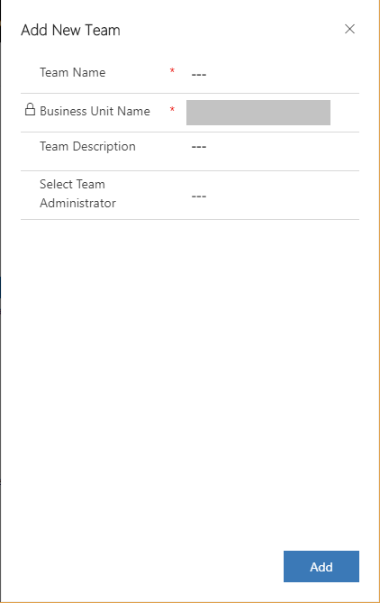

Add or manage teams in Dynamics 365 for Sales Professional
==========================================================

In Dynamics 365 for Sales Professional, a team is a group of users who share and
collaborate on business records. A user can be associated with multiple teams.

1.  In the site map, select **Sales Settings**.

2.  Under **Advanced Settings**, select **Team management**.

3.  Select **Create a team**.

4.  Enter the following details, and then select **Add**.

    -   **Team Name**

    -   **Business Unit Name**: This is defaulted to your organization name.

    -   **Team Description**: Enter a description of what the team is created
        for.

    -   **Select Team Administrator**: Select the person who will do the team
        administration, such as adding or removing members to the team.

Add New Team dialog box in Advanced Settings

Add members to the team
-----------------------

1.  In the **Team Management** page, select the team you want to add members to,
    and then on the command bar, select **Add Members**.

2.  Select the members, and then select **Add**.

Remove members from the team
----------------------------

1.  In the **Team Management** page, select the team you want to remove the
    members from, and then on the command bar, select **Remove Members**.

2.  Select the members you want to remove, and then select **Remove**.

Manage Roles
------------

When a team is assigned a role, the team members are assigned the set of
privileges associated with that role.

1.  Select **Advanced Settings** \> **Team Management**.

2.  Select a team you want to assign a role to, and then on the command bar,
    select **Manage Roles**.

3.  In the **Manage Roles** dialog box, select the security role you want for
    the team, and then select **OK**.

### See Also

Add or manage users in Dynamics 365 for Sales Professional  
[Quick Setup & Advanced Settings
overview](https://microsoft.sharepoint.com/teams/crmtechreview/Shared%20Documents/Sales/Sales%20pro/quick-setup-advanced-settings-overview.md)
