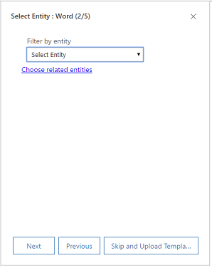
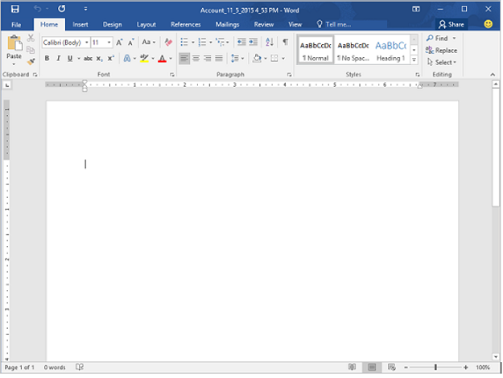
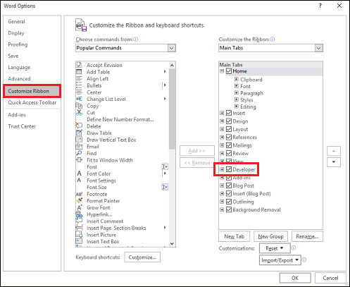
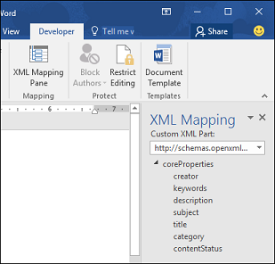
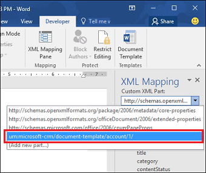
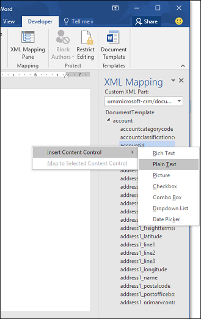
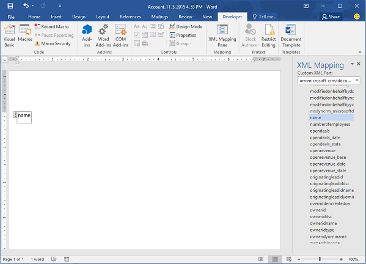
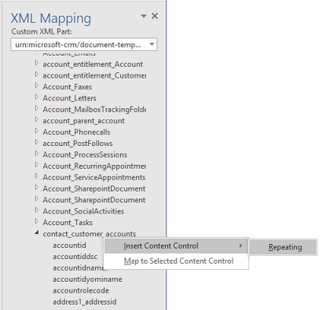

Create and manage Word templates in Dynamics 365 for Sales Professional
=======================================================================

Microsoft Word provides powerful ways to present your Dynamics 365 for Sales
Professional data in a standardized and well formatted document. With Word
templates, you can easily create and share your template with others, so all the
documents that go out to your customer have a consistent look as per your
organization’s branding.

When the templates are ready, users can generate standardized documents
automatically populated with Dynamics 365 for Sales Professional data with just
one click.

Follow the steps in this topic to successfully create Word templates in Dynamics
365 for Sales Professional.

### Step 1: Create a Word template

1.  Make sure you have the System Administrator role in Dynamics 365 for Sales
    Professional.

2.  In the site map, select **Sales Settings**.

3.  Under **Advanced Settings**, select **Excel and Word Templates**.

4.  Select **New template**.

5.  In the **Create Template Type** pane, select **Word Template**, and then
    select **Next**.

Select template type in the Create Template wizard

1.  Select an entity to which the template applies. The template will use data
    from this entity.

>   Select entity in the Create Template wizard

>   Select entity in the Create Template wizard

1.  To select the fields that you want to be included in the Word template,
    select **Choose Related Entities**. The **Choose Related Entity** dialog box
    opens.

>   The relationships you select on this screen determine what entities and
>   fields are available later when you define the Word template. Only select
>   the relationships you need to add Dynamics 365 for Sales Professional data
>   to the Word template. When you’re done selecting, select **Done**.

>   Here are some example relationships for the Account entity.

-   1:N Relationship. An account can have multiple contacts.

-   N:1 Relationship. A lead, account, or contact can have multiple accounts.

-   N:N Relationship. An account can have multiple marketing lists. A marketing
    list can have multiple accounts.

    >   [!Note] To ensure documents download in a timely matter, there is an
    >   upper limit of 100 for the number of related records returned for each
    >   relationship. For example, if you’re exporting a template for an
    >   account, and you want to include a list of its contacts, the document
    >   will return at most 100 of the account’s contacts.

1.  In the **Select Entity** dialog box, select **Next**.

2.  Select **Download** to create a Word file on your local computer with the
    exported entity included as XML data.

3.  To upload the template later, select **Upload the template later** check
    box, and then select **Next**.

4.  To upload the template back after you customize the data, go to the list of
    templates, and then select **Upload Template**.

More information: [Upload the template back into Dynamics 365 for Sales
Professional](#BKMK_Upload)

### Step 2: Enable the Developer tab

Open the Word template file. At this point, the document appears to be blank.

Blank Word template

To see and add Dynamics 365 for Sales Professional XML data, you need to enable
the Word Developer tab.

1.  Go to **File** \> **Options** \> **Customize Ribbon**, and then select the
    **Developer** check box.

>   Enable Developer tab in Word

>   Enable Developer tab in Word

1.  Select **OK**.

>   The **Developer** tab now appears in the Word ribbon.

>   Developer tab in Word

>   Developer tab in Word

### Step 3: Define the Word template

Use the XML Mapping Pane to define the Word template with Dynamics 365 for Sales
Professional entity fields.

1.  In your Word template, select **Developer** \> **XML Mapping Pane**.

>   XML Mapping Pane in the Developer tab of Word

>   XML Mapping Pane in the Developer tab of Word

>   The default XML schema is selected.

>   Default XML schema selected in XML Mapping Pane

Default XML schema selected in XML Mapping Pane

1.  Select the Dynamics 365 for Sales Professional XML schema. It will begin
    with “urn:microsoft-crm/document-template/”.

>   Select the schema for Dynamics 365 for Sales

>   Select the schema for Dynamics 365 for Sales Professional

>   [!Important]

>   If you have frequent accidental edits that cause Word to freeze or have
>   performance degradation, be sure to turn off the AutoCorrect options
>   according to the section: “A known issue and how to avoid it”.

1.  Expand the entity to see all available fields, right-click the field you
    wish to add, and then select **Insert Content Control** \> **Plain Text**.

>   Insert content as Plain Text

>   Insert content as Plain Text

>   The field from Dynamics 365 for Sales Professional is added to the Word
>   template.

>   Field added to Word doc

>   Field added to Word doc

>   Add additional entity fields, add descriptive labels and text, and format
>   the document.

>   A completed template might look like this:

>   Complete Word template

>   Complete Word template

>   Some content control fields you entered likely have multiple lines of data.
>   For example, accounts have more than one contact. To include all the data in
>   your Word template, set the content control field to repeat.

>   Set content control fields to repeat

1.  Put fields with repeating data in a table row.

2.  Select the entire table row in the template.

>   Row selected in a table

>   Row selected in a table

1.  In the XML Mapping Pane, right-click the relationship containing the content
    control fields, and then select **Repeating**.

    Set the content control fields to repeat in Word template

When you use the Word template in Dynamics 365 for Sales Professional to create
a document, the table will populate with multiple rows of data.

When the template has the fields and formatting you want, save it and upload it
into Dynamics 365 for Sales Professional.

### Step 4: Upload the Word template back into the Sales app

When you have your Word template built the way you want, save it so you can
upload it into Dynamics 365 for Sales Professional.

An administrator can use the Advanced Settings page to upload the Word template
into Dynamics 365 for Sales Professional.

>   [!Note]

>   Users in your organization can see the templates available to them by
>   selecting the **Word Templates** button on the command bar in the list of
>   records.

1.  In the Sales app, go to **Advanced Settings** \> **Excel and Word
    Templates**.

2.  Select **Upload Template**.

3.  Find and upload the file.

>   create-template-wizard-step-upload-template

>   create-template-wizard-step-upload-template

1.  Select **Upload**.

You’ll see the summary of the file you’re uploading.

1.  Select **Finish**.

### See Also

[Use document templates to create standardized
documents](#use-document-templates-in-dynamics-365-f)  
[Quick Setup & Advanced Settings
overview](https://microsoft.sharepoint.com/teams/crmtechreview/Shared%20Documents/Sales/Sales%20pro/quick-setup-advanced-settings-overview.md)
