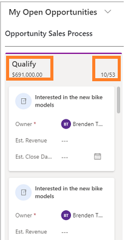
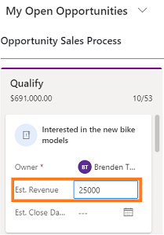
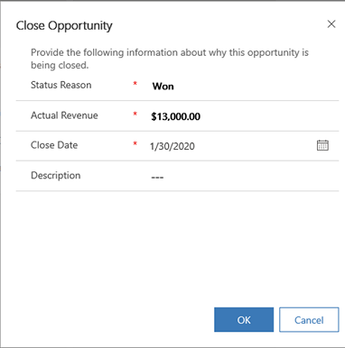
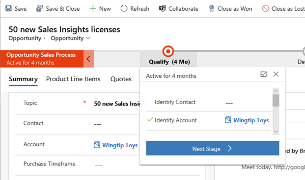

# Work with opportunities in the Kanban view (Sales Professional)

Use the Kanban view to effectively keep tabs on the sales pipeline. 

The Kanban view shows opportunities as cards. The lanes in the Kanban view represent the default statuses or business process flow stages of opportunities. The opportunity cards within the swim lanes show where in the process the opportunities are. 

You can drag the opportunities to different lanes to move them from one status or stage to another.

## Open a Kanban view

A Kanban view is available when the Kanban control is added to the Opportunity entity. If you don't see the Kanban view, talk to your system customizer.

To open the Kanban view:

1. In the site map, select **Opportunities**.
2. On the command bar, select the **More commands** icon  and then select **Show As** > **Kanban**.

    > [!div class="mx-imgBorder"]  
    >  

## Available Kanban views for opportunity records

The following two types of Kanban views are available for opportunities:

- Based on the business process flow stage (default view).
- Based on the Opportunity status.

You can switch between the views by selecting the Kanban type from the Kanban type drop-down list.

> [!div class="mx-imgBorder"]  
> 

In the status-based Kanban view, each swim lane represents a default opportunity status such as, Open, Won, or Lost.

> [!div class="mx-imgBorder"]  
> 
 
In the Business process flow-based view, swim lanes represent the stages of opportunities in the **Opportunity sales process** business process flow. 

Currently, the Kanban view is only available for the **Opportunity sales process** business process flow.

> [!div class="mx-imgBorder"]  
> 

> [!NOTE]
> If your system administrator or customizer has customized the **Opportunity sales process** business process, such as changing the stages in the business process flow, the changes are reflected in the business process flow-based opportunity Kanban view. 
 
## Know your Kanban views

Here are some important things to know about your Kanban view:
-  At the top of each lane, the total estimated revenue for the opportunities in that lane is shown. 

    > [!div class="mx-imgBorder"]  
    > 

    It also shows a count of opportunity cards in that lane. At any given point, only the first 10 records or cards will be shown in any lane. If there are more than 10 opportunity cards in a lane—for example, 50—the count shows 10/50. To see more cards, scroll down in the lane. When you scroll down, the count changes to show 20/50, and so on.
    
    > [!NOTE]
    > Aggregation of more than 50,000 records is not supported in a single swim lane. If there are more than 50,000 records, the aggregated estimated revenue is shown as blank and the total number of records are shown as 50000+.

-  Selecting the card title opens the opportunity Main form. The Main form also opens when you move cards across business process flow stages. When you close the Main form, the whole Kanban view is refreshed.

-  The card fields are editable inline. You can quickly change details for the three fields of an opportunity record right from the card.

    > [!div class="mx-imgBorder"]  
    > 

-  When you select a different view, cards in the lanes are filtered based on the selected view. 

-  You can use the **Search** box to filter the records or cards in the swim lane based on the search criteria. For example, if you enter the keyword "Interested," it will refresh the Kanban view to only show the opportunity records where the title begins with "Interested".

    > [!div class="mx-imgBorder"]  
    > 

-  You can drag a card and move it to other lanes. 

    **In the Status-based Kanban view:**

    - Moving a card to other lanes in the Status-based Kanban view opens the Opportunity status change dialog box.
    
      > [!div class="mx-imgBorder"]  
      > 
      
    - You can drag an opportunity card from the Open pane to the Won or Close lanes. 
    
    - When you move the card to the Won or Lost lanes, the opportunity record is closed. A lock is shown on the card, which means that the card (opportunity record) is inactive—you can't edit the fields on the card.
    
    - You can still reopen a closed opportunity (a locked card) by moving the card from the Won or Lost lanes to the Open lane.
    
    - When you're dragging a card to move to another lane, the lanes where the card can't be dropped appear dimmed.

    **In the Business process flow-based view:**
    
    - Moving a card to other lanes in the Business process flow-based Kanban view opens the main Opportunity form with the business process flow pop-up window.

      > [!div class="mx-imgBorder"]  
      > 

    - You can move the card from the current lane to the consecutive next or previous lane. Swim lanes where the card can't be dropped appear dimmed.

    - When you're dragging a card to move to another lane, the lanes where the card can't be dropped appear dimmed.
    
    - For all closed opportunities a lock icon is shown. The lock icon means that you can't change the information on the card inline, but you can still move the cards from one lane to another.

### See also

[Add the Kanban control to Opportunity or Activity entities](add-kanban-control-sp.md)  
[Create or edit opportunities](manage-opportunities-sales-professional.md)  

[!INCLUDE[footer-include](../includes/footer-banner.md)]
