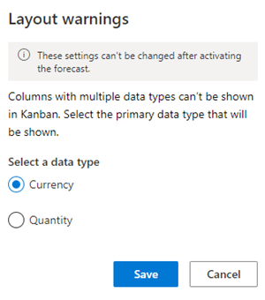
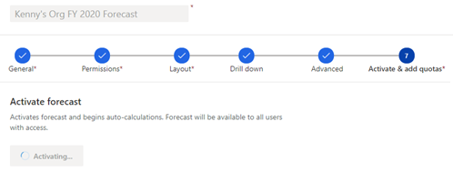

# Activate and upload simple columns data 

Activate a forecast, and download the spreadsheet template to populate quotas and simple columns data. Then, upload the spreadsheet to the forecast.

## License and role requirements
| &nbsp; | &nbsp; |
|-----------------------|---------|
| **License** | Dynamics 365 Sales Enterprise or Dynamics 365 Sales Premium  More information: [Dynamics 365 Sales pricing](https://dynamics.microsoft.com/sales/pricing/) |
| **Security roles** | System Administrator or Forecast Manager   See [Predefined security roles for Sales](security-roles-for-sales.md)|
|||

## Activate a forecast and upload simple data

Now that you've completed the required configurations for the forecast, use the **Activate & add quotas** step to activate it and make it available for users. After the forecast is active, you can download a template (Excel workbook) and upload it with data, such as quotas and simple column types, for all users who are defined in the forecast hierarchy.

> [!IMPORTANT]
> - You can have only six active forecasts at a time in your organization.
> - Use only the forecast configuration page to activate forecasts. Don't use any other options, such as **Advanced find**. 

1. If you've used different data types for columns in the forecast, an error is displayed at the top of the **Activate forecast** section. You must resolve the issue to publish and display the data in the Kanban view, deal flows, and trend charts. The following screen is an example of error:

    > [!div class="mx-imgBorder"]
    > 

    1. Select **Fix issue**. The **Layout warnings** pane opens on the right side of the page.

        > [!div class="mx-imgBorder"]
        >   

    2. Select the primary data type that meets your needs, and then select **Save**.

        > [!div class="mx-imgBorder"]
        > 

    After the error is resolved, you can continue with activating the forecast. For more information about how different data types are used in forecasts, go to [Forecast with multiple data type columns](forecast-different-data-types.md).

2. In the **Activate forecast** section, select **Activate forecast**. The configured forecast starts calculating the values for the forecast and becomes available for users in your organization. The activation might take a few minutes.
    
   > [!div class="mx-imgBorder"]
   > 
    
   After a forecast is activated, a confirmation message is displayed and the option to download the quota template becomes available.

    > [!NOTE]
    > Forecast auto-recalculation works only when the forecast is active. If the last period of the forecast has just lapsed, the forecast will continue auto-recalculating for 30 more days and then will stop.

3. In the **Upload quota and other static data for this forecast** section, select **Download simple data column template**. A template (Excel workbook) showing users in the hierarchy is downloaded to your local computer.

   > [!div class="mx-imgBorder"]
   > 

   The naming convention of the downloaded workbook is  ***forecastname*_Simple.xlsx**. For example, if you've created a forecast with the name **Kenny's Org FY 2020 Forecast**, the name of the downloaded workbook is **Kenny's Org FY 2020 Forecast_Simple.xlsx**.

4. Open the downloaded Excel workbook.

    The workbook is divided into groups of two tabs, **Direct** and **Parent**. The groups depend on the simple columns you've configured for the forecast. Each tab consists of the following columns: **Record Id**, **Hierarchy** field (and any hierarchy-related columns), and each forecast period (depends on the number of periods you've selected for the forecast). 

    For example, if you've configured a forecast by using two **Simple** columns&mdash;**Quota** and **Committed**&mdash;and specified the number of periods as **4** in 2020, the downloaded workbook will consist of four tabs: **Quota (Direct)**, **Quota (Parent)**, **Committed (Direct)**, and **Committed (Parent)**. Each tab consists of six columns – **Record Id**, **User**, **FY2020 Q1**, **FY2020 Q2**, **FY2020 Q3**, and **FY2020 Q4**.

    > [!div class="mx-imgBorder"]
    > 

    - ***Column* (Direct)** tab: This tab shows all the sales reps or territories (also called leaf nodes) in the forecasting hierarchy. Enter the forecast values. After you upload the workbook, the values will be displayed under their respective columns in the forecast grid. The values you enter for managers or parent territories on the **Direct** tab won't affect the values that you enter on the **Parent** tab (a manager or parent territory can also be working on opportunities and will have certain values as an individual).

    - ***Column* (Parent)** tab: This tab shows anyone who has direct reports in the selected hierarchy. A manager or parent territory has at least one direct report. Enter the values you want, and when the workbook is uploaded, the values will be shown under their respective columns in the forecast grid for managers or parent territories (a level above individuals).

    > [!IMPORTANT]
    > Don't change the **Record Id** values in the workbook. If they're changed, the forecast will display inaccurate values.

5. Save and close the workbook.

6. In the **Upload quota and other static data for this forecast** section, select the option to browse and upload, or drag the workbook to the upload area. You can verify the status at the bottom of the upload area.

7. After the workbook is uploaded, select **Finish**.

You're directed to the **Forecast configuration** home page, where your organization's forecasts are listed.

>[!NOTE]
>You can also upload data to simple columns using the **msdyn_ForecastApi** action. More information: [msdyn_ForecastApi](../sales-enterprise/developer/reference/custom-actions/msdyn_ForecastApi.md)

[!INCLUDE[cant-find-option](../includes/cant-find-option.md)]

---
> [!div class="nextstepaction"] 
> [Previous step: Configure advanced settings](forecast-configure-advanced-settings.md)

### See also

[Configure forecasts in your organization](configure-forecast.md)  
[msdyn_ForecastApi](../sales-enterprise/developer/reference/custom-actions/msdyn_ForecastApi.md)

[!INCLUDE[footer-include](../includes/footer-banner.md)]
