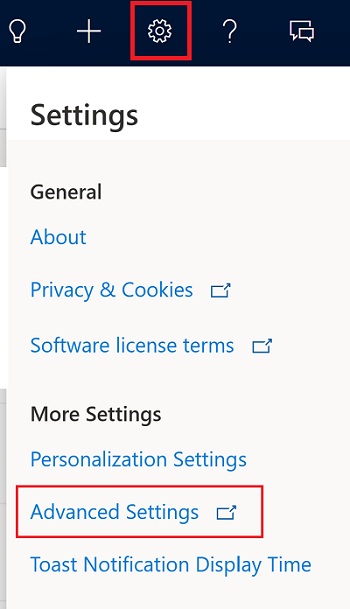
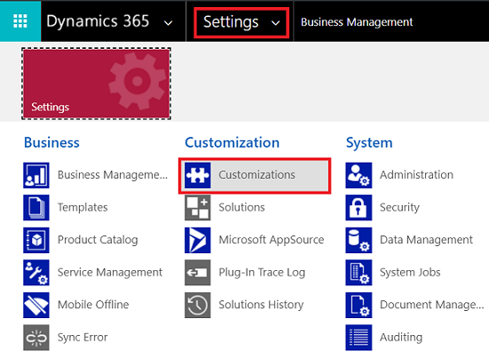
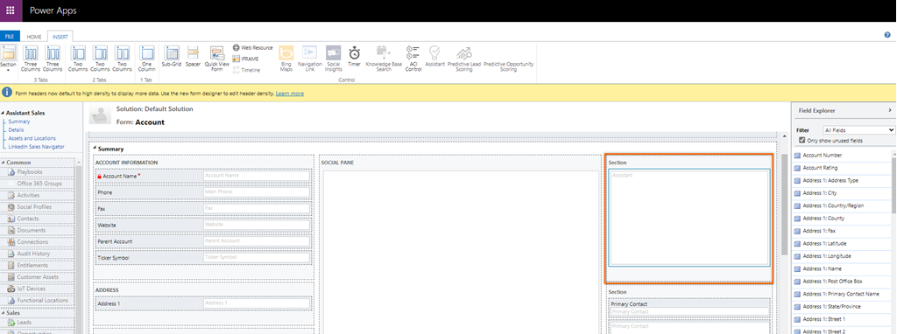

# Add the assistant widget to custom forms

By default, the assistant widget is available only in the out-of-the-box form. If you're using customized forms, you can display the assistant widget on custom forms by following the steps described in [How to add the widget](#how-to-add-the-widget).

## License and role requirements

| &nbsp; | &nbsp; |  
|-----------------------|---------|
| **License** | Dynamics 365 Sales Premium or Dynamics 365 Sales Enterprise  More information: [Dynamics 365 Sales pricing](https://dynamics.microsoft.com/sales/pricing/) |
| **Security roles** | System Administrator   See [Predefined security roles for Sales](security-roles-for-sales.md)|
|||

## How to add the widget?

>[!NOTE]
>Adding the assistant widget is only supported in Unified Interface apps.

1. Sign in to Dynamics 365 Sales Hub app and go to **Advanced settings**.

    > [!div class="mx-imgBorder"]
    > 

    The **Business Management** page opens.

2.  On the navigation bar, select **Settings**, and then select **Customizations**.

    > [!div class="mx-imgBorder"]
    > 

3.  On the **Customization** page, select **Customize the System**.

4. Under **Components**, expand *Entities*, and then the entity you want, and select **Forms**.

5. In the list of forms, select the form to which you want to add the assistant widget.

6. Go to the **Insert** tab and add a section with column to the form.

    > [!div class="mx-imgBorder"]
    > 

7. Select the added section and then on the tool bar, select **Assistant**.   

    > [!div class="mx-imgBorder"]
    > 

    The assistant widget is added to the section.

    > [!div class="mx-imgBorder"]
    > 

    >[!NOTE]
    >- When you add the widget to the form, the assistant icon in the tool bar becomes inactive and you can't add it to the same form.
    >- When you open the form and see that the assistant icon is inactive, specifies that the assistant widget is already added to the form. 

8. Save and publish the form.

[!INCLUDE [cant-find-option](../includes/cant-find-option.md)]

### See also

[Configure the assistant](configure-assistant.md)      
[Guide customer communications with assistant](assistant.md)

