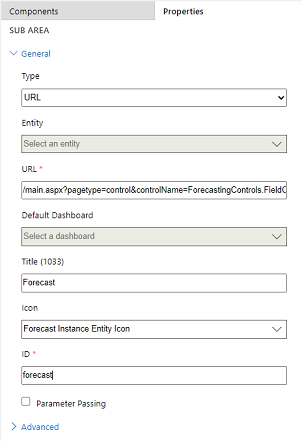

# Add the forecast grid and configuration options to a sitemap 

As the forecast grid and configurations are based on URL custom control forms, add them manually to the sitemap so that your users can access.

## License and role requirements
| &nbsp; | &nbsp; |
|-----------------------|---------|
| **License** | Dynamics 365 Sales Premium or Dynamics 365 Sales Enterprise   More information: [Dynamics 365 Sales pricing](https://dynamics.microsoft.com/sales/pricing/) |
| **Security roles** | System Administrator   More information: [Predefined security roles for Sales](security-roles-for-sales.md)|

## Add forecast grid and forecast configuration options to sitemap

When you create a custom model-driven app, you can choose a default solution to create a sitemap for the app. However, the list contains solutions that are based on entity forms only. The forecast options are based on URL custom control forms and do not appear in the solution list. You must manually add these options to the sitemap. After you add these options, users in your organization can see them on the app’s sitemap. 

Follow these steps to individually configure the sitemap for forecast grid and forecast configuration:

1.	Open your custom app on the app designer and go to the sitemap designer.

2.	Select a group from the area for which you want to add the forecast options. 

    >[!NOTE]
    >We recommend using the General area for forecast grid and the Administration area for forecast configuration.

3.	On the sitemap designer canvas, select **Add** > **Subarea**.

    OR

    From the **Components** tab, drag the **Subarea** tile to an empty box under the **Group** section in the canvas. You'll see the empty box when you move the tile to the correct place in the canvas.

4.	Select the subarea that you have created and go to the **Properties** tab.

5.	Under the **General** section, do the following:

    a.	Select **Type** as **URL**.

    b.	In **URL**:
        
       - For the forecast grid, enter: **/main.aspx?pagetype=control&controlName=ForecastingControls.FieldControls.ForecastGridPage**
        
       - For the forecast configuration, enter: **/main.aspx?pagetype=control&controlName=ForecastingControls.FieldControls.CCFForecastConfig**
    
    c.	In **Title**:

       - For the forecast grid, enter **Forecasts**.

       - For the forecast configurations, enter **Forecast configurations**.

    d.	In **Icon**, select the following:

       - For the forecast grid, select **Forecast Instance Entity icon**.

       - For the forecast configurations, select **Forecast Definition Entity icon**.
            
    e.	(Optional) If required, enter unique IDs for the forecast grid and forecast configuration. You can also use the default IDs.
    
       > [!div class="mx-imgBorder"]
       > 

6.	Save and close the sitemap designer page.

7.	Publish your custom app.

    The forecast grid and configuration options are now displayed on the sitemap.

More information: [Create a sitemap for an app using the sitemap designer](/customerengagement/on-premises/customize/create-site-map-app.md#add-a-subarea-to-a-group-in-the-site-map)

[!INCLUDE[cant-find-option](../includes/cant-find-option.md)]

### See also

[Configure a forecast in your organization](configure-forecast.md)

[Design custom business apps by using the app designer](/customerengagement/on-premises/customize/design-custom-business-apps-using-app-designer)

[!INCLUDE[footer-include](../includes/footer-banner.md)]
