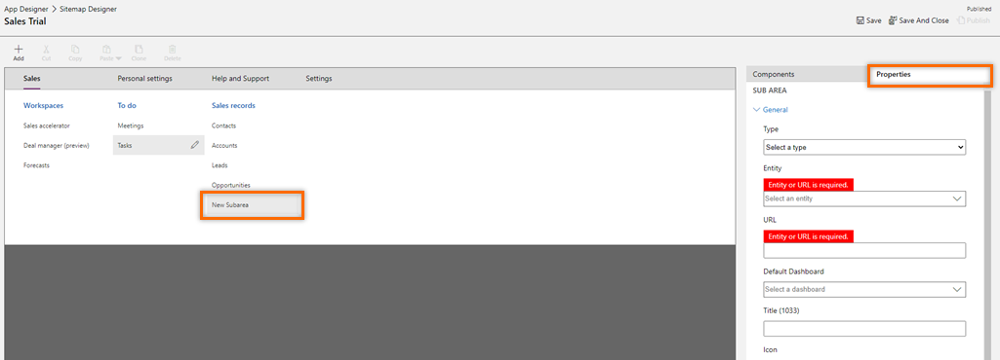
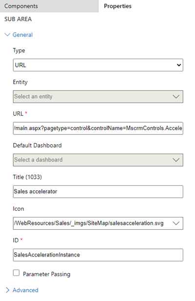

# Add the sales accelerator site map entry to custom app

Know how to add the sales accelerator site map entry to your custom app.

## License and role requirements
| Requirement type | You must have |
|-----------------------|---------|
| **License** | Dynamics 365 Sales Premium or Dynamics 365 Sales Enterprise   More information: [Dynamics 365 Sales pricing](https://dynamics.microsoft.com/sales/pricing/) |
| **Security roles** | System Administrator   See [Predefined security roles for Sales](security-roles-for-sales.md)|

## Add the site map entry to your custom app

>[!NOTE]
>Enable sales insights in your organization before you add the site map to your custom app.     

1. Open your custom app in the app designer. In the following example, the custom app **Sales SandBox** is opened.   
    > [!div class="mx-imgBorder"]
    >      
2. Open the site map designer. Select the pencil icon corresponding to the **Site Map** section.     
    > [!div class="mx-imgBorder"]
    >      
3. Select the area in which you want to add the work list entry and then select **+ Add** > **Subarea**.    
    > [!div class="mx-imgBorder"]
    >       
    In the following example, subarea entry is added to the **Sales** area under **Sales records**.     
    > [!div class="mx-imgBorder"]
    >       
4. Select **New Subarea** and go to the **Properties** tab.
    > [!div class="mx-imgBorder"]
    >        
5. In the subarea properties, enter the following values:     
    - Choose **Type** as **URL**.
    - Enter the **URL** value as `/main.aspx?pagetype=control&controlName=MscrmControls.AcceleratedSales.AnchorShellControl`.
    - Enter the **Title (1033)** for the entry. For example, **Sales accelerator**.
    - Select the **Icon** to use in the sitemap. For example, use default icon **salesacceleration.svg**. 
    - Enter the **ID** field with a unique ID value. For example, **SalesAccelerationInstance**.    
        > [!div class="mx-imgBorder"]
        >        
6. (Optional) To show or hide the section only to enabled users, go to **Advanced** and then select **Privileges**. In the **Entity** dropdown list, select **Work Queue record**.     
7. Save and publish the sitemap.
    The work list site map entry is added to your custom app.

[!INCLUDE[cant-find-option](../includes/cant-find-option.md)] 

### See also

[Configure sales accelerator](enable-configure-sales-accelerator.md)
[Add the Up next widget to an entity form](add-upnext-widget-form.md)

