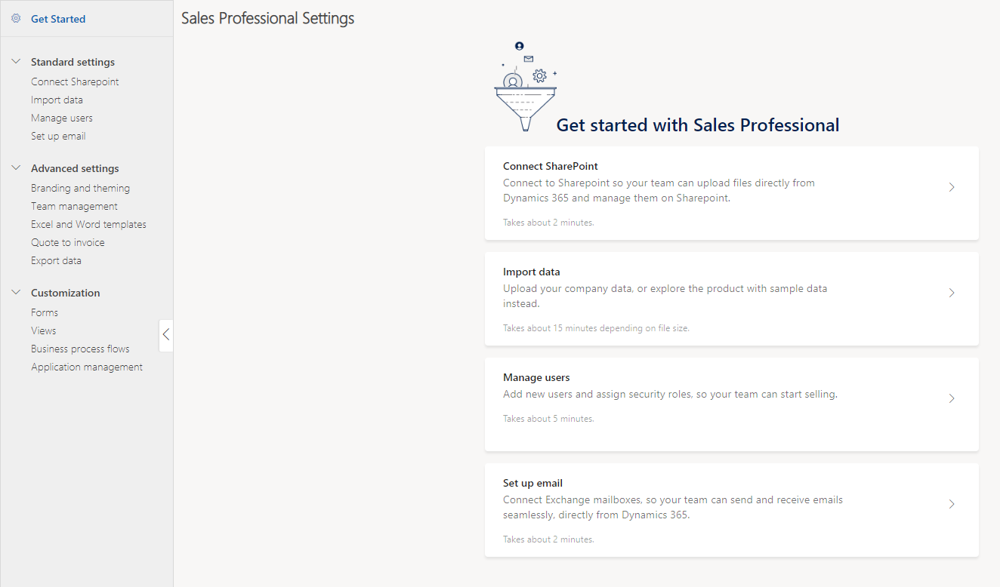
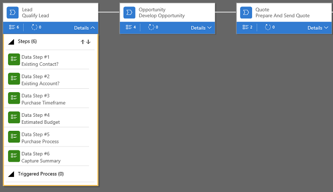

# Overview of admin settings  

Admin settings provides an organized and unified experience for administrators to easily configure the sales app from a single place.

## Requirements
|  | |
|-----------------------|---------|
| **License** | Dynamics 365 Sales Premium, Dynamics 365 Sales Enterprise, or Dynamics 365 Sales Professional  More information: [Dynamics 365 Sales pricing](https://dynamics.microsoft.com/sales/pricing/) |
| **Security roles** | System Administrator   See [Predefined security roles for Sales](security-roles-for-sales.md)|
|||

## Access admin settings

System administrators in Dynamics 365 Sales are the users who have the System Administrator role or equivalent permissions assigned. Dynamics 365 Sales offers an organized and unified experience to administrators so they can quickly and easily configure their sales app from a single place.

Depending on the Dynamics 365 Sales license you have, select one of the following tabs for specific information: 

# [Sales Premium and Sales Enterprise](#tab/SE)

To go to app settings, at the bottom of the site map, select the **Change area**  icon, and then select **App Settings**.

The **Overview** page opens. The **Overview** page is a landing page that consolidates all the sales settings in one place. You can go to individual feature settings right from here. The site map is also logically arranged so it is easier to find the settings in the site map.  

> [!NOTE]
> These settings are also available in the legacy web client but have been consolidated in one place in the Sales Hub app for ease of use. 

> [!TIP]
> By default, this new unified settings experience is available only in the Sales Hub app. To learn how to enable this experience in custom applications, see **Leverage the unified settings experience in a custom sales application** in the [Simplified system configuration in Dynamics 365 Sales](https://cloudblogs.microsoft.com/dynamics365/it/2020/03/30/simplified-system-configuration-in-dynamics-365-sales/) blog.  

# [Sales Professional](#tab/SP)

Select **Sales Settings** from the site map to manage the admin settings in Sales Professional.

### Welcome page

The Welcome page has resources to get you started—you’ll see links to videos and documentation. Go to the **Standard settings** page to start setting up the basics, or go directly to the app and start working.

### Standard settings page

The **Standard settings** page provides an intuitive experience of setting up what's most important with the fewest number of clicks. With just one click, Microsoft Exchange and SharePoint are automatically configured for you, and your users are ready to send out emails or share documents. The quick setup also lets you quickly import data, so your users have it ready in the app to start their work.

> [!div class="mx-imgBorder"]
> 

> [!TIP]
> To learn how to use the site map to go to different areas of the app, see [Site map on the side](user-guide-learn-basics.md).

### Advanced settings page

When you want more advanced-level settings to configure the app, or
you want to customize it to meet your organization’s requirements, **Advanced settings** is your one-stop shop. You can find the settings for branding and theming, teams, and maintaining templates all under one roof. The configurations are simple—you’ll be done with these in just a few clicks.

### Customize

If the Sales app does not entirely fit your business requirement, use the
drag-and-drop designers to quickly make changes that reflect the
specific information that your company needs. For example, change the pipeline phases to match your organization’s business flows, or add new fields to capture data relevant to your business—all of this without writing a single line of code.

> [!div class="mx-imgBorder"]
> 

---
[!INCLUDE [cant-find-option](../includes/cant-find-option.md)]

### See also

[Define lead qualification experience](define-lead-qualification-experience.md)  
[Enable customization of the Opportunity Close form](enable-opportunity-close-customization.md)  
[Set up enhanced email](set-up-enhanced-email.md)  
[Enable or disable saving of business card image](retain-business-card-image-after-scanning.md)  
[Enable or disable PDF generation from sales records](enable-pdf-generation-quote.md)

[!INCLUDE[footer-include](../includes/footer-banner.md)]
