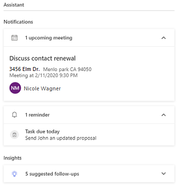
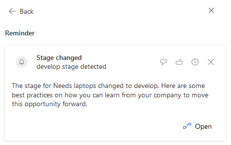
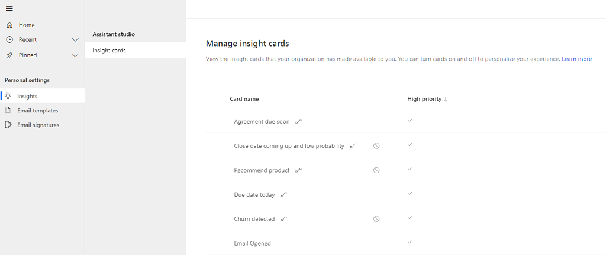
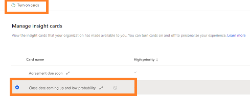

# Use the assistant to guide customer communications 

The assistant (formerly known as Relationship Assistant) is part of Dynamics 365 Sales Insights. The assistant keeps an eye on your daily actions and communications, and helps you stay on top of your day with insight cards that are displayed prominently throughout the application to provide tailored and actionable insights. 

Some ways the assistant reminds you of upcoming activities are:

- Evaluating your communications and notifying you when a contact or account has been inactive for a while.

- Identifying email messages that might be waiting for a reply.

- Alerting you when an opportunity is nearing its close date.
  
> [!NOTE]
> The administrator must enable assistant before you can try it out. For complete details about prerequisites, how to enable the feature, and how to set it up, see [Configure the assistant](configure-assistant.md).

## License and role requirements
|  | |
|-----------------------|---------|
| **License** | Dynamics 365 Sales Enterprise or Dynamics 365 Sales Premium  More information: [Dynamics 365 Sales pricing](https://dynamics.microsoft.com/sales/pricing/) |
| **Security Role** | Salesperson and above    See [Predefined security roles for Sales](security-roles-for-sales.md)|
|||

## How and where the assistant can help you  

The assistant works by analyzing the data at its disposal and generating a collection of insight cards, each of which includes a message that summarizes the content of the card and presents a set of actions. The assistant sorts the cards by priority and filters them for your current context. You can access the assistant in a variety of ways in the Sales Insights app.

> [!NOTE]
> The locations where you access the assistant might vary depending on the configuration set by your administrator. 

- **Navigation bar**: When you select the bulb icon to open the assistant, insight cards are displayed in a pane as shown in the following example.

   > [!div class="mx-imgBorder"]
   > 

- **Dashboards**: The following image shows an assistant widget displayed on the **Sales Activity Social Dashboard**.

- **Entities**: An assistant widget displays insight cards related to the following entities: accounts, contacts, leads, opportunities, and cases. The following image is an example of an assistant widget displayed on an entity.

   > [!div class="mx-imgBorder"]
   > 

## What cards do I see?

- When you open the assistant by using the navigation bar or dashboard, you'll see the cards that you are the owner or part of a team that owns the card.

   > [!NOTE]
   > Meeting cards are special and displayed to users that are either the  owner, organizer, or an attendee in the meeting.

- When you open the assistant through an entity record, you'll see the cards that belongs to the record or to related records. The list of related records varies from one entity to  another:
   -	**Account**: Account and its related contacts, opportunities, and incidents.
   -	**Opportunity**: Opportunity and its related contacts.
   -	**Incident**: Incident and its related contacts, and accounts.
   -	**Lead**: Lead and its related contacts.
   -	**Custom Entity**: Related accounts and contacts.
   -	**All other entities**: The entity itself only.

## Categorization of insight cards

Insight cards are categorized either as notifications that need immediate attention, or insights that provide information to be acted on later.

- **Notifications** display insight cards about your upcoming&mdash;and past-due&mdash;items and events. They include **upcoming meetings** cards for any meetings scheduled for the day and **reminders** for items that require your attention.

   > [!NOTE]
   > Any custom insight cards created by your organization through Assistant Studio will be displayed as reminders.

-	**Insight**: Displays suggestions based on AI-driven models for things that require your attention. For example, a card might highlight an email with a negative sentiment that could put an opportunity at risk, suggest ways to prioritize an opportunity, suggest a cross-sale, or prompt you to look at recent items that have been auto-captured.

### Characteristics of assistant categories

By default, the top five insight cards are displayed in the assistant for upcoming meetings, reminders, and insights. Select **Show more** to view more available cards. The heading displays the total number of insight cards that are available for you or for the record you're associated with in each category.

In this example, we're viewing the **reminders** category. The heading specifies that there's a total of 13 reminders available. The latest five are displayed, along with summary information about them. 

> [!div class="mx-imgBorder"]
> 

To view complete details of the activity, select the card. In this example, we've selected the meeting **Stage changed**. You can select **Open** to view more details.

> [!div class="mx-imgBorder"]
> 

You can perform actions such as open, snooze, dismiss, like, or dislike on the card. These actions are described in the following section.

## Elements of an insight card

When you open the assistant, it displays the name and basic description of each card. Select and open the card to view further details. Typically, a card consists of the elements illustrated in the following image.

> [!div class="mx-imgBorder"]
> 

1. **Main content area**: Shows the title of the record the card refers to, its summary, card type, and other basic information.

2. **Actions area**: Provides convenient links to help you complete whatever action the card is recommending. The type of links and number of links (up to two) vary by card type. More information: [Insight cards reference](action-cards-reference.md)

3. **Snooze**: The snooze time varies by card type. All the high priority and cards of type Today will be snoozed for 1 hour, and all other cards will be snoozed for 24 hours. After the snooze time expires, the card will again be visible.

4. **Dismiss**: Select this button to dismiss the card permanently, regardless of whether you've completed the action it recommends.

   > [!NOTE]
   > - When you snooze or dismiss a card, a confirmation message is displayed for a specified time. If you don't undo the action before the time expires, the card is automatically snoozed or dismissed. You can configure how long to display the confirmation message. More information: [Configure Sales Insights Assistant](configure-assistant.md)
   > - After a certain period of time, insight cards are automatically dismissed if no action has been performed on the cards.

5. **Feedback**: Helps you give feedback about whether the card was useful for you. The feedback helps Microsoft and your organization administrators to improve the card experience and make it more helpful for you. More information: [View card usage metrics](edit-insight-cards.md#view-card-usage-metrics)

## Manage insight cards

You can configure the assistant by choosing which types of insight cards you'd like to see or hide. 

> [!NOTE]
> You can override the administrator configuration for certain cards, such as **No activity with a record**, where you can display the card when there is activity for the set number of days on the record. This configuration will be applicable only for you.

1. Sign in to the **Dynamics 365 Sales Hub** app.

2. At the bottom of the site map, select **Change area**, and then select **Personal settings** > **Insights**.

3. Under **Assistant studio**, select **Insight cards**.

   The **Manage insight cards** page appears with the list of insight cards ordered by status and priority.

   > [!div class="mx-imgBorder"]
   > 

**To turn on a card**

- Choose a card that's turned off, and then select **Turn on cards**.  

   Alternatively, you can select the **More options** icon on the card, and then select **Turn on card**. 

   > [!div class="mx-imgBorder"]
   > 

   >[!NOTE]
   >You can select multiple cards that are turned off, and then turn them on simultaneously. 

**To turn off a card**

- Choose a card that's turned on, and then select **Turn off cards**. The card will no longer be displayed for you. 

  Alternatively, you can select the **More options** icon on the card, and then select **Turn off card**. 

   > [!div class="mx-imgBorder"]
   > 

   > [!NOTE]
   > You can select multiple cards that are turned on, and then turn them off simultaneously. 

[!INCLUDE [cant-find-option](../includes/cant-find-option.md)]

### See also  

[Configure the assistant](configure-assistant.md)  
[Insight cards reference](action-cards-reference.md)

[!INCLUDE[footer-include](../includes/footer-banner.md)]
