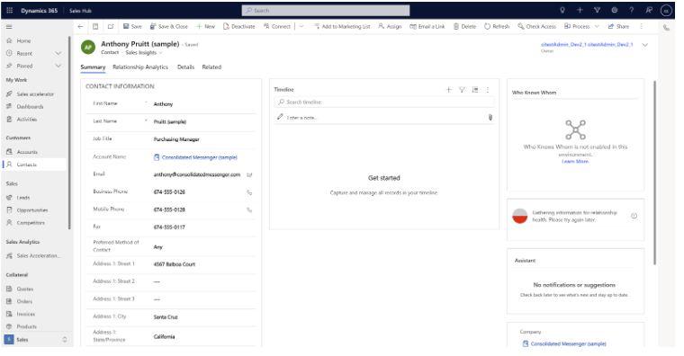
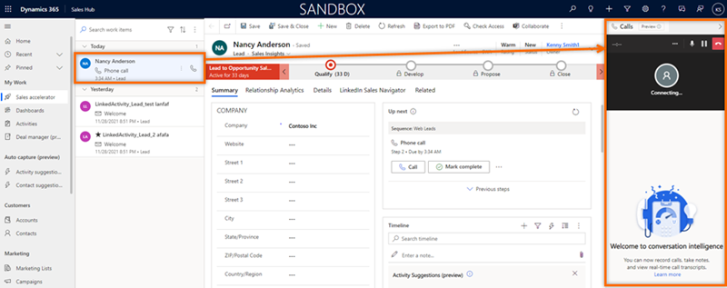
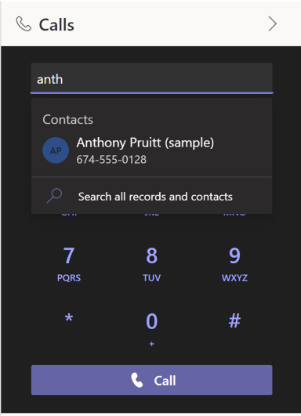

# Make and receive calls through Microsoft Teams (Preview)

> [!IMPORTANT]
> - While in preview, Teams calls does not support emergency calling.
> - Preview features are not complete, but are made available to you before general availability so you can evaluate them and provide feedback to Microsoft. Preview features are not intended for production use and may have limited or restricted functionality, as further explained in our [Product Terms](https://go.microsoft.com/fwlink/?linkid=2173816). 

Microsoft Teams dialer helps you to be more productive and get work done effectively by calling customers directly from within Dynamics 365 Sales Hub app. You can make and receive calls through Teams. 

## License and role requirements

| &nbsp; | &nbsp; |
|-----------------------|---------|
| **License** | Dynamics 365 Sales Premium or Dynamics 365 Sales Enterprise   More information: [Dynamics 365 Sales pricing](https://dynamics.microsoft.com/sales/pricing/) |
| **Security roles** | Salesperson and above   See [Predefined security roles for Sales](security-roles-for-sales.md)|
|||

## Open Teams calls dialer

>[!NOTE]
>- An administrator must configure the Microsoft Teams dialer in your organization to use. More information: [Configure Microsoft Teams dialer](configure-microsoft-teams-dialer.md). 
>- You can't make emergency calls using Teams dialer in Dynamics 365 Sales.

When you sign in to your organization, you can view the **Calls (preview)** dialer pane on the right of the page.   
Select the phone icon () on the top-right corner of the page to open the **Calls (preview)** and view the dial pad. 

> [!div class="mx-imgBorder"]
>      

## Make calls using Teams  

You can use Microsoft Teams to call a customer directly from the dialer, a record, or a work item to make a call. 

>[!NOTE]
>Verify that a valid phone number is associated with the Dynamics 365 records or work item.  

**To dial a customer through a Dynamics 365 record** 

1.	Open a record. In this example, we’re opening a contact record.    
    In the **Business Phone** field, a phone number has been associated with the contact **Nancy Anderson**.  

    > [!div class="mx-imgBorder"]
    >     

2.	Select the phone icon () corresponding to the phone number and the call is established.   

    > [!div class="mx-imgBorder"]
    >      

**To dial a customer from a work list item**

1.	Go to **My Work** > **Sales accelerator**.    
    Your work list opens. You can see the phone call activities that are pending for the day. In this example, the phone call activity for **Nancy Anderson** is pending for the day.

    > [!div class="mx-imgBorder"]
    >     

2.	Select the phone icon () corresponding to the work item.    
    The Teams dialer opens, and the call is established.   

    >[!NOTE]
    >You can also use the **Call** option in the **Up next** widget to make the call.

    > [!div class="mx-imgBorder"]
    >   

**To dial a customer manually**

1. Open the Teams dialer.
2. Enter the phone number of the customer or search the customer through dialer search box.   
 
    > [!div class="mx-imgBorder"]
    >  

3.  Select **Call**.

## Receive calls through Teams

You can receive calls in Dynamics 365 Sales. When a call is received, a notification is displayed at the bottom-right corner of the page as shown in the following image:

> [!div class="mx-imgBorder"]
>     

The caller name is automatically displayed when the phone number is associated with a record. For example, Kenny Smith is a lead and has the mobile number +1 123 456 7890 associated with his record. When you receive a call from +1 123 456 7890, the name Kenny Smith is automatically displayed and select the name to open the record. 

To receive the call, select **Answer**. The Teams telephony panel opens and the call is connected. A phone call activity is created and appears on the timeline of the record. If the received call is not associated with any record, only a phone call activity is created.    

## Call analysis

[Configure conversation intelligence](fre-setup-ci-sales-app.md) for real-time analysis of your call data with overview, summary, transcription, insights, and action items.

More information: [Get real-time call data through Teams call](get-real-time-call-data-through-teams-call.md)  

[!INCLUDE [cant-find-option](../includes/cant-find-option.md)]

### See also

[Configure Microsoft Teams dialer](configure-microsoft-teams-dialer.md)     
[Get real-time call data through Teams call](get-real-time-call-data-through-teams-call.md)   

[!INCLUDE[footer-include](../includes/footer-banner.md)]
