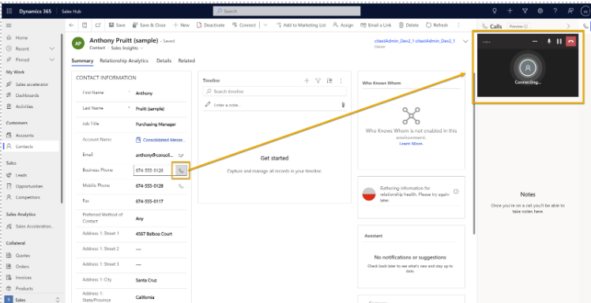
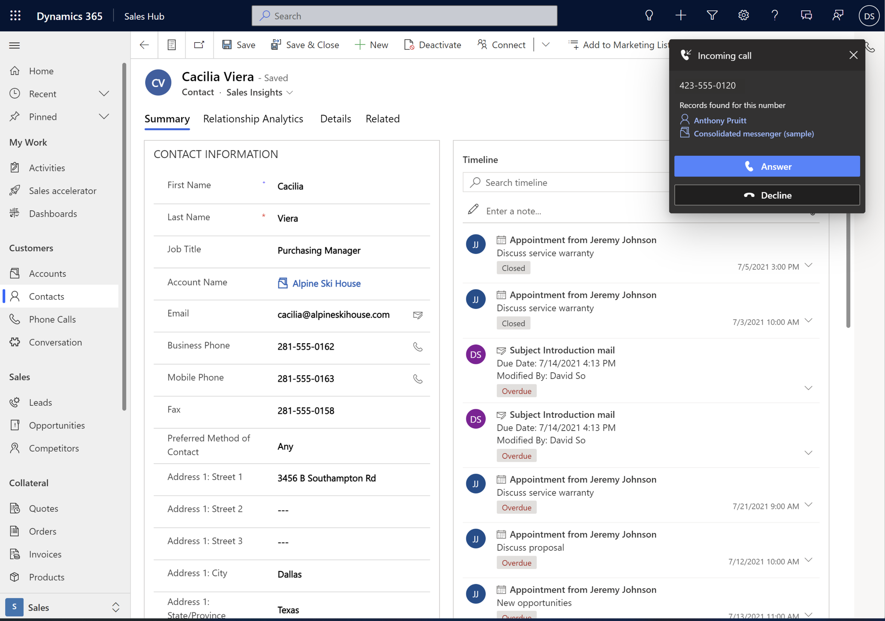

# Make and receive Teams calls in Dynamics 365  

Microsoft Teams dialer helps you to be more productive and get work done effectively by calling customers directly from within the Dynamics 365 Sales Hub app. You can make and receive calls through the Teams dialer.

## License and role requirements

| Requirement type | You must have |
|-----------------------|---------|
| **License** | Dynamics 365 Sales Premium, Dynamics 365 Sales Enterprise, or Dynamics 365 Sales Professional   More information: [Dynamics 365 Sales pricing](https://dynamics.microsoft.com/sales/pricing/) |
| **Security roles** | Any primary sales role, such as salesperson or sales manager   More information: [Primary sales roles](security-roles-for-sales.md#primary-sales-roles)|

## Open Teams calls dialer

>[!NOTE]
> An administrator must configure the Microsoft Teams dialer in your organization for you to use it. More information: [Configure Microsoft Teams dialer](configure-microsoft-teams-dialer.md)

Sign in to your sales app and select the phone () icon in the upper-right corner of the page to open the **Calls** and view the dial pad.  

> [!div class="mx-imgBorder"]
>   

> [!IMPORTANT]
> The dialer won't work if third-party cookies are blocked in the private or incognito window of your browser. To use the dialer, select the **Third-party cookie blocking** icon in your browser and select **Allow cookies**.  

## Make calls with Teams  

You can use Microsoft Teams to call a customer directly from the dialer, a record, or a work item in Dynamics 365.  

>[!NOTE]
>Verify that a valid phone number is associated with the Dynamics 365 records or work item.  

**To call a customer through a Dynamics 365 record** 

1.	Open a record. In this example, we're opening a contact record.

    In the **Business Phone** field, a phone number has been associated with the contact **Anthony Pruitt**.  

    > [!div class="mx-imgBorder"]
    > 

2.	Select  corresponding to the phone number. The call is established.  

    > [!div class="mx-imgBorder"]
    > 
  
3. (Optional) Select the ellipses (three-dots menu) in the dialer screen to change your microphone and speaker settings. 

**To call a customer from a work list item**

1.	Go to **My Work** > **Sales accelerator**.

    Your work list opens. You can see the phone call activities that are pending for the day. In this example, the phone call activity for **Nancy Anderson** is pending for the day.

    > [!div class="mx-imgBorder"]
    > 

2.	Select  corresponding to the work item.    
    The Teams dialer opens, and the call is established.   

    >[!NOTE]
    >You can also use the **Call** option in the **Up next** widget to make the call.

**To call a customer manually**

1. Open the Teams dialer.

2. Enter the phone number of the customer, or search for the customer through dialer search box.   
 
    > [!div class="mx-imgBorder"]
    >  

3.  Select **Call**.

## Receive Teams calls in Dynamics 365

You can receive calls in Dynamics 365 Sales. When a call is received, a notification is displayed in the upper-right corner of the page, as shown in the following image:

> [!div class="mx-imgBorder"]
>   

The caller name is automatically displayed when the phone number is associated with a record. For example, Kenny Smith is a lead and has the mobile number +1 123 456 7890 associated with his record. When you receive a call from +1 123 456 7890, the name Kenny Smith is automatically displayed; you can select the name in the notification to open the record.  

> [!NOTE]
>- If a phone number is associated with more than one record, the notification will display up to 3 records and will indicate more records exist with this phone number. Select the appropriate record.
>- If you receive a call while you're on another call, the inbound call notification will provide an option to either end the current call and accept the incoming call, or to reject the incoming call and continue with the current call.

To receive the call, select **Answer**. The Teams telephony panel opens and the call is connected. 

A phone call activity is created and displayed on the timeline of the record. If the phone number is automatically resolved to a record, the **Call From** and **Regarding** fields of the phone call activity are automatically populated. If the received call isn't associated with any record, only a phone call activity is created. To associate the call with a record during the call, select the **Details** tab and then select **Connect a record**.

## Transfer a Teams call (preview)

[!INCLUDE [preview-disclaimer](../includes/preview-disclaimer.md)]

While you're on a call with a customer, you can transfer the call to another colleague's Teams line or a phone number.

1. While you're on the call, select **More options** and select **Transfer**.  
    The customer's call will be placed on hold.

1. Enter the name of the colleague you want to transfer the call to or their phone number.  

1. (Optional) If you're calling a system user, select **Ring back if there's no answer** for a safe transfer. Otherwise, the call will be disconnected if there's no answer.

    If the recipient is in a meeting or out of office, select **Cancel** and then **Resume** to go back to the customer.

1. Select **Transfer**.  
    The recipient will see the transfer notification with details of the original user and the customer. After you transfer the call, the call is treated as a new one and any notes or recordings made during the original call are not transferred to the recipient.

## Consult and transfer a Teams call (preview)

[!INCLUDE [preview-disclaimer](../includes/preview-disclaimer.md)]

While you're on a call with a customer, you can consult a colleague before transferring the call to them. You can also just consult the colleague and answer the customer directly without really transferring the call.

1. While you're on the call, select **More options** and select **Consult then transfer**.  
    The customer will be placed on hold.

1. Start typing the name of the colleague you want to transfer the call to or a phone number.  

1. Select the person to consult. If the recipient is in a meeting or out of office, select **Cancel** and then **Resume** to talk to the customer.
1. Select **Call**.  
    The duration of the hold is displayed so that you know how long the customer has been waiting.
1. Consult with the user. If they're ready to take the call, select **Transfer** else, select **Cancel** to go back to the customer.
    If you select **Transfer**, the recipient will see the transfer notification with details of the original user and the customer. After you transfer the call, the call is treated as a new one and any notes or recordings made during the original call are not transferred to the recipient.

## Call analysis

[Configure conversation intelligence](fre-setup-ci-sales-app.md) for real-time analysis of your call data with overview, summary, transcription, insights, and action items. More information: [Get real-time call data through Teams call](get-real-time-call-data-through-teams-call.md)  

[!INCLUDE [cant-find-option](../includes/cant-find-option.md)]

### See also

[Configure Microsoft Teams dialer](configure-microsoft-teams-dialer.md)     
[Get real-time call data through Teams call](get-real-time-call-data-through-teams-call.md)   

[!INCLUDE[footer-include](../includes/footer-banner.md)]
