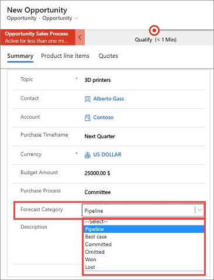

# Capture forecast category for opportunity 

Capture the forecast category to indicate the confidence level of an opportunity getting converted into a sale.

## License and role requirements

| &nbsp; | &nbsp; |
|-----------------------|---------|
| **License** | Dynamics 365 Sales Premium or Dynamics 365 Sales Enterprise   More information: [Dynamics 365 Sales pricing](https://dynamics.microsoft.com/sales/pricing/) |
| **Security roles** | System Administrator or Forecast Manager  See [Predefined security roles for Sales](security-roles-for-sales.md)|
|||

## Select option set 

You must select an option set while configuring the forecast to determine the confidence level of an opportunity as it moves along the path to conversion. For example, when you select the option set as **forecast categories**, the forecast grid displays the stages that are defined in the option set.

You can also manually configure your columns for a fully customized forecast. Forecast shows how many opportunities are in the pipeline and which of those are committed, delivering actionable insights. 

1.	In the site map, select **Opportunities**.

2.	In the list of opportunities, open an opportunity for which you want to capture the forecast category.

3.	In the **Forecast Category** drop-down list, select one of the following, and then select **Save**:

    -  **Pipeline**. The confidence of winning this opportunity is low. Any opportunity that a sales rep has just started to work on can be set to this category (this is the default value).

    -  **Best case**. The sales rep has started talking to customers or has shared quotes, and there is a moderate chance of winning the opportunity.

    -  **Committed**. The customer has committed to closing the deal.

    -  **Omitted**. To exclude an opportunity’s numbers from the forecast. 
    
    - **Won**. Don't select this option manually. When you close an opportunity as **Won**, its forecast category is automatically set to **Won**.  
    
    - **Lost**. Don't select this option manually. When you close an opportunity as **Lost**, its forecast category is automatically set to **Lost**.

       > [!div class="mx-imgBorder"]
       > 

[!INCLUDE[cant-find-option](../includes/cant-find-option.md)]

## See also

[Create or edit an opportunity](create-edit-opportunity-sales.md)  

[Configure a forecast in your organization](configure-forecast.md)

[View forecasts](view-forecasts.md)

[Close opportunities as won or lost](close-opportunity-won-lost-sales.md)

[!INCLUDE[footer-include](../includes/footer-banner.md)]
