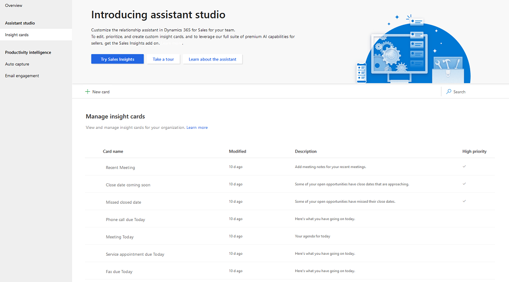
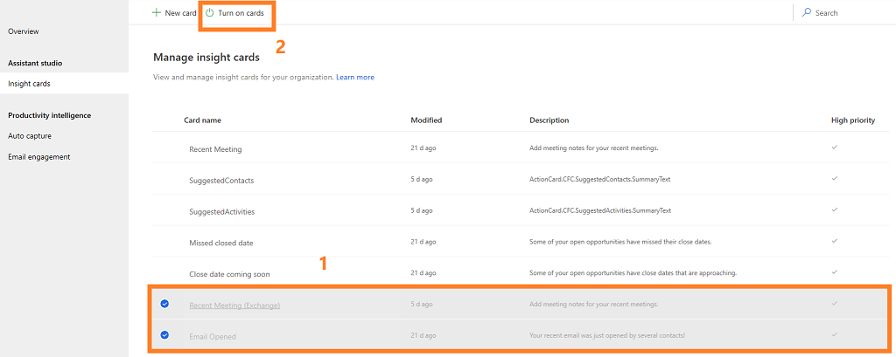
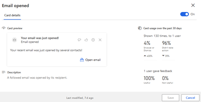
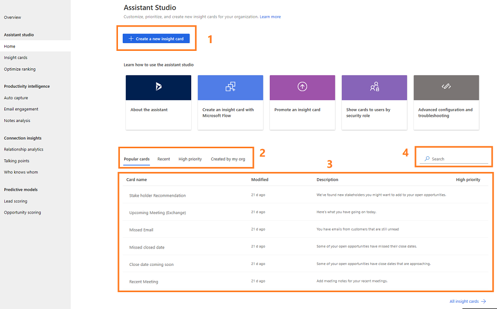
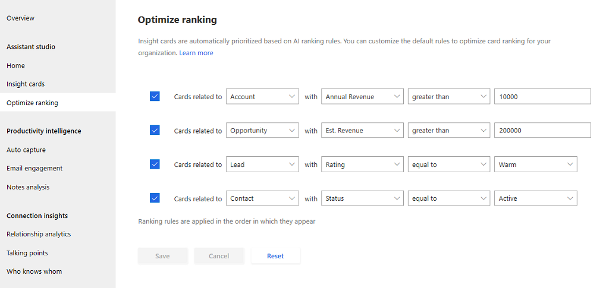

# Configure the assistant 

Configure the assistant to help sellers track their daily actions and communications through a collection of actionable insight cards.

## License and role requirements
|  | |
|-----------------------|---------|
| **License** | Dynamics 365 Sales Enterprise or Dynamics 365 Sales Premium  More information: [Dynamics 365 Sales pricing](https://dynamics.microsoft.com/sales/pricing/) |
| **Security Role** | System Administrator    See [Predefined security roles for Sales](security-roles-for-sales.md)|
|||

## Configure the standard and premium assistant 

The assistant in Dynamics 365 Sales (formerly known as relationship assistant) helps sellers track their daily actions and communications through a collection of actionable insight cards. 

The assistant is available in two forms:

- **Assistant (standard)**: This feature is included with Dynamics 365 Sales Enterprise. The assistant comes with a set of out-of-the-box standard cards. As an administrator, you can configure which insight cards to present to users to help them stay on top of their day. Some insight cards are enabled by default; you can enable, disable, or customize the standard cards. To configure the standard assistant, see [Configure and manage insight cards for the standard assistant](#configure-and-manage-insight-cards-for-the-standard-assistant).

- **Assistant (premium)**: The premium assistant is available in Sales with the Dynamics 365 Sales Insights license. With premium assistant capabilities, you can use Power Automate directly from the assistant studio to create custom insight cards, tailored to the specific needs of your team. To configure the premium assistant, see [Configure and manage insight cards for the premium assistant](#configure-and-manage-insight-cards-for-the-premium-assistant).

## Configure and manage insight cards for the standard assistant

### Prerequisites

Assign user privileges to give access to the assistant features. The privileges required to access Sales Insights features are automatically enabled for all out-of-the-box security roles, but they're initially disabled for all custom roles. If you enable any Sales Insights features, you must check the settings listed in the following table to help ensure that your users can access those features, and to help ensure that other features don't stop working because of privilege cascades related to these features.

|Privilege| Security role tab |Description and requirements|
|--|--|--|
|**Action card**| **Core records**  |Gives the ability to view and interact with insight cards that are generated by the assistant.   **Warning:** If the assistant is enabled, all users *must* have a role with read access for this privilege. Because of cascading, users without this privilege will lose access to many Dynamics 365 Sales features when the assistant is enabled.|
| **Action card user settings** | **Core records**  | Gives the ability to view and change user preferences for insight cards that are generated by the assistant. **Warning:** If the assistant is enabled, all users *must* have a role with read access for this privilege. Because of cascading, users without this privilege will lose access to many Dynamics 365 Sales features when the assistant is enabled. |

More information: [Security roles and privileges](/dynamics365/customer-engagement/admin/security-roles-privileges)

### Configure and manage standard insight cards

1. On the site map under **Assistant**, select **Insight cards**.

    > [!div class="mx-imgBorder"]
    > 
    
2.	To turn on (enable) the insight cards, select the cards that are grayed out, and then select **Turn on cards**.

    In this example, we've selected the cards **Recent Meetings (Exchange)** and **Email Opened**.

    > [!div class="mx-imgBorder"]
    > 
    
    More information: [Manage insight cards](assistant.md#manage-insight-cards)

3. To turn off (disable) the insight cards, select the cards that have been turned on, and then select **Turn off cards**.
    
    In this example, we've selected the cards **SuggestedContacts** and **Upcoming Flight**.

    > [!div class="mx-imgBorder"]
    > 
    
4. To see a preview of a card, get more details about it&mdash;such as a description and the time it was last modified&mdash;or turn it on or off, select the card.

    > [!div class="mx-imgBorder"]
    > 

    Sellers can also set their own personal preferences for their insight cards. They can't add cards that you disable here, but they can disable cards that you've enabled if they don't find them useful. They can also change the configuration settings for those cards that have them, though your settings will be the defaults. More information: [Manage insight cards](assistant.md#manage-insight-cards)

## Configure and manage insight cards for the premium assistant

The premium assistant that's part of the Sales Insights add-on offers advanced capabilities, including:

- [Creating custom insight cards](create-insight-cards-flow.md).

- [Prioritizing individual cards](edit-insight-cards.md#set-priority-for-a-card).

- [Optimizing card ranking](optimize-ranking-insight-cards.md).

- [Assigning cards to users by roles](edit-insight-cards.md#assign-roles-to-or-remove-roles-from-a-card).

- [Turn on or off insights cards](edit-insight-cards.md#turn-cards-on-or-off).

- [Edit flow of an insight card](edit-insight-cards.md#edit-flow-of-a-card).

- [View card usage metrics](edit-insight-cards.md#view-card-usage-metrics).

> [!NOTE]
> You can create custom cards not only from the assistant studio but also directly by using the solution. More information: [Create custom cards in the assistant](extend-relationship-assistant-card.md)

1. Verify that you have [installed and configured premium Sales Insights features](intro-admin-guide-sales-insights.md#install-and-configure-premium-sales-insights-features).

2. Go to **Change area** in the lower-left corner of the page, and select **Sales Insights settings**.

3. On the site map under **Assistant**, select **Home**.

4. On the **Home** tab (**Assistant Studio** page), you can perform actions as described in the below table.
    
    > [!div class="mx-imgBorder"]
    > 

    | Number | Description | 
    |--------|---------|
    | **1** | Create cards with that are custom-made for your organization by using Power Automate. More information: [Creating custom insight cards](create-insight-cards-flow.md) |
    | **2** | Quickly view cards by using tabs to view cards that are most popular, recently used, high in priority, and created by your organization. |
    | **3** | Table with card details displays the cards that are available in your organization. More information: [Edit insight cards](edit-insight-cards.md) |
    | **4** | Search for cards that you want to view or manage. |
    
5. On the **Optimize ranking** tab, you can create rules to prioritize cards to appear in the application.

    The following is an example of the **Optimize ranking** tab:

    > [!div class="mx-imgBorder"]
    > 

    To learn more, see [Optimize ranking of insight cards](optimize-ranking-insight-cards.md).

## Assistant studio tutorials

Assistant tutorials are available for you to learn how to create custom insight cards by using minimal or no code through Power Automate. Using the tutorials, you learn from creating a basic custom insight, a "hello world" equivalent, and gradually increase the complexity as you go along.

More information: [Assistant studio tutorials for Dynamics 365 Sales Insights](/learn/modules/sales-insights-lab/)

## Disable teasers

The updates in Sales Insights are displayed to sellers as teasers in the assistant. By default, teasers are enabled in your organization. However, you can disable if you don’t wish to display the teasers. To disable, follow these steps:

1. Sign in to the Dynamics 365 Sales Hub app, and go to **Change area** > **Sales Insights settings**.

2. On the site map, select **Overview**.

3. In the **Teasers** section, turn off the toggle.

    > [!div class="mx-imgBorder"]
    > 

Teasers will be disabled in your organization.

[!INCLUDE[cant-find-option](../includes/cant-find-option.md)]

### See also

[Introduction to administer Sales Insights](intro-admin-guide-sales-insights.md)  
[Create insight cards](create-insight-cards-flow.md)  
[Edit insight cards](edit-insight-cards.md)  
[Optimize ranking of insight cards](optimize-ranking-insight-cards.md)  
[Create custom cards in Assistant](extend-relationship-assistant-card.md)  
[Sales Insights privacy notice](privacy-notice.md)

[!INCLUDE[footer-include](../includes/footer-banner.md)]
