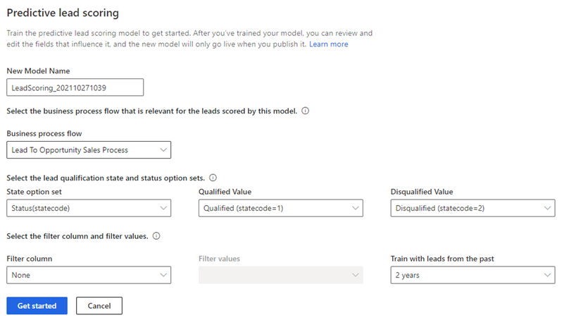
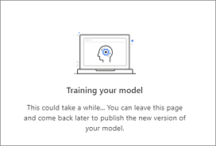

# Configure predictive lead scoring

Configure predictive lead scoring to help sellers prioritize leads based on scores and achieve higher lead qualification rates.

## License and role requirements

| Requirement type | You must have |
|-----------------------|---------|
| **License** | Dynamics 365 Sales Premium or Dynamics 365 Sales Enterprise**  More information: [Dynamics 365 Sales pricing](https://dynamics.microsoft.com/sales/pricing/) |
| **Security roles** | System Administrator    More information: [Predefined security roles for Sales](security-roles-for-sales.md)|

** Enable predictive lead scoring through quick setup (with the Dynamics 365 Sales Enterprise license). In this case, you'll get 1,500 scored records per month. To enable predictive lead scoring through quick setup, you must go to the **Get started with digital sales** page under **App Settings**. [Lead and opportunity scoring](digital-selling-scoring.md)

## What is predictive lead scoring

Predictive lead scoring uses a predictive machine learning model to calculate a score for all open leads based on historical data. The score helps salespeople prioritize leads, achieve higher lead qualification rates, and reduce the time that it takes to qualify a lead. When you first create a scoring model, historical data collection is initiated and stored in the data lake for analysis.  

> [!NOTE]
> If your Dynamics 365 Sales subscription expires or your org gets deleted, the historical data will be deleted after 30 days of the event.

For example, say you have two leads&mdash;Lead A and Lead B&mdash;in your pipeline. The lead scoring model applies a score of 80 for Lead A and 50 for Lead B. By looking at the score, you can predict that Lead A has a greater chance of being converted into an opportunity, and you can engage it. Also, you can further analyze why the score of Lead B is low by looking at the top reasons influencing the score and deciding whether to improve this score.

The following image shows an example of a lead scoring widget.

> [!div class="mx-imgBorder"]
> 

> [!IMPORTANT]
> - If you're using a model that pertains to a version prior to 2020 release wave 2 for Dynamics 365, delete the model. Otherwise, the previous version of the model will be applied on all leads in your organization, and the newly generated models won't have any effect on the leads. More information: [Delete a model](pls-duplicate-models.md#delete-a-model)
> - From 2020 release wave 2 for Dynamics 365, the application writes the lead scoring related data to **msdyn_predictivescore** table and has stopped writing to the lead table. This table is common for both lead and opportunity scoring. More information: [Entity reference](entity-reference.md)

## Prerequisites

Verify that you meet the following requirements before adding lead scoring models for your organization:

- Verify that advanced Sales Insights features are enabled. More information: [Install and configure premium Sales Insights features](intro-admin-guide-sales-insights.md#install-and-configure-premium-sales-insights-features)

- A minimum of 40 qualified and 40 disqualified leads created and closed in the past 3 months to 2 years. You can configure the timeframe in the **Train with leads from the past** field. More information: [Create and add a scoring model](#create-and-add-a-scoring-model)

   > [!NOTE]
   > These numbers represent the minimum requirement. The more leads you can include to train the model, the better the prediction results will be.

## Create and add a scoring model

A scoring model defines the criteria for choosing the leads for training and scoring. If your organization follows different sales practices across different regions or business units, you can create multiple models and define unique training sets for each of them.  

**To create and add a scoring model:**

1. Go to **Change area** in the lower-left corner of the Sales Hub app, and select **Sales Insights settings**.

1. On the site map under **Predictive models**, select **Lead scoring**.  
  
   When you open this page for the first time, you'll see one of following screens depending on whether your organization has enough leads in the past 24 months that match the minimum requirements:

   - If there are enough leads, a model is generated by default. You'll see a popup message with the prediction accuracy score and top five fields that are influencing the score. You can verify the model accuracy and publish it or edit and retrain the model. 
   
   - If there aren't enough leads, you'll see a configuration page for adding a new model.
   - If you've already created a model and want to create another model for a different data set, scroll down to the bottom of the page and select **Add Model**. 
      > [!NOTE]
      > The **Add model** command will be disabled when you reach the maximum limit of 10 models (both published and unpublished).

   The **Predictive lead scoring** configuration page is displayed. 

    > [!div class="mx-imgBorder"]
    > 
   The following steps describe how to add a new model. 
 
1. In the **New model name** box, enter a name that contains alphanumeric characters. Underscores are allowed, but not spaces or other special characters.

     By default, the name is **LeadScoring_**<***YYYYMMDD***><***Time***> (for example, **LeadScoring_202009181410**). The date and time are based on Coordinated Universal Time (UTC).

 1. In the **Business process flow** list, select a flow that's relevant for the leads that you're generating the model for.
    The list displays all the business process flows that are defined for leads in your organization.  

    > [!NOTE]
    >- To display custom business process flows in the list, enable **Change Tracking** for the business process flow entity. More information: [Enable change tracking to control data synchronization](/power-platform/admin/enable-change-tracking-control-data-synchronization)
    >- When you generate the model, custom business processes will be automatically enabled to sync the data to Data Lake Storage for analytics.
 
1. In the **State option set** list, select the option set in which the status of the leads is defined, and then select the corresponding qualified and disqualified values in the **Qualified value** and **Disqualified value** lists, respectively.  

    The out-of-the-box **Status** state option set contains the qualified and disqualified values as **Qualified** and **Disqualified**, respectively. You can also select your custom option set if it's defined.

 1. Select **Filter column** and **Filter values** to define the leads that the model must score.  

     If you want to score a specific set of leads based on the line of business they belong to, or based on other criteria, use the filter criteria to distinguish the leads the model must score.  

    > [!NOTE]
    > To filter based on multiple columns, create a calculated field with the required columns and then select the calculated field in the Filter column field. More information: [Define calculated columns to automate calculations](/powerapps/maker/data-platform/define-calculated-fields)

 1. Choose a time period for the training set from the **Train with leads from the past** list. The default duration is 2 years.  

    > [!NOTE]
    > You must have a minimum of 40 qualified and 40 disqualified leads that were created and closed during the selected period. For example, if you select 6 months, the model considers leads that were created and closed in the past 6 months to verify the minimum lead requirement.

     The model considers closed leads from the selected period and uses that to score the open leads from past 2 years.  

    If you don't have the minimum closed leads in the chosen time period, the **Get started** option will be disabled. Choose another time period that has enough closed leads to train the model.  

 1. Select **Get started**.

     The application starts training the model, and a notification is displayed. The application uses standard attributes to train the model. You can [edit the model](pls-edit-and-retrain-model.md) later to include custom or intelligent attributes.  

    > [!div class="mx-imgBorder"]
    > 

    > [!NOTE]
    > If there aren't enough leads to generate the model, an error message is displayed. Review and edit the configurations, and try generating the model again.

    After the model is trained, a popup message is displayed. 
    :::image type="content" source="media/pls-model-ready.png" alt-text="A screenshot of the popup message that appears after the model is trained":::

1. If you want the application to automatically retrain the model after every 15 days, select **Retrain automatically**. 

1. Perform one of the following actions: 
    - If you're ready to publish, select **Publish**. The model is applied to leads that match the criteria specified in the model configuration. Users can see the lead scoring in their views under the **Lead score** column and a widget in the lead form. More information: [Convert leads into opportunities](../sales/work-predictive-lead-scoring.md)
    
    - If you want to verify the model's accuracy, select **View Details** and then select the **Performance** tab. For more information, see [View the accuracy and performance of a predictive scoring model](scoring-model-accuracy.md).
    

[!INCLUDE[cant-find-option](../includes/cant-find-option.md)]

### See also

[Prioritize leads through scores](../sales/work-predictive-lead-scoring.md)  
[Install and configure premium Sales Insights features](intro-admin-guide-sales-insights.md#install-and-configure-premium-sales-insights-features)  
[Predictive lead/opportunity scoring FAQs](faqs-sales-insights.md#predictive-leadopportunity-scoring)

[!INCLUDE[footer-include](../includes/footer-banner.md)]
