# Configure predictive opportunity scoring 

Configure predictive opportunity scoring to help sellers prioritize opportunities based on scores and achieve higher opportunity qualification rates.

## License and role requirements
| Requirement type | You must have |
|-----------------------|---------|
| **License** | Dynamics 365 Sales Premium or Dynamics 365 Sales Enterprise More information: [Dynamics 365 Sales pricing](https://dynamics.microsoft.com/sales/pricing/) |
| **Security roles** | System Administrator    More information: [Predefined security roles for Sales](security-roles-for-sales.md)|

## What is predictive opportunity scoring

Predictive opportunity scoring uses a predictive machine learning model to calculate a score for all open opportunities. The score helps salespeople prioritize opportunities, achieve higher opportunity qualification rates, and reduce the time that it takes to qualify an opportunity.   

>[!NOTE]
>Your historical data will be deleted after 30 days from the date of your subscription expiration. 

Using this score, you can:

- Identify quality opportunities and convert them into won deals.
- Spend time on opportunities that have low scores and convert them into possible deals.

For example, say you have two opportunities&mdash;Opportunity A and Opportunity B&mdash;in your pipeline. The opportunity scoring model applies a score of 75 for Opportunity A and 55 for Opportunity B. By looking at the score, you can predict that Opportunity A has more chances of being converted into a won deal, and you can engage it. Also, you can further analyze why the score of Opportunity B is low by looking at the top reasons that are influencing the score and deciding how to improve this score.

The following image is an example of an opportunity scoring widget.

> [!div class="mx-imgBorder"]
> 

>[!IMPORTANT]
>- If you're using predictive opportunity scoring that pertains to a version prior to 2020 release wave 2 for Dynamics 365, delete the model. Otherwise, the previous version of the model will be applied on all opportunities in your organization, and the newly generated models won't have any effect on the opportunities. More information:[Delete a model](#delete-a-model)
>- From 2020 release wave 2 for Dynamics 365, the application writes the opportunity scoring related data to **msdyn_predictivescore** entity and has stopped writing to the opportunity entity. This entity is common for both lead and opportunity scoring. More information: [Entity reference](entity-reference.md).

You can add custom fields to generate an accurate model for predictive opportunity scoring. The custom fields can be specific to your organization so that you can decide the impact of the outcome.

## Prerequisites

Verify that you meet the following requirement before adding predictive opportunity scoring models for your organization:

- Verify that advanced Sales Insights features are enabled. More information: [Install and configure premium Sales Insights features](intro-admin-guide-sales-insights.md#install-and-configure-premium-sales-insights-features). 

- The following minimum opportunity criteria includes opportunities that were created and closed in the past 3 months to 2 years. You can configure the timeframe in the **Train with opportunities from the past** field. More information: [First-run setup experience](#first-run-setup-experience)  

    - If you want to use the default selection of attributes for each business process stage, you need a minimum of 40 won and 40 lost opportunities.
    - If you need a per stage model, wherein you can select the attributes for each business process stage, then you must have a minimum of 40 closed opportunities in the last stage of the business process. 

  >[!NOTE]
  >- These numbers represent the minimum requirement. The more opportunities you can include to train the model, the better the prediction results will be.
  >- It takes about 4 hours for the data to sync with the data lake. So, recently closed opportunities won't be considered by the model immediately.

## Understand the configuration page

Before we configure the predictive opportunity scoring, let's understand the configuration summary page. When a model is generated and published, the configuration summary page is displayed as shown in the following image.

> [!div class="mx-imgBorder"]
> 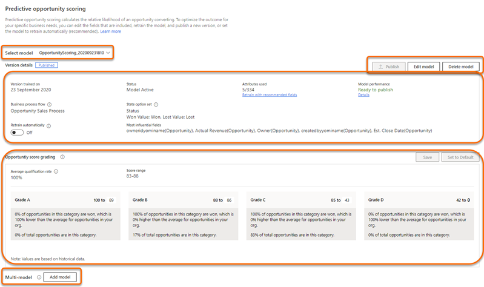

The configuration page is organized into the following sections:

- [Select a model](#select-model)
- [Actions you can perform on the model](#actions-you-can-perform-on-the-model)
- [Version details](#version-details)
- [Opportunity score grading](#opportunity-score-grading)
- [MultiModel](#multimodel)

### Select model

In the upper-left corner of the page, you can use the **Select model** drop-down list to choose the model you want to view, edit, or delete. The list consists of both published and unpublished models.

> [!div class="mx-imgBorder"]
> 

### Actions you can perform on the model

In the upper-right corner of the page, you can choose from actions that you can perform on the model.

> [!div class="mx-imgBorder"]
> 

- **Publish**: When you publish a model to your organization, users in your organization can see the My Open Opportunities Scored system view and the opportunity score widget on opportunity forms. After you publish, this button appears dimmed and will be available only after you retrain or edit the model.
- **Edit model**: You can update or add fields that affect the prediction accuracy score. This is useful when you want to modify fields to consider or include a unique business process. More information: [Edit and retrain a model](#edit-and-retrain-a-model)
- **Revert version**: You can return the model to its previous version when the retrained model isn't satisfactory or doesn't meet an acceptable level of your organization's requirements. This action is only available when you've retrained the model but haven't published it yet.
- **Delete model**: You can delete models that aren't required in your organization. This option is displayed for published models. More information: [Delete a model](#delete-a-model)

### Version details

The parameters displayed in this section show information about the status and performance of the model.

> [!div class="mx-imgBorder"]
> 

| Parameter | Description |
|-----------|-------------|
| Version trained on | Displays a date that lets you know when the model was last trained. |
| Status | Displays whether the model is active or inactive. |
| Attributes used | Displays the number of attributes used from the available list to train the model. If you're not satisfied with the outcome of the trained model, you can select **Retrain with recommended fields** to retrain the model with the standard (out-of-the-box) attributes. If the parameter displays **Edited** next to the number of attributes used, this specifies that the attributes used are custom-selected. |
| Model performance | Displays information about the model's accuracy and projected performance based on the data available and selected to train the model. **Note**: The range of the accuracy score is defined based on the area under the curve (AUC) classification measurements. - **Ready to publish** specifies that the model accuracy is above the range, and you can expect that the model will perform well. - **OK to publish** specifies that the model accuracy is within range, and you can expect that the model might perform reasonably well. - **Not ready to publish** specifies that the model accuracy is below the range, and you can expect that the model will perform poorly. |
| Business process flow | Displays the business process flow that's applied on the opportunities that are scored by this model. |
| Filter column and filter values | When multiple models are used, this selection defines which column and which values within that column correspond to the opportunities that this specific model should score. |
| State option set | Displays the option set that's used for won and lost opportunities in this model. |
| Retrain automatically | Allows you to set the model to be retrained automatically. More information: [Automatic retraining](#automatic-retraining) |
| Most influential fields | Displays the top five attributes that most affect the outcome of the prediction accuracy score. |

### Opportunity score grading

When a model is published, the opportunities that are in your organization's pipeline are graded according to the range defined in this section. Each opportunity in the pipeline is graded A, B, C, or D, according to the opportunity score. Opportunities in the top score range are graded A while opportunities within the lowest score range are graded D.

> [!div class="mx-imgBorder"]
> 

You can configure the range for the grading according to your organizational requirements. When you change the opportunity score range for a grade, the maximum range value for the adjacent grade changes automatically in accordance with the change in the minimum value. For example, when you change the minimum range value score for **Grade A** to 51, the maximum opportunity score range for **Grade B** changes to 50.

### MultiModel

In the lower-left corner of the page, you can use **Add model** to generate a new model to represent a line of business that might use different opportunities than your first model. The **Add model** command will be disabled as soon as you reach the maximum limit of 10 models (both published and unpublished). More information: [Add a model](#add-a-model)

> [!div class="mx-imgBorder"]
> 

## First-run setup experience

When the predictive opportunity scoring configuration section is opened for the first time in your organization and no models have been trained on the installation of Sales Insights, you must add the model. 

However, if your organization has enough opportunities in the past 24 months that match the default configurations, a model is generated by default. A pop-up window is displayed with the prediction accuracy score and top five fields that are influencing the score. Based on your organization's requirements, you can publish the model, or you can edit and then publish the model.

If you're using your custom attributes for opportunity generation, you can generate the model by configuring the parameters with your custom attributes.

1. Before you configure the model, review the [prerequisites](#prerequisites). 

    > [!NOTE]
    > You can also enable predictive opportunity scoring through quick setup (with the Dynamics 365 Sales Enterprise license). In this case, you'll get 1,500 scored records per month. To enable predictive opportunity scoring through quick setup, you must go to the **Get started with digital sales** page under **App Settings**. [Lead and opportunity scoring](digital-selling-scoring.md)

2. Go to **Change area** in the lower-left corner of the page, and select **Sales Insights settings**.

    > [!div class="mx-imgBorder"]
    > 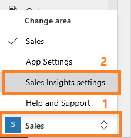

3. On the site map under **Predictive models**, select **Opportunity scoring**.

    The **Predictive opportunity scoring** configuration page is displayed.

    > [!div class="mx-imgBorder"]
    > 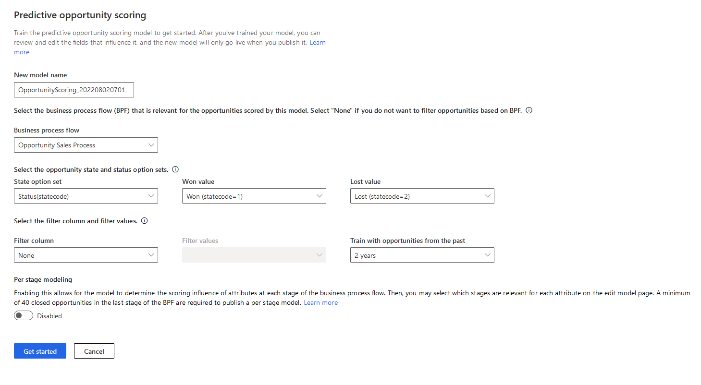

4. In the **New model name** box, enter a name that contains alphanumeric characters. Underscores are allowed, but not spaces or other special characters.

    By default, the name is selected as **OpportunityScoring_**<***YYYYMMDD***><***Time***> (for example, **OpportunityScoring_202009181410**). The date and time are based on Coordinated Universal Time (UTC).

5. In the **Business process flow** list, select a business process flow that's relevant for the opportunities that you're generating the model for. 
    > [!NOTE]
    >- To display custom business process flows in the list, enable **Change Tracking** for the business process flow entity. More information: [Enable change tracking to control data synchronization](/power-platform/admin/enable-change-tracking-control-data-synchronization)
    >- When you generate the model, custom business processes will be automatically enabled to sync the data to Data Lake Storage for analytics.

6. In the **State option set** list, select the option set in which the status of the opportunities is defined, and then select the corresponding won and lost values in the **Won value** and **Lost value** lists, respectively.

    Opportunities are marked as:
    - **Won** when they've met certain criteria that denotes that they are ready to purchase a product or service from a business.
    - **Lost** when the criteria aren't met. 

    The out-of-the-box **Status** state option set contains the won and lost values as **Won** and **Lost**, respectively. You can also select your custom option set that's relevant to your business.

7. Select **Filter column** and **Filter values** to define the opportunities for which the model must score.  

    With multiple models, each model can be directed to score a specific set of opportunities based on the line of business they belong to, or based on other criteria. The filter column is the column that holds the value that distinguishes which opportunities the model should score. These selections determine which column and which values within that column correspond to the opportunities that this model will score.  

    >[!NOTE]
    >To filter based on multiple columns, create a calculated field with the required columns and then select the calculated field in the Filter column field. More information: [Define calculated columns to automate calculations](/powerapps/maker/data-platform/define-calculated-fields)
   
8. Choose time period from the **Train with opportunities from the past** list. The default duration is 2 years.   

    > [!NOTE]
    > You must have a minimum of 40 won and 40 lost opportunities that were created and closed during the selected period. For example, if you select 6 months, the model considers opportunities that were created in the past 6 months to verify whether the minimum opportunity requirement is met.  
   
    The model considers closed opportunities from the selected period and uses that to score the open opportunities from past 2 years.  

   If you don't have the minimum closed opportunities in the chosen time period, the **Get started** option will be disabled. Choose another time period that has enough closed opportunities to train the model.  

9. (Optional) Turn on **Per stage modeling** if you want to select the attributes that the model must consider for each business process stage. 
    You'll select the attributes and corresponding stages after creating the model. More information: [Manual retraining](#manual-retraining)
    :::image type="content" source="media/enable-per-stage-modelling.png" alt-text="Screenshot of the Add model page with the Per stage modeling option.":::

    > [!NOTE]
    > The **Per stage modeling** option will be disabled if you don't have a business process flow for opportunity. 
    
10. Select **Get started**.  

    The application starts generating a model, and a notification is displayed. The application uses the standard attributes to generate the model.

    > [!div class="mx-imgBorder"]
    > 

    >[!NOTE]
    >If there aren't enough opportunities to generate the model, an error message is displayed. Review and edit the configurations, and try generating the model again.

11. After the model is generated, the opportunity scoring configuration page is displayed with the version summary, including model performance, the top fields that are influencing the outcome, and the option to choose to automatically retrain the model. 

11. Select **Publish**, if the model accuracy score is at an acceptable level as per your organization's standards.

    The model is applied to the selected set of opportunities in your organization. Users can see the opportunity scoring in their views under the **Opportunity score** column and a widget in the opportunity form. More information: [Convert leads into opportunities](../sales/work-predictive-opportunity-scoring.md)

    >[!NOTE]
    >To improve the model accuracy or specify attributes for each business process stage, select **View details**. You can review the details of the model and edit the fields. More information: [Manual retraining](#manual-retraining)

## Add a model

In organizations that have different lines of business, you might need different models to score the corresponding opportunities. To accomplish this, you can add and publish multiple models that are specific to each line of business in your organization. To ensure that these models are accurate for your organization, you can choose custom attributes (fields) to be used to generate the opportunity score for a model.

1. Go to the predictive opportunity scoring configuration summary page.

2. In the lower-left corner of the page, select **Add model**.

    > [!div class="mx-imgBorder"]
    > 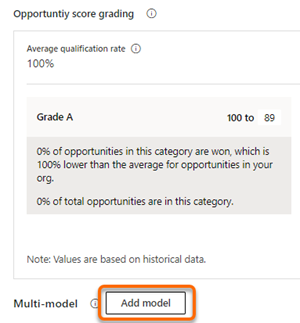

    >[!NOTE]
    >If you already have 10 models (both published and unpublished), the **Add model** option is disabled. Delete the models that are no longer required in your organization.  More information: [Delete a model](#delete-a-model)

     :::image type="content" source="media/enable-per-stage-modelling.png" alt-text="Screenshot of the Add model page with the Per stage modeling option.":::

3. Perform steps 4 through 10 in [First-run setup experience](#first-run-setup-experience), earlier in this topic, to add the model. 

    After the model is generated, a confirmation message appears with a summary of model performance, the top fields that are influencing the outcome, and the option to choose to automatically retrain the model. 

    > [!div class="mx-imgBorder"]
    > 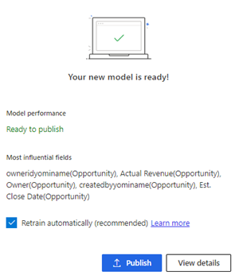

4. If you've turned on **Per stage modeling**, select **View Details** to specify the business process stages for which the model must consider an attribute.  

5. Select **Publish**, if the model accuracy score is at an acceptable level as per your organization's standards.

    The model is applied to the selected set of opportunities in your organization. Users can see the opportunity scoring in their views under the **Opportunity score** column and a widget in the opportunity form. More information: [Prioritize opportunities through scores](../sales/work-predictive-opportunity-scoring.md)

    >[!NOTE]
    >If the accuracy of the score isn't acceptable, select **View details**. You can review the details of the model and edit the fields to improve the score's accuracy. More information: [Edit and retrain a model](#edit-and-retrain-a-model)

## Edit and retrain a model

It's time to retrain a model when its prediction accuracy score doesn't meet your organization's standards, or the model simply gets old. Retraining generally increases the prediction accuracy score. The application uses the latest data (opportunities) from your organization to train the model so that it can provide more accurate scores for your users.

>[!NOTE]
>For better prediction accuracy scoring, retrain a model after the data in your organization is refreshed.

You can retrain the model [automatically](#automatic-retraining) or [manually](#manual-retraining). Both methods are described in the following sections.

### Automatic retraining

Automatic retraining allows the application to retrain a model automatically once every 15 days. This can allow the model to learn from historical data and improve its prediction accuracy over time. Depending on the model's accuracy, the application makes an informed decision whether to publish or ignore the retrained model.

To retrain a model automatically, go to the predictive opportunity scoring configuration page and select **Retrain automatically**. By default, this option is enabled when a model is published. Here are the scenarios where the application automatically publishes the model:

- When the accuracy of the retrained model is equal to or greater than 95 percent of the accuracy of the active model.
- When the current model is more than three months old. 

    >[!NOTE]
    >A retrained model might not be published if the accuracy of the model isn't maintained at the application's standard. If this occurs, the existing user-published model will be retained.

### Manual retraining

1. On the predictive opportunity scoring configuration page, open the model and ensure that **Retrain automatically** is turned off.

1. Select **Edit model**.

2. On the **Edit fields** page, select attributes from opportunity entity, and its related entity (account) including custom attributes to train the model.

    :::image type="content" source="media/si-admin-predictive-opportunity-scoring-edit-model-page.png" alt-text="A screenshot of the Edit model page.":::  

    >[!NOTE]
    >The scoring model don't support the following types of attributes:
    >- Attributes on custom entities
    >- Date and time related attributes
    >- System generated attributes (such as, opportunityscore, opportunitygrade, version number, entity image, exchange rate, and predictive score ID)

3. If you've enabled per stage modeling support, you'll see two additional columns: **Application stages** and **Prediction influence**.
        :::image type="content" source="media/per-stage-modelling-selection.png" alt-text="Screenshot of the edit fields page with the Application stages and Prediction influence columns.":::

    1. In the **Application stages** field, select the stages for which the model should use the attribute. For example, the Actual Revenue attribute will have more influence during the Close stage rather than initial stages. You can select more than one stage for each attribute. 
    2. Use the information in the **Prediction influence** column to understand the influence of the attribute at each stage. Prediction influence is calculated based on historical data and ranges from very low to very high. For example, let's say that you don't want to consider Budget Amount for Develop stage, but historical data shows that it has a high influence. In this case, you might want to reconsider your decision or analyze why it has such high influence.  

3. (Optional) Scroll to the right of the attributes list and turn on **Ignore empty values**.  
    By default, empty values in the attribute are included for training the model. If you notice that empty values are acting as detractors or are producing false positives, turn on **Ignore empty values**.  
    :::image type="content" source="media/ignore-empty-values.png" alt-text="A screenshot of ignore empty values option in the attributes list.":::

    > [!NOTE]
    > When you turn on **Ignore empty values** for an attribute, the scoring widget will indicate that the score is calculated after excluding blank values in the attribute, as shown in the following screenshot:
    :::image type="content" source="media/ignore-empty-values-scoring-widget-opp.png" alt-text="A screenshot of scoring widget when the Ignore empty values option is turned on."::: 

1. Select **Retrain model**.

    The model starts to be generated with the selected custom attributes, and a notification is displayed on the screen.

4. On the configuration summary page, review the model performance and other parameters. If the retrained model satisfies your organizational requirements, publish the model.

    >[!NOTE]
    >If the parameters of the retrained model aren't satisfactory, edit the attributes and retrain the model. 

## View attribute insights

On the **Attribute Insights** pane, you can view detailed information about an attribute, such as its qualification rate and the most important reasons&mdash;both positive and negative&mdash;for that rate. This information provides insights on the performance of each attribute that influences the prediction score. Based on these insights, you can analyze and understand:

- Why certain attributes carry more prediction influence than others.
- How the attribute values compare to the attribute global qualification rate.
- How the model harnesses your data to drive predictive scores.

Additionally, you can connect the attribute value's relative impact on the score to the data input behaviors of your sellers and how that might affect the accuracy of the predictive score.

The insights displayed on the **Attribute Insights** pane are based on your organization's opportunity data and how it correlates to qualified outcomes. For example, when an opportunity has an attribute value that correlates with a qualification rate above the attribute's global qualification rate, the predictive score of that opportunity increases. When the qualification rate for an opportunity is below that of the attribute's average, the predictive score decreases.

The following image shows an example of an **Attribute Insights** pane for the **Annual Revenue (Base)** attribute.

> [!div class="mx-imgBorder"]
> 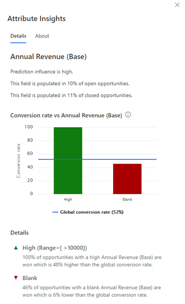    

Typically, the **Attribute Insights** pane is divided into the following sections:

- A summary of the status of the prediction influence, how many times the attribute is populated in open and closed opportunities, and the reason the attribute isn't automatically selected to create the model.

- A graph that illustrates how each value of the attribute contributes to the qualification rate. In this example, you can see that the opportunity score value **High** perform better than the average, and **Blank** perform below the average. The average is represented by a blue line and calculated based on the following formula:

  `Global qualification rate` = {`Total number of opportunities qualified in your organization`/(`Total number of qualified + disqualified opportunities through this attribute`)} &times; 100

  Hover over each bar to view the summary of the value, such as the qualification rate and the number of open and closed opportunities. The qualification rate for a value of the attribute is calculated based on the following formula:
 
  `Qualification rate for a value of the attribute` = (`Total number of opportunities qualified with the given value in the attribute`/`Total number of closed opportunities with that value in the attribute`) &times; 100
 
  For example, if opportunities with high budget have a 42 percent qualification rate, the formula is:

  (`Total number of opportunities with high budget that are qualified)/( Total number of opportunities with high budget that are closed`) &times; 100 = 42  

  >[!NOTE]
   >These calculations are based on the sample data at the time the model is trained, and might not represent the current snapshot of data. The past two years of data is considered and if the model has a filter, the calculations are done after the data is filtered.  

- A **Details** section that provides reasons for why the values are trending as they are in the graph at that point in time. If there isn't enough data for attributes from related entities, the application won't display the insights.

- The **About** tab provides more information about the attribute insights.

>[!NOTE]
>The insights for the attributes are updated when the model is retrained, either manually or automatically. For models that were created before March 2021, data for attribute insights won't be available. We suggest that you retrain&mdash;or enable the option to automatically retrain&mdash;these models to view the attribute insights.

**To view the Attribute Insights pane**

1. Go to the predictive opportunity scoring configuration page, and select **Edit model**.

2. On the **Edit fields** page, select the attribute for which you want to view insights, either from **Primary entity** or **Related entities**. The **Attribute Insights** pane is displayed on the right side of the page.

## Delete a model

You can delete a model when it's no longer required in your organization. You can have only 10 models&mdash;both published and unpublished&mdash;simultaneously.

1. Go to the predictive opportunity scoring configuration page.

2. Select a model from the **Select model** list, and then select **Delete model**. In this example, we've selected the model **OpportunityScoring_202009231810**.

    >[!NOTE]
    >You can't delete a model if the **Retrain automatically** option is enabled. Disable the option first.

    > [!div class="mx-imgBorder"]
    > 

3. In the confirmation message that appears, select **Delete**.

The model is deleted from your organization.

## Manage duplicate models

When you create multiple models, it’s important to configure them so that they are not scoring the same opportunities. In the case of duplicate models, it’s difficult to identify which model scored the opportunity. Duplicate models are automatically identified when you create or edit models. A conflict message is displayed when the configuration is a duplicate of existing models.    
To remove the duplicate models, use one of the following methods depending on the action you’re performing:
- [Create model](#create-model)
- [Published model](#published-model)

### Create model

When you select **Get started**, a conflict message is displayed stating that the model you’re creating has conflicts with other models in the list. The following image shows an example of the message:

> [!div class="mx-imgBorder"]
> 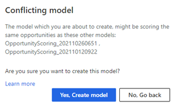
 
-	Select **No, Go back** and change the filter column and values to ensure that the model is scoring unique opportunities. For more information, see step 7 in [First-run setup experience](#first-run-setup-experience).
-Or-
-	Proceed to create a duplicate model, which might cause conflicts in identifying the opportunities that are being scored by this model.

### Published model

When you open a published model, a note displays above the version details section with the list of models that the current model is a duplicate of. The following image shows an example of the message:

> [!div class="mx-imgBorder"]
> 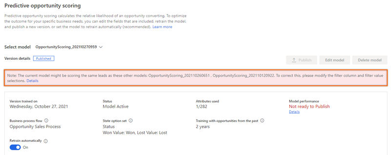
 
1.	Select **Delete model** to delete the current model from the application.
2.	[Create the model](#add-a-model) with different filter column and filter values to score a opportunity.

## Add the opportunity scoring widget to a form

By default, the predictive opportunity scoring widget is available only in the out-of-the-box **Sales Insights** form. If you're using customized forms for opportunities, you can display the predictive opportunity scoring widget on your custom forms by following these steps.

> [!IMPORTANT]
> - Adding opportunity scoring widgets is only supported in Unified Interface apps.
> - You can't use the legacy form designer to add an opportunity scoring widget to a form.

1. Sign in to the [Power Apps](https://make.powerapps.com/) portal.

    > [!div class="mx-imgBorder"]  
    > 

2. Search for and select your organization's environment.

    > [!div class="mx-imgBorder"]  
    > 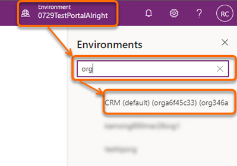

3. Select **Data** > **Tables**.

    The **Tables** page opens with the list of tables.

    > [!div class="mx-imgBorder"]  
    > 

4. Open the table, select the **Forms** tab, and then select a main form to add the widget to. In this example, the table **Opportunity** is selected and the main form **Opportunity** is selected.

    >[!NOTE]
    >If you're unable to view the table to which you want to add the widget, in the upper-right corner of the page, change the filters settings to **All**. 

    > [!div class="mx-imgBorder"]  
    > 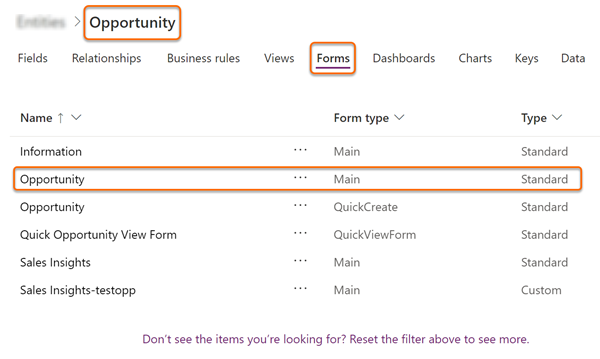

5. In the form designer, select **Component**, and then from **Layout**, add a column to the form as a placeholder to add the widget.

    > [!div class="mx-imgBorder"]  
    > 

    The column is added to the form.

7. From the site map, select **Display** > **Predictive score**.

    >[!NOTE]
    >Ensure that the added placeholder column is selected. If it isn't, the widget will be added at a random place in the form. 

    > [!div class="mx-imgBorder"]  
    > 

8. In the **Edit predictive score** pop-up window, select **Done**.

    > [!div class="mx-imgBorder"]  
    > 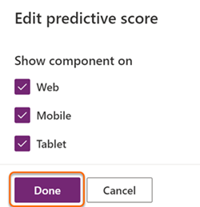

    The predictive score widget is added to the form, as shown in the following image.

    > [!div class="mx-imgBorder"]  
    > 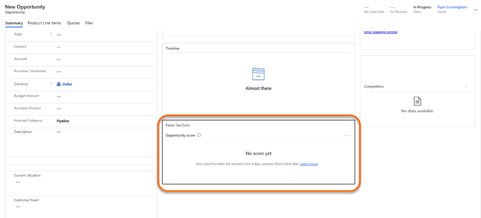

    >[!NOTE]
    >To hide the **New section** label, go to the **Properties** tab of the **New Section** settings pane, and then select **Hide label**.

9. Save and publish the form.

[!INCLUDE[cant-find-option](../includes/cant-find-option.md)]

### See also

[Prioritize opportunities through scores](../sales/work-predictive-opportunity-scoring.md)  
[Install and configure premium Sales Insights features](intro-admin-guide-sales-insights.md#install-and-configure-premium-sales-insights-features)  
[Predictive lead/opportunity scoring FAQs](faqs-sales-insights.md#predictive-leadopportunity-scoring)

[!INCLUDE[footer-include](../includes/footer-banner.md)]
