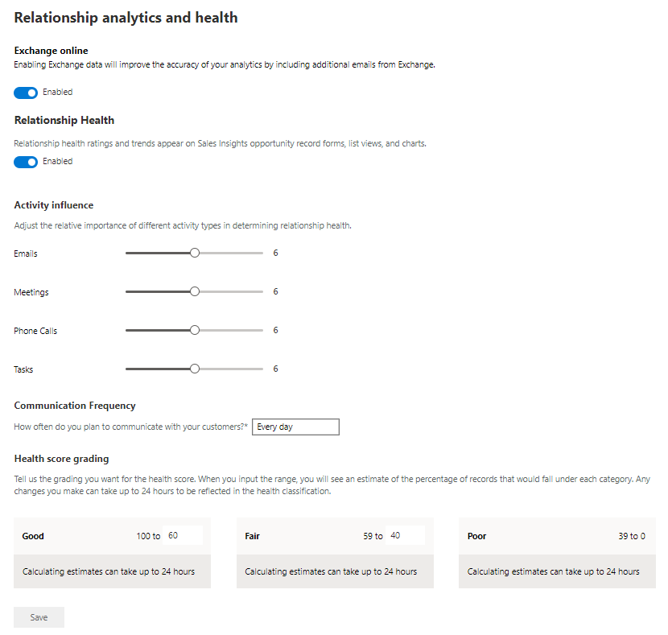
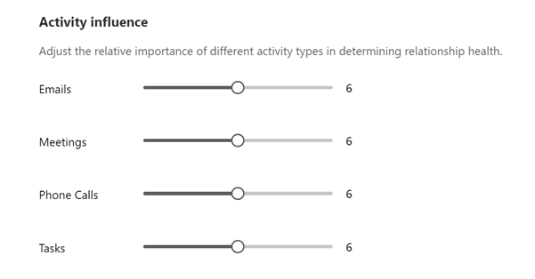

# Configure relationship analytics and health 

Relationship analytics provides a graphical representation of KPIs and activity histories of any contact, opportunity, lead, or account. It uses data from Dynamics 365 and Exchange Online (if configured) to create more accurate and complete relationship information. To configure the feature, perform the following tasks:

1. [Enable relationship analytics and health](#enable-relationship-analytics-and-health)
1. [Allow to collect information from Exchange server](#allow-to-collect-information-from-exchange-server) 

## License and role requirements

| &nbsp; | &nbsp; |
|-----------------------|---------|
| **License** | Dynamics 365 Sales Premium  More information: [Dynamics 365 Sales pricing](https://dynamics.microsoft.com/sales/pricing/) |
| **Security Role** | System Administrator    More information: [Predefined security roles for Sales](security-roles-for-sales.md)|
|||

>[!IMPORTANT]
>This feature is intended to help sellers or sales managers enhance their team’s performance. This feature is not intended for use in making, and should not be used to make, decisions that affect the employment of an employee or group of employees, including compensation, rewards, seniority, or other rights or entitlements. Customers are solely responsible for using Dynamics 365, this feature, and any associated feature or service in compliance with all applicable laws, including laws relating to accessing individual employee analytics and monitoring, recording, and storing communications with end users. This also includes adequately notifying end users that their communications with sales persons may be monitored, recorded, or stored and, as required by applicable laws, obtaining consent from end users before using the feature with them. Customers are also encouraged to have a mechanism in place to inform their sales persons that their communications with end users may be monitored, recorded, or stored.

## Enable relationship analytics and health 

1. In the Sales Hub app, go to **Change area** in the lower-left corner of the page, and select **Sales Insights settings**. 
   
3. Under **Relationship insights**, select **Analytics and health**.   

    > [!NOTE]
    > If you don't see the **Analytics and health** menu, verify whether the advanced Sales Insights features are enabled. To learn more, see [Install and configure premium Sales Insights features](intro-admin-guide-sales-insights.md#install-and-configure-premium-sales-insights-features). 
    
4. Select the toggle to enable relationship analytics for your organization and then select **Save**.  

    > [!div class="mx-imgBorder"]
    >   
    
    The application takes few seconds to enable relationship analytics for your organization. After relationship analytics is enabled, you can configure the parameters as required.    

    By default, the data sources and view similar opportunities options are enabled. 

    The modern design experience is available by default for contacts, opportunities, leads, and accounts. Users in your organization can see an improved relationship analytics tab for opportunities. The tab displays customer interaction KPIs along with suggestions calculated from similar won opportunities through AI-driven models.  

    > [!div class="mx-imgBorder"]
    >  
    
    > [!NOTE]
    > - You must have at least 30 won and 30 lost opportunities to compare with existing opportunities.
    > - To understand how users use this feature, see [View similar opportunities](relationship-analytics.md#relationship-analytics-with-similar-opportunities).   
    
6. To show the relationship health score in opportunities, views, and charts, set the toggle to **On**.    

    > [!NOTE]
    > You can disable the option if you don't wish to display the score in opportunities, views, and charts. However, disabling the option does not affect the process of gathering the relevant health data.   
    
    > [!div class="mx-imgBorder"]
    >  
    
7. Adjust the importance of activities of different types as they contribute to the relationship health score.  

    Businesses place different emphasis on the type of communication used with customers. The activities include, Emails, Meetings, Phone calls, and Tasks. 
    
    > [!div class="mx-imgBorder"]
    > 
    
8. Choose **Communication frequency**.     

    Businesses have varying sales cycles and different expected levels of communications with customers. A longer expected communications frequency reduces the expectation of more recent frequent communications in the health score. A shorter expected communications frequency increases the expectation of more recent frequent communications in the health score. 
    
    > [!div class="mx-imgBorder"]
    >     
    
9.  Set **Health score grading** for health scores to grade opportunities.  

    When health score is calculated, the opportunities in your organization's pipeline are graded according to the range defined in this section. Each opportunity in the pipeline is graded Good, Fair, or Poor, according to the health score. Opportunities in the top score range are graded Good while records within the lowest score range are graded Poor.  
    
    You can configure the range for the grading according to your organizational requirements. When you change the health score range for a grade, the maximum range value for the adjacent grade changes automatically in accordance with the change in the minimum value. For example, when you change the minimum range value score for Good to 60, the maximum lead score range for Fair changes to 59.    
    
    After setting the values, the initial grading of opportunities can take up to 24 hours.
    
    > [!div class="mx-imgBorder"]
    >     
    
10. Select **Save**.   

    Relationship analytics is ready to use in your organization.   

## Allow to collect information from Exchange server 

Enable the **Dynamics 365 Sales Insights – Analytics** option in the admin center to collect valuable information about communications&mdash;such as emails and meetings&mdash;for users in your organization from Exchange server. This data is used in analytics features for salespeople and sales managers. When you enable, the **Exchange Data** option on the relationship analytics configuration page is automatically selected. 
   
1. Go to the **Microsoft 365 admin center**.     
    
2. Select **Settings** > **Org Settings** > **Dynamics 365 Sales Insights – Analytics**.    
    > [!div class="mx-imgBorder"]
    >     
    
3. Read the description carefully, select the **Allow org data to be used by Dynamics 365 Sales Insights - Analytics** option, and then save the changes.       
    
    Dynamics 365 can now connect to the Exchange server to collect data.

[!INCLUDE[cant-find-option](../includes/cant-find-option.md)]

### See also

[Use relationship analytics to gather KPIs](../sales/relationship-analytics.md)  
[Add Relationship intelligence widgets to custom forms](add-ri-widgets-to-custom-form.md) 
[GDPR for Sales Insights](embedded-intelligence-gdpr.md)  
[View and export KPI data (GDPR)](view-export-KPI-data-gdpr.md)  

[!INCLUDE[footer-include](../includes/footer-banner.md)]
