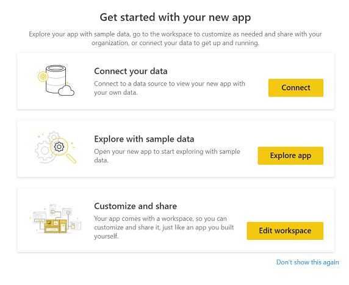
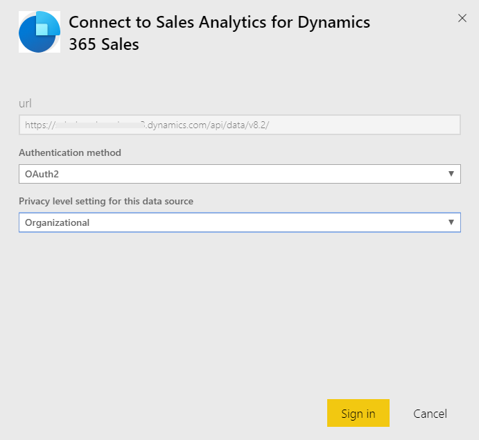
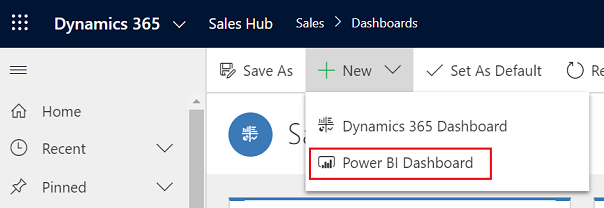
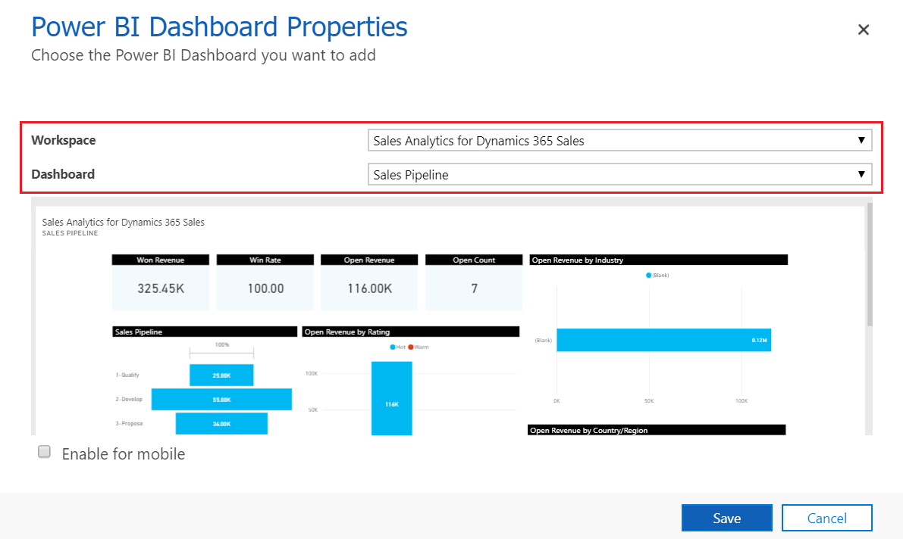

# Configure Power BI template apps to work with Dynamics 365 Sales 

In this article, you'll learn how to configure Power BI template apps to work with Dynamics 365 Sales.

## License and role requirements

| &nbsp; | &nbsp; |
|-----------------------|---------|
| **License** | Dynamics 365 Sales Premium or Dynamics 365 Sales Enterprise   More information: [Dynamics 365 Sales pricing](https://dynamics.microsoft.com/sales/pricing/) |
| **Security roles** | System Administrator   See [Predefined security roles for Sales](security-roles-for-sales.md)|
|||

## Configure Power BI template apps for Sales

You must perform the following steps to configure Sales Analytics for Dynamics 365 Sales or Process Analytics for Dynamics 365:

1. [Review the prerequisites](#step-1-review-prerequisites).
2. [Install the Power BI template app](#step-2-install-the-power-bi-template-app).
3. [Connect your Dynamics 365 Sales organization to the Power BI template app](#step-3-connect-your-dynamics-365-sales-organization-to-the-power-bi-template-app).
4. [Configure the refresh frequency for the Power BI dataset](#step-4-configure-the-refresh-frequency-for-the-power-bi-dataset).
5. [Publish the application within your organization](#step-5-publish-the-application-within-your-organization).
6. [Step 6: Enable Power BI reporting in the Microsoft Dataverse platform](#step-6-enable-power-bi-reporting-in-the-microsoft-dataverse-platform).
7. [Add the Power BI Dashboard to the Sales Hub app (optional)](#step-7-add-power-bi-dashboards-to-the-sales-hub-app).

> [!NOTE]
> In the following steps, you'll configure the Sales Analytics for Dynamics 365 Sales app. You can follow the same steps to configure the Process Analytics for Dynamics 365 app.

### Step 1: Review prerequisites

Review the following prerequisites before configuring the Power BI template apps:

- You have administrative privileges for Dynamics 365 and Power BI.
- You have a Power BI Pro license for all users of the reports or dashboards in the Power BI template apps.

### Step 2: Install the Power BI template app

1.  Sign in to the [Power BI](https://app.powerbi.com/) app as an administrator.

2.  Open the [Sales Analytics template app](https://go.microsoft.com/fwlink/p/?linkid=2121603) link.

    > [!NOTE]
    > To get the Process Analytics for Dynamics 365 app, open the [Process Analytics template app](https://go.microsoft.com/fwlink/p/?linkid=2121604) link.

3.  Install the Power BI template app.

4.  After the Power BI template app is installed, the app configuration options page is displayed.

    > [!div class="mx-imgBorder"]
    > 

### Step 3: Connect your Dynamics 365 Sales organization to the Power BI template app

1.  On the Power BI template app configuration options page, select **Connect**.

    > [!div class="mx-imgBorder"]
    > 

2.  On the connect data page, enter the URL for your Dynamics 365 organization, and then select **Next**.

    > [!div class="mx-imgBorder"]
    > 

3.  For **Authentication method**, select **OAuth2** and for **Privacy level**, select **Organizational**. Select **Sign in**.

    > [!div class="mx-imgBorder"]
    > 

4.  Enter your Dynamics 365 Sales credentials, and then select **Enter**.

When you're signed in, the existing report will be updated with the data from your organization.

### Step 4: Configure the refresh frequency for the Power BI dataset

After you connect the Power BI template app with Dynamics 365 Sales, you need to configure the refresh frequency on the Power BI dataset to update reports and dashboards properly.

1.  Sign in to Power BI as an administrator.

2.  Go to the Power BI template app workspace.
 
3.  On the **Datasets** tab, select **Settings**.

    > [!div class="mx-imgBorder"]
    > 
 
4.  Under **Scheduled refresh**, turn on the **Keep your data up to date** toggle.

    > [!div class="mx-imgBorder"]
    > 

> [!NOTE]
> We recommend that you set **Refresh frequency** to **Daily**.

### Step 5: Publish the application within your organization

You must share the configured application with your entire organization for users to view the dashboards and reports by using their own Power BI Pro accounts.

1.  On the app workspace, select **Update app**.

    > [!div class="mx-imgBorder"]
    > 

2.  On the **Permissions** tab, select **Entire organization**, and then select **Update app**.

    > [!div class="mx-imgBorder"]
    > 

The app is now available to install for all individuals in your organization.

### Step 6: Enable Power BI reporting in the Microsoft Dataverse platform

As an administrator, you must enable Power BI reporting in the Microsoft Dataverse platform for sales managers to view the dashboards in the Sales Hub app.

1.  Sign in to the Microsoft Dataverse platform, and then go to **Settings**.

2.  Select **Administration** > **System Settings**.

3.  On the **Reporting** tab, turn on the **Allow Power BI visualization embedding** toggle.

    > [!div class="mx-imgBorder"]
    > 
 
### Step 7: Add Power BI dashboards to the Sales Hub app

Each sales manager must configure their environment to integrate the Sales Analytics for Dynamics 365 Sales dashboard.

1.  Sign in to Dynamics 365 Sales, and then open the **Sales Hub** app.

2.  Under **My Work**, select **Dashboards**.

3.  Select **New** > **Power BI Dashboard**.

    > [!div class="mx-imgBorder"]
    > 
 
4.  For **Workspace**, select **Sales Analytics for Dynamics 365 Sales**. For **Dashboard**, select **Sales Pipeline**.

    > [!div class="mx-imgBorder"]
    > 
 
5.  Select **Save**, and then select **Close**.

     > [!div class="mx-imgBorder"]
    > 

The Sales Analytics for Dynamics 365 Sales dashboard is now available in Dynamics 365.

### See also

[Analyze your sales data by using Power BI template apps](introduction-sales-template-apps.md) 
[Customize Power BI template apps for Dynamics 365 Sales](customize-template-apps.md)

[!INCLUDE[footer-include](../includes/footer-banner.md)]
