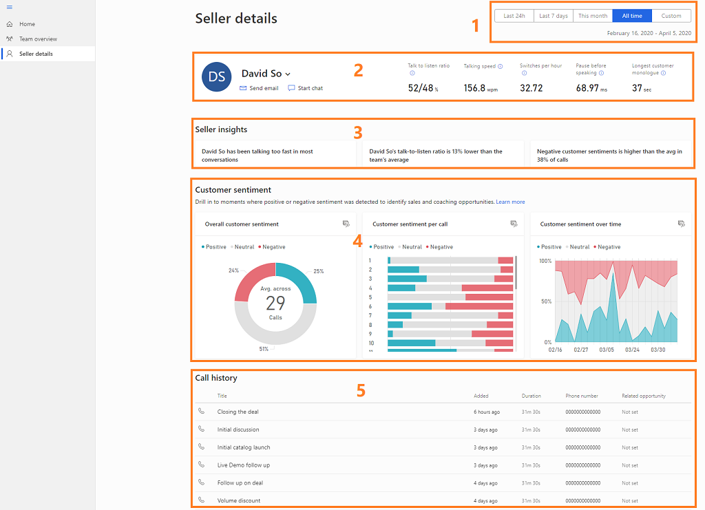
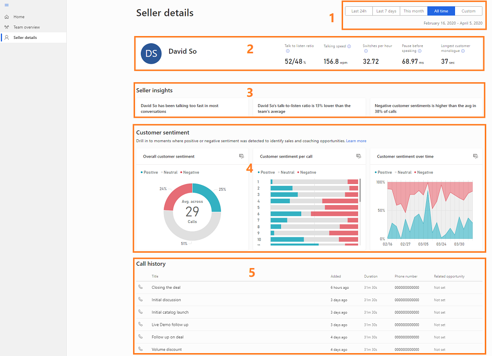

# View a seller’s performance to identify best practices and coaching opportunities 

View insights and analysis of each seller’s performance during calls with customers and leads. 

The information you see on the **Seller details** page varies according to your role (sales manager or seller). To view the **Seller details** page, sign in to **Conversation intelligence**, and select **Seller details**. 

## License and role requirements

| &nbsp; | &nbsp; |
|-----------------------|---------|
| **License** | Dynamics 365 Sales Premium  More information: [Dynamics 365 Sales pricing](https://dynamics.microsoft.com/sales/pricing/) |
| **Security roles** | Salesperson and above    More information: [Predefined security roles for Sales](security-roles-for-sales.md)|
|||

## Seller details page for sales managers

As a sales manager, the **Seller details** page helps you analyze the overall behavior of an individual seller during customer calls. Using this analysis, you can identify coaching scenarios to increase wins and productivity gains for the business. With the **Seller details** page, you can:

- Identify keywords that customers use during calls.

- Identify competitor names that customers mention during calls.

- Identify potential sellers who might need coaching.

- Identify best practices of your top sellers.

- Drill down into each seller view and analyze the data, such as conversational KPIs, insights, and customer sentiment.

- Analyze call transcripts and identify the areas where sellers need coaching, or where top sellers excel.

- Comment on call transcripts and share with sellers.

- Drill down into specific seller’s calls to follow up on action items, signals, such as keywords, competitors mentioned during the call, and identify possible coaching activities.

The following image is an example of how the seller page is displayed for sales managers:

> [!div class="mx-imgBorder"]
> 

Let's look at the KPIs and insights in detail:

|KPI/Insights|Description|
|------------|-----------|
|**1. Date filter**|Select a timeline for which you want to view the data.|
|**2. Basic information**|Select a seller from the drop-down list to view that seller's information such as insights, statistics, and call history. With this information, you can assess a seller's behavior and identify areas where the seller requires coaching. You can comment directly on call transcripts to provide coaching inputs or gather information as required. You can also send them an email or chat directly. Select the email icon to send an email and select the chat icon to chat with the seller. These insights also show the seller’s conversational style, with KPIs such as average talking speed, switch per conversations, average pause, and longest customer monologue.|
|**3. Insights**|Displays what’s happening with the seller and the latest trends specific to each seller, such as customer sentiment and talk-to-listen ratio.|
|**4. Statistics** |•	**Average customer sentiment level:** Displays the customer sentiments (positive, negative, and neutral) for each call that the seller handled. •	**Average talk to listen ratio:** Displays the average talk-to-listen ratio of the seller during calls with a customer. •  **Sentiment over time:** Shows the three customer sentiments (positive, negative, and neutral) across the specified timeframe for the seller.|
|**5. Call history**|Displays a list of the seller’s calls. Open a specific call to listen to the call, see the transcript, and view the call signals (e.g. keywords mentioned during the call). To learn more, see [View and understand call summary](../sales/view-and-understand-call-summary.md)|

## Seller details page for sellers

As a seller, the **Seller details** page helps you analyze your overall behavior during customer calls. Using this analysis, you can identify best practices, as well as areas that you need to improve. With the **Seller details** page, you can:

-	Identify the main keywords that customers use during calls.

-	Identify competitor names that customers mention during calls.

-	Analyze call transcripts and identify the areas where you need coaching.

-	View your manager’s comments on your call transcripts.

-	Drill down into specific calls to follow up on action items, view signals (e.g, keywords, competitors mentioned during the call), read the transcript, and more.

The following image is an example of how the seller page is displayed for sellers:

> [!div class="mx-imgBorder"]
> 

Let's look at the KPIs and insights in detail:

|KPI/Insights|Description|
|------------|-----------|
|**1. Date filter**|Select a timeline for which you want to view the data.|
|**2. Basic information**|Displays your conversational style, with KPIs such as average talking speed, switch per conversations, average pause, and longest customer monologue.|
|**3. Insights**|Displays the latest trends specific to you, such as customer sentiment and talk-to-listen ration.|
|**4. Statistics** |•	**Average customer sentiment level:** Displays the customer sentiments (positive, negative, and neutral) for each call that you have handled. •	**Average talk to listen ratio:** Displays your average talk-to-listen ratio during calls with a customer. •  **Sentiment over time:** Shows the three customer sentiments (positive, negative, and neutral) across the specified timeframe.|
|**5. Call history**|Displays a list of your calls. Open a specific call to listen to the call, see the transcript, and view the call signals (e.g. keywords mentioned during the call). To learn more, see [View and understand call summary](../sales/view-and-understand-call-summary.md)|

[!INCLUDE[cant-find-option](../includes/cant-find-option.md)]

### See also

[Overview of conversation intelligence](dynamics365-sales-insights-app.md)

[First-run set up experience of conversation intelligence](fre-setup-sales-insight-app.md)

[Connect to Dynamics 365 Sales environment](connect-dynamics365-sales-environment.md)

[!INCLUDE[footer-include](../includes/footer-banner.md)]
