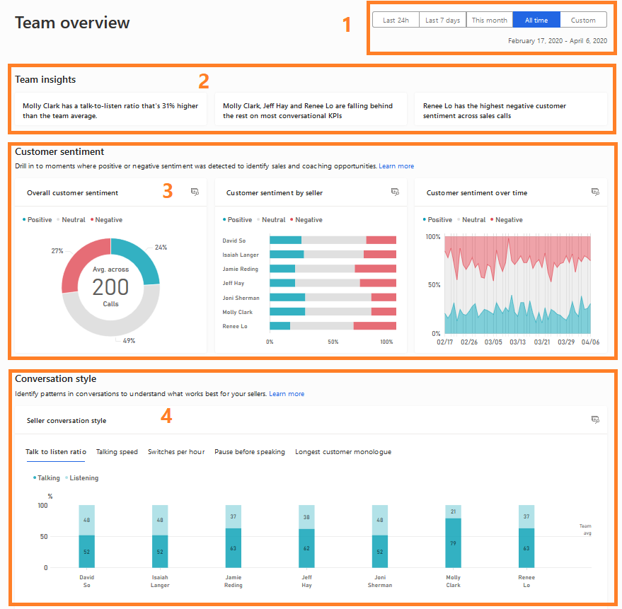

# Analyze behavior of your team on customer calls 

Sales calls are one of the most important part of your business as these calls help you to change the shape of your business by improving sales and generating revenue. The **Teams overview** page in conversation intelligence helps sales managers analyze the overall behavior of their team during customer calls. This helps in identifying coaching scenarios for the team to increase sales wins and productivity gains for the business.

## License and role requirements
| Requirement type | You must have |
|-----------------------|---------|
| **License** | Dynamics 365 Sales Premium  More information: [Dynamics 365 Sales pricing](https://dynamics.microsoft.com/sales/pricing/) |
| **Security roles** | Any primary sales role, such as salesperson or sales manager   More information: [Primary sales roles](security-roles-for-sales.md#primary-sales-roles)|

## Analyze your team's behavior

As a sales manager, these KPIs and insights help you to: 

- Assess overall customer sentiments and sentiment trends.
  
- Assess your team's contributions toward customer sentiment.

- Gain insight into what’s going on with your team.

- Analyze your team's conversational style.

To view the **Teams overview** page, sign in to  **Conversation intelligence**, and select **Teams overview**. 

> [!div class="mx-imgBorder"]
> 

|KPI/Insights|Description|
|------------|-----------|
|**1. Date filter**|Provides a time period for which you can view your team's call data and insight.|
|**2. Team insights**|Displays what’s happening in your team and the latest trends, such as which sales reps are scoring high in customer satisfaction as well as those who might need coaching based on the customer sentiments they are generating and keywords that are trending.|
|**3. Customer sentiment**|• **Overall customer sentiment:** Specifies the customer sentiment in percentage—positive, negative, or neutral. •	**Customer sentiment over time:** Displays how the three customer sentiments (positive, negative, and neutral) are spanning across the specified timeframe.  •	**Customer sentiment by sales rep:** Specifies how each of your sales reps contributed toward generating the overall customer sentiment. Also, shows which sales rep have the highest or lowest contributions.|
|**4. Conversation style**|• **Talk to listen ratio:** Specifies the average listen and talk ratio of sales reps in conversations with customers. •	**Talking speed:** Displays the average number of words used per minute by sales reps.  • **Switches per hour:** Displays the average switches between a sales rep and customer in a conversation, meaning the number of times the conversation switched from one person to another. This is a sign of engagement during conversations. • **Pause before speaking:** Displays how many milliseconds the sales rep paused before responding to customer queries; this is a signal of patience by the sales rep. • **Longest customer monologue:** Displays the longest length of speech without a break by the customer with a sales rep in seconds; this is a signal that sales reps are asking good questions and showing understanding of customer needs.|

[!INCLUDE[cant-find-option](../includes/cant-find-option.md)]

### See also

[Overview of conversation intelligence](dynamics365-sales-insights-app.md)

[First-run set up experience](fre-setup-sales-insight-app.md)

[Connect conversation intelligence to an environment](connect-dynamics365-sales-environment.md)

[!INCLUDE[footer-include](../includes/footer-banner.md)]
