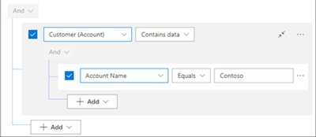

# Create and activate a segment 

As a sequence manager, you create segments&mdash;groups of records&mdash;by defining different conditions for each segment. After a segment is activated and a record satisfies the conditions that are defined in the segment, the record becomes a member of the segment. A sequence that's connected to the segment is then automatically connected to records in the segment. You don't have to manually connect the sequence to a new record when it's created in Dynamics 365 Sales.

## License and role requirements
| Requirement type | You must have |
|-----------------------|---------|
| **License** | Dynamics 365 Sales Premium or Dynamics 365 Sales Enterprise  More information: [Dynamics 365 Sales pricing](https://dynamics.microsoft.com/sales/pricing/) |
| **Security roles** | System Administrator or Sequence Manager    More information: [Predefined security roles for Sales](security-roles-for-sales.md)|

<!--markdownlint-disable MD036-->
## To create and activate a segment
<!--markdownlint-enable MD036-->
1.	Sign in to your Dynamics 365 Sales Hub app.    
2.	Go to **Change area** in the lower-left corner of the page, and select **Sales Insights settings**.   
3.	Under **Sales accelerator**, select **Segments**.   
4.	On the **Segments** page, select **New segment**.

    The **Create a segment** dialog opens.

    >[!div class="mx-imgBorder"]
    >          
 
5.	In the **Create a segment** dialog, enter the following information:     

    | Parameter | Description |
    |-----------|-------------|
    | Segment name | The name of the segment. |
    | Description | A description of the segment (optional). |
    | Record type | The type of record to be grouped in this segment. By default, the lead and opportunity record type are available. For other record types, you must configure the record types in the **Choose content and layout** section while configuring the sales accelerator. More information: [Choose content and layout](enable-configure-sales-accelerator.md#choose-content-and-layout). |
	
6.	Select **Next**.   

    The segment designer page opens.    
    >[!div class="mx-imgBorder"]
    >

7. (Optional) To allow records move from another segment to this, turn on the **Allow *records* to be moved from other segments to this one** toggle. when enabled, the application validates the records for conditions defined in this segment and moves the records accordingly though the records are connected to a different segment. When moved, the records will be connected to the sequence from this segment.    
    However, the assignment rules won't be changed. To apply the current assignment rule to the moved records, select the **Update seller assignment as well** option.     
    
    :::image type="content" source="media/sa-segment-allow-records-to-move.png" alt-text="Screenshot illustrating the option to allow records to move tho this segment and apply the assignment rules":::           

7.	On the **Builder** tab, under **And**, select **Add**. Use the following options to define the criteria for the conditions to use for evaluating records:     

    -	**Add row**: Add conditions for when the segment should be applied. For example, you can add rows to specify that this segment be applied to leads created by the user John Thomas.    
        1.	Select an attribute from the dropdown list in the first column.    
        2.	Select an operator from the dropdown list in the second column.    
        3.	Enter a value to filter by in the third column.   
            >[!div class="mx-imgBorder"]
            >          
        
            Similarly, you can create more conditions to further filter the leads to apply the segment to.    

    -	**Add group**: Add multiple conditions as a group to your segment if you want to filter leads by using more than one field.   

        1.	Select **And** or **Or** to group the conditions.     

            >[!div class="mx-imgBorder"]
            >        

        2.	Select the conditions that you want to add to the group.    

            >[!div class="mx-imgBorder"]
            >        

        3.	When you select **And**, this segment is only applied to leads that meet both criteria. When you select **Or**, the segment is applied to leads that meet any of the filter criteria. For example, to apply this segment to leads that are created by Kenny Smith and have the company name Contoso, select **AND**.

            Similarly, you can create multiple groups and further filter the leads based on the conditions defined in the groups.    

    -	**Add related entity**: Add a condition based on the attributes of related entities.   
        Select an attribute from the **Related Entity** list in the topmost field, and then choose **Contains data** or **Does not contain data**. This enables the condition section.   

        >[!div class="mx-imgBorder"]
        >        

        Define the condition as required.   

8.	After defining the conditions, select **Simulate results** to verify that the conditions for the segment work as defined.    

    >[!div class="mx-imgBorder"]
    >           

    A list of records that satisfy the conditions you've defined for the segment in the application are displayed.    
    >[!NOTE]
    >- The records displayed here are only simulated results; they might not be records that the segment can actually be applied to.   
    >- To activate the segment, select **Activate**.

    >[!div class="mx-imgBorder"]
    >

9.	Select **Save** and then select **Activate**.   

    >[!div class="mx-imgBorder"]
    >           

    A confirmation message to activate segment is displayed.    

10. Select **Activate**. 
    
The segment is activated. Now you can connect the segment to a sequence or a record. 

[!INCLUDE[cant-find-option](../includes/cant-find-option.md)]

<table>
<tr><td>

> [!div class="nextstepaction"] 
> [Next step: Connect a segment to a sequence](connect-a-segment-to-sequence.md)
</td></tr>
</table> 

### See also

[Manage segments](manage-segments.md)   
[View details of a segment](view-details-segment.md)

[!INCLUDE[footer-include](../includes/footer-banner.md)]

