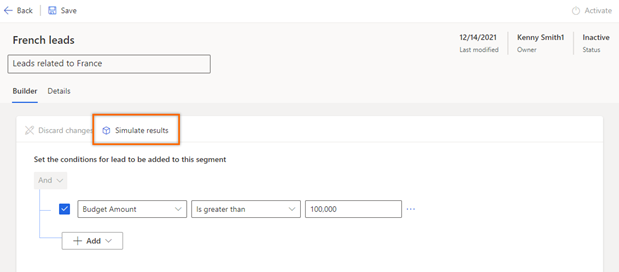
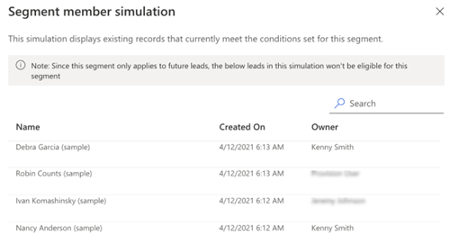

# Create and activate a segment

As a sequence manager, you create segments&mdash;groups of records&mdash;by defining different conditions for each segment. After a segment is activated and a record satisfies the conditions that are defined in the segment, the record becomes a member of the segment. A sequence that's connected to the segment is then automatically connected to records in the segment. You don't have to manually connect the sequence to a new record when it's created in Dynamics 365 Sales.

## License and role requirements

| Requirement type | You must have |
|-----------------------|---------|
| **License** | Dynamics 365 Sales Premium or Dynamics 365 Sales Enterprise  More information: [Dynamics 365 Sales pricing](https://dynamics.microsoft.com/sales/pricing/) |
| **Security roles** | System Administrator or Sequence Manager    More information: [Predefined security roles for Sales](security-roles-for-sales.md)|

<!--markdownlint-disable MD036-->
## To create and activate a segment
<!--markdownlint-enable MD036-->
1. Sign in to your Dynamics 365 Sales Hub app.
1. Go to **Change area** in the lower-left corner of the page, and select **Sales Insights settings**.
1. Under **Sales accelerator**, select **Segments**.
1. On the **Segments** page, choose a record type from the **Record type** list.
    By default, the lead and opportunity record types are available. The list displays all the record types that you've selected in the [Choose content and layout](enable-configure-sales-accelerator.md#choose-content-and-layout) section in the sales accelerator configuration.  

1. Select **New segment**.
1. In the **Create a segment for \<*record type*\>** dialog box, enter a name and description for the segment. In the **Priority** field, enter a priority.

    Set a priority for every segment. Records that meet the criteria for multiple segments are assigned to the segment that has the highest priority. You can change the priority of a segment at any time. By default, the priority is set to the priority of the last segment that was created. However, the default out-of-box segment is always prioritized last in the list.

1. Select **Next**.

    The segment designer page opens.

    :::image type="content" source="media/sa-segment-condition-builder-home-page.png" alt-text="Screenshot of segment condition builder page.":::

1. (Optional) To allow records from another segment to move to this one, turn on **Allow records to be moved from other segments to this one**. The application validates the records for conditions defined in this segment and moves the records accordingly, although the records are connected to a different segment. When moved, the records are connected to the sequence from this segment. However, the assignment rules won't be changed. To apply the current assignment rule to the moved records, select the **Update seller assignment as well** option.

    :::image type="content" source="media/sa-segment-allow-records-to-move.png" alt-text="Screenshot illustrating the option to allow records to move to this segment and apply the assignment rules.":::

1. On the **Builder** tab, under **And**, select **Add**. Use the following options to define the criteria for the conditions to use for evaluating records:

    - **Add row**: Add conditions for when the segment should be applied. For example, you can add rows to specify that this segment should be applied to leads created by the user John Thomas.

        1. Select an attribute from the dropdown list in the first column.
        1. Select an operator from the dropdown list in the second column.
        1. Enter a value to filter by in the third column.

            >[!div class="mx-imgBorder"]
            >

            Similarly, you can create more conditions to further filter the leads to apply the segment to.

    - **Add group**: Add multiple conditions as a group to your segment if you want to filter leads by using more than one field.

        1. Select **And** or **Or** to group the conditions.

            >[!div class="mx-imgBorder"]
            >

        1. Select the conditions that you want to add to the group.

            >[!div class="mx-imgBorder"]
            >

        1. When you select **And**, this segment is only applied to leads that meet both criteria. When you select **Or**, the segment is applied to leads that meet any of the filter criteria. For example, to apply this segment to leads that are created by Kenny Smith and have the company name Contoso, select **AND**.

            Similarly, you can create multiple groups and further filter the leads based on the conditions defined in the groups.

    - **Add related entity**: Add a condition based on the attributes of related entities.
        Select an attribute from the **Related Entity** list in the topmost field, and then choose **Contains data** or **Does not contain data**.

        >[!div class="mx-imgBorder"]
        >

        Define the condition as required.

    At any given time, you can have a maximum of 10 conditions in a segment, including conditions defined within groups and related entities. The condition limit is added to optimize the runtime experience of segments, ensuring faster execution and improved efficiency. If you exceed the limit, a message is displayed stating that the limit is reached and can't save the segment. For best practices to add conditions, see [Recommendation to add conditions](#recommendation-to-add-conditions). 

1. After defining the conditions, select **Simulate results** to verify that the conditions for the segment work as defined.

    >[!div class="mx-imgBorder"]
    >

    A list of records that satisfy the conditions you've defined for the segment in the application are displayed.

    >[!NOTE]
    >- The records displayed here are only simulated results; they might not be records that the segment can actually be applied to.
    >- To activate the segment, select **Activate**.

    >[!div class="mx-imgBorder"]
    >

1. Select **Save** and then select **Activate**.

    >[!div class="mx-imgBorder"]
    >

    A confirmation message to activate segment is displayed.

1. Select **Activate**.

The segment is activated. Now you can connect the segment to a sequence or a record.

>[!NOTE]
>From the 9.3 release, all segments that are related to a primary entity (such as lead or opportunity) run every time you update the attributes of the primary entity that are added to the conditions.

## Recommendation to add conditions

You can have a maximum of 10 conditions in segments at any given time. However, you can optimize the conditions by following the recommendations described below:

- **Distribute segments**: Create multiple segments with proper distribution of conditions and you can connect them to the same sequence. For example, you can create two segments, one for leads that are created by the user **John Thomas** and another for leads that are created by the user **Kenny Smith**. Then, you can connect both the segments to the same sequence. When a lead is created by **John Thomas**, the lead is added to the sequence, and the sequence is applied to the lead. Similarly, when a lead is created by **Kenny Smith**, the lead is added to the sequence and the sequence is applied to the lead.

- **Create nested entities**: To add more conditions, create nested conditions through rollup entities with many-to-many or one-to-many relationships. More information: [Define rollup columns that aggregate values](/power-apps/maker/data-platform/define-rollup-fields) 

- **Avoid simple conditions**: Don't use simple attributes in the segment conditions that are already used in the assignment rules such as Owner. For example, if you have an assignment rule that assigns leads to the user **Kenny Smith**, don't create a segment for leads that are created by the user **John Thomas**.

- **Don't update data or metadata**:  Updating the data or metadata of a record that's already in a segment can cause unexpected behavior or bypass the validations. For example, if you update the owner of a lead that's already in a segment, the lead is removed from the segment. Similarly, if you update the metadata of a segment, the segment is deactivated. 

- **Minimize overlapping segments**: Avoid creating segments that have overlapping conditions. For example, if you create a segment for leads that are created by the user **John Thomas** and another segment for leads that are created by the user **Kenny Smith**, don't create a third segment for leads that are created by the user **John Thomas** and **Kenny Smith**. 

<table>
<tr><td>

> [!div class="nextstepaction"]
> [Next step: Connect a segment to a sequence](connect-a-segment-to-sequence.md)
</td></tr>
</table>

[!INCLUDE[cant-find-option](../includes/cant-find-option.md)]

### See also

[Manage segments](manage-segments.md)   
[View details of a segment](view-details-segment.md)  

[!INCLUDE[footer-include](../includes/footer-banner.md)]
