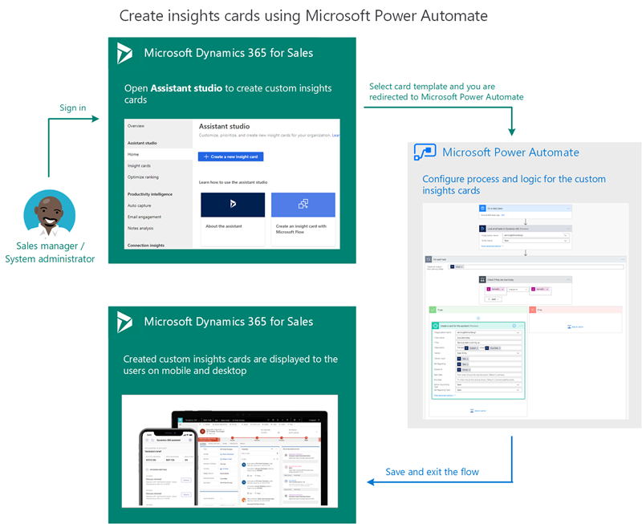
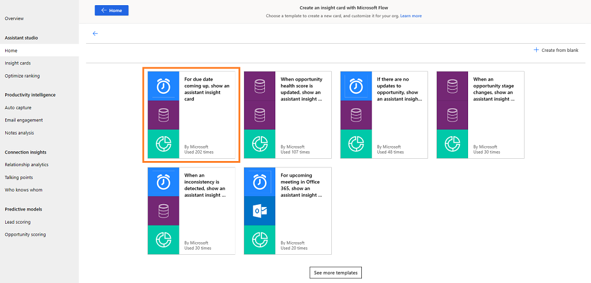
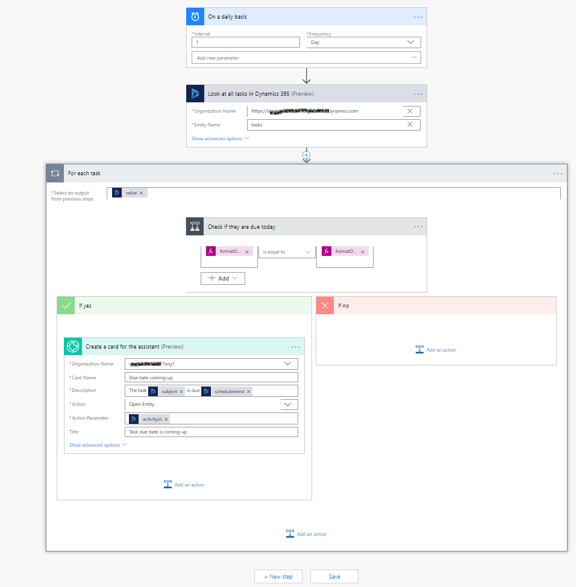
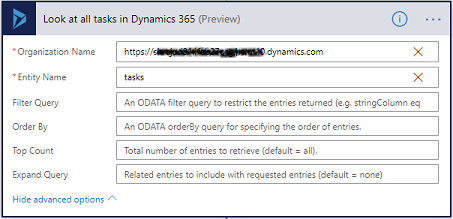
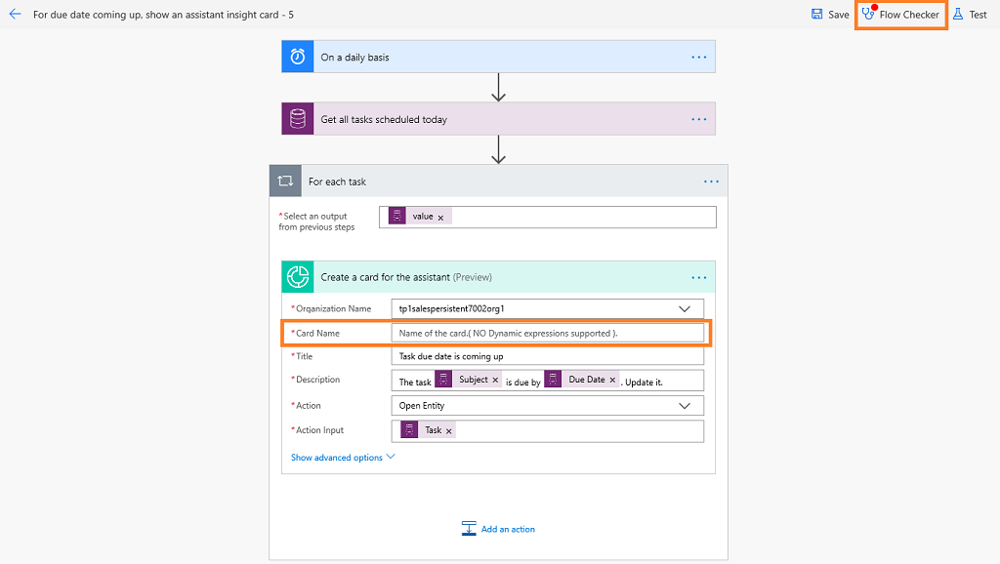
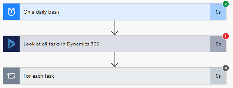
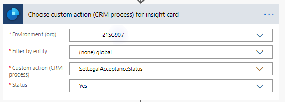
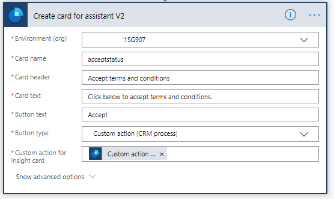
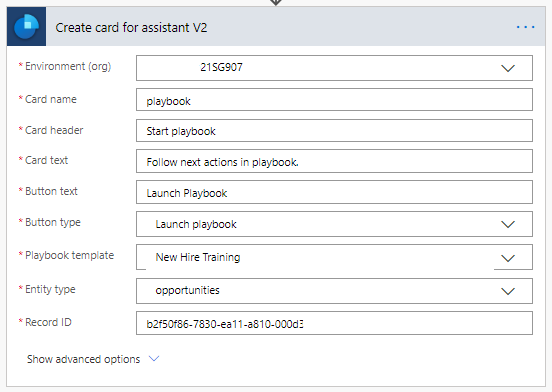
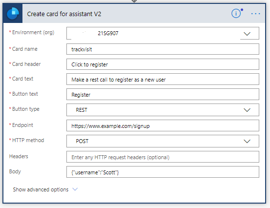

# Create custom insight cards 

As a system administrator or sales manager, you can create your own suggested actions that are more relevant to your organization through the assistant management feature. By using events and conditions, you can customize the circumstances on when to create suggestions and push information into the seller’s workflow. This helps the sellers to close deals faster. The following diagram illustrates a high-level flow of insight card creation:

> [!div class="mx-imgBorder"]
> 

## License and role requirements
| Requirement type | You must have |
|-----------------------|---------|
| **License** | Dynamics 365 Sales Premium  More information: [Dynamics 365 Sales pricing](https://dynamics.microsoft.com/sales/pricing/) |
| **Security roles** | System Administrator or Sales Manager    More information: [Predefined security roles for Sales](security-roles-for-sales.md)|

## Create a custom insight card 

In this procedure, we will show as an example how to create an insight to act when a property is updated. Let’s create the **When property is updated, create an insight to act** card.

>[!NOTE]
>- To create custom insight cards with the assistant studio, ensure that Microsoft Power Automate is installed.
>- The custom insight card is displayed in the list of insight cards in **Assistant studio** only after a card is generated based on the defined flow. For example, you defined a flow to display a card when an opportunity is created with an estimated value above $5000. When an opportunity is created for the first time in the organization with the estimated value of $6000, the card is generated and will be available in the list of insight cards in **Assistant studio**.

1.	Sign in to **Dynamics 365 Sales** and go to the **Sales Hub** app.

2.	Go to **Change area** and select **Sales Insights settings**.

    > [!div class="mx-imgBorder"]
    > 

3. On the site map, under **Assistant**, select **Home** to go to the **Assistant Studio** page.

    > [!TIP]
    > Alternatively, on the **Sales Insights settings** page, select **Manage** from the **Assistant (full capabilities)** section to go to the **Assistant Studio** page.

4. On the Assistant Studio page, select **+ Create a new insight card**.
 
    A template selection page opens. 
    
    > [!NOTE]
    > We recommend you use templates to create insight cards.

5. Select a template to create the card.

    > [!NOTE]
    > If you want to create insight cards from an empty flow, select **Create from blank**. To learn more, see [Create a flow in Power Automate](/power-automate/get-started-logic-flow).
    
    In this example, we selected the **Due date is coming up** template to create the custom card.

    > [!div class="mx-imgBorder"]    
    > 

    The flow validates your accounts of the applications that the flow is going to connect. In this example, the flow is connecting to Microsoft Dataverse and Dynamics Sales Insights. Once you are successfully signed in, you can continue creating the card.

    If any of the accounts are not valid, the **Continue** button appears dimmed and you cannot proceed. Select **Update** to sign in with a valid credential.

    > [!div class="mx-imgBorder"]       
    > 

6. Select **Continue**.

    The predefined flow is displayed. In this example, we are creating an insight when a due date is coming up for an opportunity. There are three steps associated with the predefined flow with the prepopulated data: 
    - **Step 1**: Create schedule
    - **Step 2**: Define operation
    - **Step 3**: Define control
    
    You can edit the steps according to your requirements.

    > [!div class="mx-imgBorder"]       
    > 

7. In step 1, a schedule for when you want to display the card is defined. In this example, the frequency is set to daily and you can add other parameters such as time zone. 

    > [!div class="mx-imgBorder"]       
    > 
 
    If you want to change the flow, select the plus (+) icon on the connector that is linking to the next step and then select **Add an action** as per your organizational requirements. To learn more, see [Add multiple actions and advanced options to a flow](/power-automate/multi-step-logic-flow).

8. In step 2, an operation is defined to get records from an organization to the selected entity. In this example, we have selected the entity as task and the organization. 

    Select **Show advanced options** to further update the step by configuring the parameters **Filter Query**, **Order By**, **Top Count**, and **Expand Query**.

    > [!div class="mx-imgBorder"]       
    > 

9. In step 3, select an **apply to each** control and enter the necessary information.

    a. The **Value** token is added to the **Select an output from previous steps** box. This value is obtained from the previous step where we defined the entity.
    
    > [!div class="mx-imgBorder"]       
    >   
  
    b. The condition step is defined to match the date of the task that is defined in step 2 to the current date to trigger the condition. Here, we are defining the value as **formatDateTime(item()?['scheduledend'],'yyyy-MM-dd')**, the condition as **is equal to**, and the threshold value as **formatDateTime(utcNow(),'yyyy-MM-dd')**.
    
    > [!div class="mx-imgBorder"]       
    > 
    
      To learn more about conditions, see [Add a condition to a flow](/power-automate/add-condition).

    c. The **If yes** section defines the properties of the card and actions you can take. Here we have selected an action to **Create a card for the assistant**. Enter the following information:

      -  **Organization Name**: The name of the organization for which you want to trigger the card.
      - **Card Name**: Name of the card to refer to in the list of available cards in the **Manage insight cards**.
      - **Description**: The summary or the basic information of the card that is to be displayed.
      - **Action**: The convenient links that will help you complete whatever type of action the card is recommending. The number (up to two) and types of links provided here vary by card type. To learn more, see [Add actions to cards](#add-actions-to-cards).
      - **Action Parameter**: The ID of the created action.
      - Optionally, you can configure the advanced options for the condition. Select **Show advanced options** and update the parameters **Title**, **Start Date**, **End Date**, **Display to**, **Reasons**, **Regarding Object ID**, **Action Parameter Entity ID Type**, and **Regarding Object Type**.
        
      When you select a text box, the dynamic content pane appears. You can select and add the relevant fields. These dynamic content field variables and values displayed by these fields change according to the information passed.

      > [!div class="mx-imgBorder"]       
      > 

    To learn more about expression conditions, see [Use expressions in conditions to check multiple values](/power-automate/use-expressions-in-conditions).

10. Use **Flow Checker** to verify errors and warnings in the flow. 

    Errors and warnings in the flow cause performance or reliability issues. Ensure that the flow is error and warning free. The checker is always active, appearing in the command bar in the designer. The checker shows a red dot when it finds one or more errors in your flow.

    For example, while creating a **For due date coming up** card, you haven't entered **Card Name**. The flow checker identifies the error and displays a red dot.  

    > [!div class="mx-imgBorder"]       
    > 

    When you select **Flow Checker**, the corresponding error is displayed with more details. In this example, the error specifies that the **Card Name** is not entered. Resolve the error to continue.

    > [!div class="mx-imgBorder"]       
    > 

    > [!NOTE]
    > You must resolve all errors and warnings to save the flow.

11. (Optional) Select the **Test** button to test your flow. 

    Ensure that all the configured steps are working as required. The test feature runs and validates each step in the flow and highlights if any error occurs on a step. You must resolve the error to proceed.

    Select an option to test the flow by triggering actions or by using the data from previous test runs, and then select **Save & Test**.

    > [!div class="mx-imgBorder"]
    > 

    In this example, you see that the step **Look at all tasks in Dynamics 365** has failed the test. Select the step and more information on the error is displayed. You must resolve the error to proceed.

    > [!div class="mx-imgBorder"]
    > 

12. Save the flow.

    When the card is saved, the **Manage insight cards** list gets updated and the **Due date coming up** card displays. Now you can edit the card to set priority and assign to different security roles.

## View your saved flows

After you create a flow, a card must be generated based on the created flow to access the flow in the designer. Sometimes, cards may not be generated immediately and you may not find the created flow to update or view. 

To access the saved flows, follow these steps:

1. Go to [Microsoft Power Automate](https://flow.microsoft.com) and sign in with your Dynamics 365 Sales credentials.

    > [!NOTE]
    > By default, your organization is selected based on your latest association. If you have multiple organizations associated with you, select the proper organization from your profile settings. 

2. Select **Solutions** and then select **Default Solution**.

    > [!div class="mx-imgBorder"]
    > 

    All default solutions are listed.

3. On the tool bar, go to Search and search for the flow that you want update or view.

    > [!div class="mx-imgBorder"]
    > 

## Add actions to cards

[!INCLUDE [cc-beta-prerelease-disclaimer](../includes/cc-beta-prerelease-disclaimer.md)]

> [!IMPORTANT]
> - [!INCLUDE[cc_preview_features_definition](../includes/cc-preview-features-definition.md)]  
> - [!INCLUDE[cc_preview_features_expect_changes](../includes/cc-preview-features-expect-changes.md)]
> - [!INCLUDE[cc-preview-features-no-ms-support](../includes/cc-preview-features-no-ms-support.md)]

You can add actions that a user can do on a card. To select an action, follow these steps:

1. In the **Search connectors and actions** box, enter **Sales Insights**.

2. Select the **Create card for assistant V2 (preview)** connector.

    > [!div class="mx-imgBorder"]
    > 

3. In **Button type**, select one of the following actions:

    - **Custom action (CRM process)**: Perform the steps in [Custom action (CRM process)](#custom-action-crm-process) to invoke a custom action that is defined in Dynamics 365 Sales for an entity. 

    - **Launch playbook**:  Perform the steps in [Launch playbook](#launch-playbook) to launch a playbook with the custom action.

    - **Open record**

    - **Open URL**

    - **REST**: Perform the steps in [REST](#rest) to invoke a REST API with the custom action.

    > [!div class="mx-imgBorder"]
    > 

### Custom action (CRM process)

Use the **Custom action (CRM process)** option to invoke a custom action that is defined in Dynamics 365 Sales for an entity. To learn more, see [Use Web API actions](/powerapps/developer/common-data-service/webapi/use-web-api-actions).

To add a custom action, follow these steps:

1. In the **Search connectors and actions** box, enter **Sales Insights**.

2. Select the **Choose custom action (CRM process) for insight card (preview)** connector.

    > [!div class="mx-imgBorder"]
    > 

    A step to choose a custom action appears.

    > [!div class="mx-imgBorder"]
    > 

3. In the **Choose custom action (CRM process) for insight card** step, enter the required information.

    | Parameter | Description |
    |-----------|-------------|
    | Environment (org)| Select your organization name. |
    | Filter by entity | Choose the entity that is associated with the action. |
    | Custom action (CRM process)| Select the custom action that you want to perform on the card. |
    | Status | This is a dynamic field and the values that are displayed here are based on the selected custom action. | 

4. Define the card by using the chosen custom action. In the **Create card for assistant V2** step, enter the required information.

    | Parameter | Description |
    |-----------|-------------|
    | Environment (org)| Select your organization name. |
    | Card name | Enter a name for the card. |
    | Card header| Enter a name to appear on the header of the card.  |
    | Card text | Enter a message to appear in the body of the card. |
    | Button text | Enter a name for the button that should appear on the card. |
    | Button type | Select the button type as **Custom action (CRM process)**. |
    | Custom action for insight card | Select the box. The custom action that is defined in the previous step is added automatically. This option appears only for the **Custom action (CRM process)** button type. | 

    > [!div class="mx-imgBorder"]
    > 

### Launch playbook

Use the **Launch playbook** option to launch a playbook from the card. Before you use the playbook option, verify that playbook solution is available in your organization. To learn more, see [Enforce best practices with playbooks](/dynamics365/sales/enforce-best-practices-playbooks).

1. On the **Create card for assistant V2 (preview)** step, select the **Button type** as **Launch playbook**.

2. Enter the information as required.

    | Parameter | Description |
    |-----------|-------------|
    | Environment (org)| Select your organization name. |
    | Card name | Enter a name for the card. |
    | Card header| Enter a name to appear on the header of the card.  |
    | Card text | Enter a message to appear in the body of the card. |
    | Button text | Enter a name for the button that should appear on the card. |
    | Button type | Select the button type as **Launch playbook**. |
    | Playbook template | Select a template in the list of playbook templates. This option appears only for the **Launch playbook** button type. |
    | Entity type | Select the entity type of which you want to launch the playbook template for. This option appears only for the **Launch playbook** button type. |
    | Record ID| Enter the unique ID of the selected entity. This option appears only for the **Launch playbook** button type. | 

    > [!div class="mx-imgBorder"]
    > 

### REST

Use the **REST** option to invoke REST API.  

1. On the **Create card for assistant V2 (preview)** step, select the **Button type** as **REST**.

2. Enter the information as required.

    | Parameter | Description |
    |-----------|-------------|
    | Environment (org)| Select your organization name. |
    | Card name | Enter a name for the card. |
    | Card header| Enter a name to appear on the header of the card.  |
    | Card text | Enter a message to appear in the body of the card. |
    | Button text | Enter a name for the button that should appear on the card. |
    | Button type | Select the button type as **REST**. |
    | Endpoint | Enter the URL of the corresponding API to call. This option appears only for the **REST** button type. |
    | HTTP method | Choose an HTTP method for the API to call. This option appears only for the **REST** button type. |
    | Body| Enter request parameters for the REST API. This option appears only for the **REST** button type.| 

    > [!div class="mx-imgBorder"]
    > 

[!INCLUDE[cant-find-option](../includes/cant-find-option.md)]    

### See also

[Configure and manage insight cards for the premium assistant](configure-assistant.md#configure-and-manage-insight-cards-for-the-premium-assistant)

[Edit insight cards](edit-insight-cards.md)

[Optimize ranking of insight cards](optimize-ranking-insight-cards.md)

[!INCLUDE[footer-include](../includes/footer-banner.md)]
