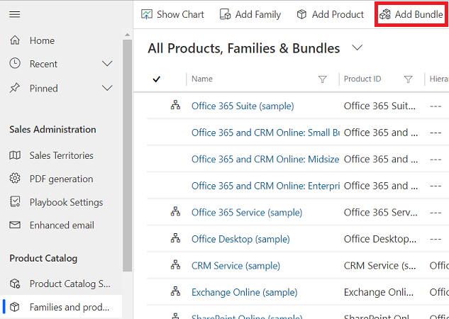

# Set up product bundles to sell multiple items together (Sales Hub) 

Encourage customers to buy more products instead of a single product by combining products in a bundle.

## License and role requirements
| &nbsp; | &nbsp; |  
|-----------------------|---------|
| **License** | Dynamics 365 Sales Premium or Dynamics 365 Sales Enterprise   More information: [Dynamics 365 Sales pricing](https://dynamics.microsoft.com/sales/pricing/) |
| **Security roles** | System Administrator   More information: [Predefined security roles for Sales](security-roles-for-sales.md)|

## What is a product bundle?  

A bundle is a collection of products that is sold as single unit. Product bundling is useful in cases like:  
  
- Pairing a top-selling product with a less popular product  
  
- Grouping products in a way that customers get more benefit from the full line of products, for example, Microsoft Office Suite or a digital camera with lenses

Here are some things to know about bundles:  
  
- You can mark certain products in a bundle as optional and sell them individually.  
  
- You can't add product families, kits, or other bundles to a bundle.  

## Create a product bundle (Sales Hub)

1. [!INCLUDE[proc_permissions_admin_cust_mgr_vp_sales_ceo](../includes/proc-permissions-admin-cust-mgr-vp-sales-ceo.md)]  
  
2. Select the site map , then select **App Settings**, and then select **Families and Products**.  
  
3. To add a standalone product bundle, select **Add Bundle**.  
  
    -OR-  
  
    To add product bundle to an existing family, select the family in the list, and then select **Add Bundle**.  

    > [!div class="mx-imgBorder"]
    > 
  
4. Fill in the information:

   - **Name** 

   - **Product ID**

   - **Parent**: Select a parent product family for the product bundle. If you're creating a child product bundle in a product family, the name of the parent product family is populated here. More information: [Change the parent of a product (reparenting)](change-product-parent.md)

   - **Valid From**/**Valid To**: Define the period the product bundle is valid for by selecting a **Valid From** and **Valid To** date.
    
   - **Unit Group**: Select a unit group. A unit group is a collection of various units a product is sold in and defines how individual items are grouped into larger quantities. For example, if you're adding seeds as a product, you may have created a unit group called "Seeds" and defined its primary unit as "packet."  
  
   - **Default Unit**: Select the most common unit in which the product will be sold. Units are the quantities or measurements that you sell your products in. For example, if you're adding seeds as a product, you can sell it in packets, boxes, or pallets. Each of these becomes a unit of the product. If seeds are mostly sold in packets, select that as the unit. 

     [!INCLUDE[proc_more_information](../includes/proc-more-information.md)] [Create a unit group and add units to that group](create-unit-group-add-units-that-group.md)  

   - **Default Price List**: If this is a new product, this field is read-only. Before you can select a default price list, you must complete all the required fields and then save the record. Although the default price list is not required, after you save the product record, it is a good idea to set a default price list for each product. If a customer record does not contain a price list, [!INCLUDE[pn-dyn-365-sales](../includes/pn-dyn-365-sales.md)] can use the default price list for generating quotes, orders, and invoices.

   - **Decimals Supported**: Enter a whole number between 0 and 5. If the product can't be divided into fractional quantities, enter 0. The precision of the **Quantity** field in the quote, order, or invoice product record is validated against the value in this field if the product does not have an associated price list.

   - **Subject**: Associate this product with a subject. You can use subjects to categorize your products and to filter reports. 
  
5. Select **Save**.  
  
6. On the **Bundle Products** tab, select **Add New Product Association**.  
  
    The **Product Association** page opens.  
  
7. Select products that you want to add to the bundle.  
  
    - **Bundle**: The bundle you're adding the products to is selected by default.  
  
    - **Product**: Select the **Lookup** button, and select a product you want to add to the bundle. You can't add a family or a product bundle to a product bundle.
  
    - **Quantity**: Specify the quantity of product you want to add to the bundle.  
  
    - **Required**: Specify whether this product is required or optional. If you select a product as optional, you can sell the bundle without the product.  
  
    - **Unit**: Select the unit in which you want to sell the product.  
  
8. Select **Save & Close**.  
  
9. To change properties of an individual product in the bundle, select **Edit Properties** corresponding to the product, and change the values as required.  
 
If you've added this bundle to a family, the bundle will inherit the properties from its parent family. To change the bundle's property:

10. Open the property, and select **Override**. [!INCLUDE[proc_more_information](../includes/proc-more-information.md)] [Use properties to describe a product](use-properties-describe-product.md)  
  
11. To add product relationships, select the **Related** tab, and then select **Relationships**. [!INCLUDE[proc_more_information](../includes/proc-more-information.md)] [Define related products to increase chances of sales](define-related-products-increase-chances-sales.md)  

> [!TIP]
> To create a new product bundle based on an existing one, on the command bar, select **Clone**. This opens a new product bundle record with the same information as the original product bundle record, except for **Name** and **Product ID**.  

  
## Typical next steps  
  [Create price lists and price list items to define pricing of products](create-price-lists-price-list-items-define-pricing-products.md)  
  
  [Classify products and bundles into product families](create-product-bundles-sell-multiple-items-together.md)  
  
[!INCLUDE [cant-find-option](../includes/cant-find-option.md)]

### See also  
[How prices are calculated for product bundles?](pricing-product-bundles.md)
[Set up a product catalog: Walkthrough](set-up-product-catalog-walkthrough.md)   
[System Settings dialog box - Sales tab](/power-platform/admin/system-settings-dialog-box-sales-tab)

[!INCLUDE[footer-include](../includes/footer-banner.md)]
