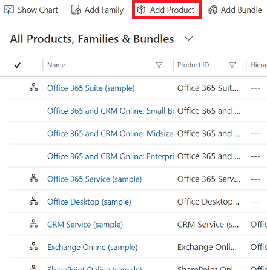

# Set up products 

Use products in Dynamics 365 Sales to define the products or services that your organization offers

## License and role requirements

|  | |
|-----------------------|---------|
| **License** | Dynamics 365 Sales Enterprise or Dynamics 365 Sales Premium  More information: [Dynamics 365 Sales pricing](https://dynamics.microsoft.com/sales/pricing/) |
| **Security roles** | System Administrator   See [Predefined security roles for Sales](security-roles-for-sales.md)|
|||

## Create a product (Sales Hub)

Products are the backbone of your business. They can be physical products or services—whatever your organization sells. Your sales reps use the products you create in [!INCLUDE[pn-sales-enterprise-doc-name-shortest](../includes/pn-sales-enterprise-doc-name-shortest.md)] to generate sales quotes, marketing campaigns, orders, and invoices. Your customer service reps might also use them when they create customer service cases.  

1. [!INCLUDE[proc_permissions_admin_cust_mgr_vp_sales_ceo](../includes/proc-permissions-admin-cust-mgr-vp-sales-ceo.md)]

2. Select the site map , then select **App Settings**, and then select **Families and Products**.  
  
3. To create a child product to an existing product family, select the family in the list, and then on the command bar, select **Add Product**. The selected family becomes the parent family of the new product you're creating. [!INCLUDE[proc_more_information](../includes/proc-more-information.md)] [Create a product family](create-product-family.md)  
  
   -OR-  
  
   If you want to create an independent product, select **Add Product**. 

    > [!div class="mx-imgBorder"]
    >  
  
4. Fill in your information:  
  
   - **Name** 

   - **Product ID**

   -	**Parent**: Select a new parent for this product. More information: [Change the parent of a product (reparenting)](change-product-parent.md)

   - **Valid From**/**Valid To**: Define the period the product is valid for by selecting a **Valid From** and **Valid To** date.
    
   - **Unit Group**: Select a unit group. A unit group is a collection of various units a product is sold in and defines how individual items are grouped into larger quantities. For example, if you're adding seeds as a product, you may have created a unit group called "Seeds" and defined its primary unit as "packet."  
  
   - **Default Unit**: Select the most common unit in which the product will be sold. Units are the quantities or measurements that you sell your products in. For example, if you're adding seeds as a product, you can sell it in packets, boxes, or pallets. Each of these becomes a unit of the product. If seeds are mostly sold in packets, select that as the unit. 

     [!INCLUDE[proc_more_information](../includes/proc-more-information.md)] [Create a unit group and add units to that group](create-unit-group-add-units-that-group.md)  

   - **Default Price List**: If this is a new product, this field is read-only. Before you can select a default price list, you must complete all the required fields and then save the record. Although the default price list is not required, after you save the product record, it is a good idea to set a default price list for each product. If a customer record does not contain a price list, [!INCLUDE[pn-sales-enterprise-doc-name-shortest](../includes/pn-sales-enterprise-doc-name-shortest.md)] can use the default price list for generating quotes, orders, and invoices.

   - **Decimals Supported**: Enter a whole number between 0 and 5. If the product can't be divided into fractional quantities, enter 0. The precision of the **Quantity** field in the quote, order, or invoice product record is validated against the value in this field if the product does not have an associated price list.

   - **Subject**: Associate this product with a subject. You can use subjects to categorize your products and to filter reports.
  
5. Select **Save**.

6. If you're creating this product under a family, the product will inherit the properties from its parent family. To change a product's property, in the **Product Properties** section, open the property by selecting the name, and selecting **Override**. [!INCLUDE[proc_more_information](../includes/proc-more-information.md)] [Use properties to describe a product](use-properties-describe-product.md)  
  

7. To add product relationships, select the **Related** tab, and then select **Relationships**. [!INCLUDE[proc_more_information](../includes/proc-more-information.md)] [Define related products to increase chances of sales](define-related-products-increase-chances-sales.md)  

8. To see all the products that are associated with this product in a bundle, select the **Related** tab, and select **Product Bundles**. 
  
9. Select **Save**.  
  
> [!NOTE]
> Previewing the properties of product is currently not supported in the Sales Hub app.

  
## Typical next steps  
  [Define product pricing with price lists and price list items](create-price-lists-price-list-items-define-pricing-products.md)  
  
  [Classify products and bundles into product families](create-product-bundles-sell-multiple-items-together.md)  

[!INCLUDE [cant-find-option](../includes/cant-find-option.md)]
  
### See also  
 [Set up a product catalog](set-up-product-catalog-walkthrough.md)  
 [Manage sales literature](create-sales-literature.md) 
 [Change the parent of a product (reparenting)](change-product-parent.md)  

[!INCLUDE[footer-include](../includes/footer-banner.md)]
