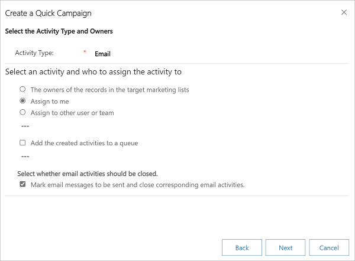

# Create a quick campaign using in-app marketing

Send an e-mail blast to customers who fit a specific demographic, a mail campaign to clients in a specific region, or perhaps a phone call campaign to previous buyers of a particular product by using a quick campaign in [!INCLUDE[pn-dyn-365-sales](../includes/pn-dyn-365-sales.md)]. 

## License and role requirements
| &nbsp; | &nbsp; |  
|-----------------------|---------|
| **License** | Dynamics 365 Sales Premium, Dynamics 365 Sales Enterprise, or Dynamics 365 Sales Professional  More information: [Dynamics 365 Sales pricing](https://dynamics.microsoft.com/sales/pricing/) |
| **Security roles** | All primary sales roles such as salesperson, sales manager, and so on.   More information: [Primary sales roles](security-roles-for-sales.md#primary-sales-roles)|
  

## When to use quick campaign

A quick campaign is a single campaign activity geared towards a targeted audience. Track the success of your quick campaign through campaign responses, and convert the positive responses into new leads, quotes, orders, or opportunities.
  
If you need to perform more than one activity for your campaign, such as an email blast and a phone call, create a standard campaign instead. [!INCLUDE[proc_more_information](../includes/proc-more-information.md)] [Create or edit a campaign using in-app marketing](create-edit-campaign-using-app-marketing-sales.md)

## Create a quick campaign and activity

When you create a quick campaign activity, an activity is created for each member in the marketing list that's part of the quick campaign.
 
> [!NOTE]
> The average time for distributing a quick campaign activity to 100,000 members is 24 hours. For larger campaigns and faster activity distribution, use Dynamics 365 Marketing. For more information, go to [Dynamics 365 Marketing documentation](../marketing/overview.md).

1. In the site map, select **Marketing Lists**.
  
2. Open a record, and then in the **Quick Campaigns** area, select **New Quick Campaign**.  
  
3. In the **Create a Quick Campaign** wizard, read the instructions on the welcome page, and then select **Next**.
  
4. On the **Specify the Campaign Name** step, enter a name for the quick campaign, and then select **Next**.
  
5. On the **Select the Activity Type and Owners** step, from the **Activity Type** list, select the type of activity you want to create. 

      You can also select who you want [!INCLUDE[pn-dyn-365-sales](../includes/pn-dyn-365-sales.md)] to assign the activity to and whether [!INCLUDE[pn-dyn-365-sales](../includes/pn-dyn-365-sales.md)] should perform the activity automatically for appropriate activities, such as sending email messages. For example, if you are creating a phone call activity for all the sales representatives, you can select the **Activity Type** as **Phone Call**, and then select **The owners of the records in the target marketing lists**. Each sales representative can then see the activity and take action on it. However, if you are creating a large number of email activities that [!INCLUDE[pn-dyn-365-sales](../includes/pn-dyn-365-sales.md)] will perform automatically, you can assign the email activity to yourself instead of the record owners.

6. Select **Next**.

     
  
6. On the **Specify the Content of the Activity** step, specify the details of the activity to be created, and then select **Next**.  

7. On the **Completing the Create Quick Campaign Wizard** step, select **Create**.  
  
   > [!NOTE]
   >  You can't add records to a quick campaign after you create it.  
 
[!INCLUDE [cant-find-option](../includes/cant-find-option.md)]

### See also

[Get started with in-app marketing](get-started-app-marketing-sales.md)   
[Create a marketing list using in-app marketing](create-marketing-list-using-app-marketing-sales.md)   
[Create or edit a campaign using in-app marketing](create-edit-campaign-using-app-marketing-sales.md)   
[Add an activity to a campaign using in-app marketing](add-activity-campaign-using-app-marketing-sales.md)   
[Add a marketing list, sales literature, or product to a campaign using in-app marketing](add-marketing-list-sales-literature-product-campaign-using-app-marketing-sales.md)   
[Track a marketing campaign response using in-app marketing](track-marketing-campaign-response-using-app-marketing-sales.md)   
[Customize quick campaign and campaign activity distribution forms](developer/marketingformdisplayattributessetApi.md)
 

[!INCLUDE[footer-include](../includes/footer-banner.md)]
